# Hardware

## Fornecimento de Energia

**Tensão:** Diferença no potencial elétrico\
**Corrente Elétrica:** Quantidade de elétrons em um tempo x

* É gerada através do movimento dos elétrons
* Energia Potencial (tensão) > Energia Sinética (movimento)

**DC (Direct Current):** Contínua (pilhas/baterias)\
**AC (Alternating Current):** Alternada (tomada)\
**Resistor:** Resistência elétrica, controla a passagem dos elétrons\
**Efeito Joule:** Energia cinética transformada em energia térmica no Resistor

### Unidades de Medida

* _Volt (V) =_ Tensão
* _Ampere (Amps/A) =_ Corrente elétrica
* _Ohm (Ω) =_ Resistência
* _Watt (W) =_ Potência, eficácia elétrica

> **WATTS** = VOLTS _X_ AMPERES\
> _Potência = Tensão X Corrente elétrica_

### Campo Elétrico

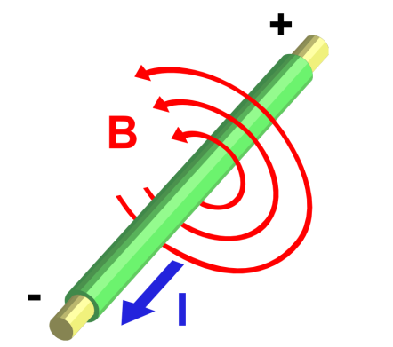

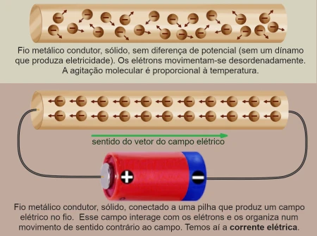

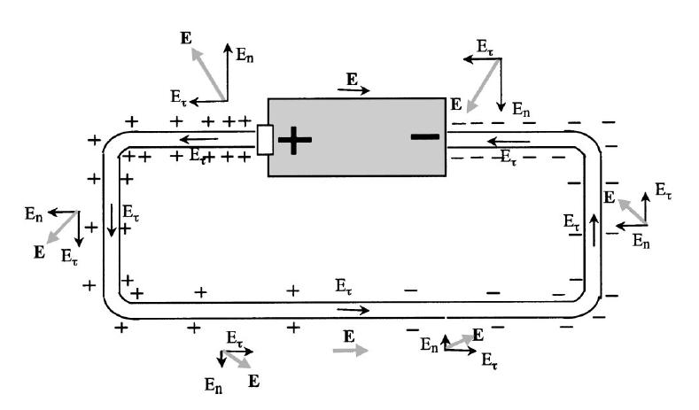

#### Corrente AC/DC

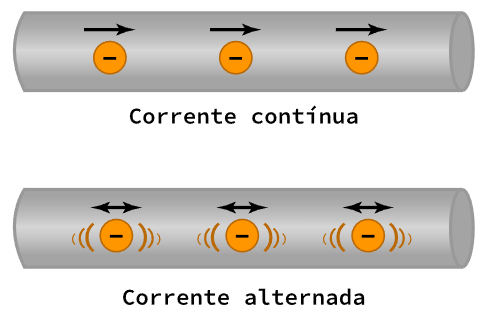

***

## Litografia

* Gravura em placas de silício; construção de transistores em chips de processadores

> **Nanômetro (nm):** Unidade de medida utilizada para chips
>
> > $$1nm = 1 metro / 10⁹$$ (um bilhão)

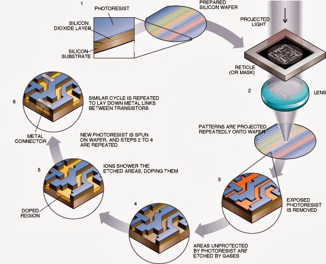

🔗 [How to Make a CPU: From Sand to Shelf | bit-tech](https://bit-tech.net/reviews/tech/cpus/how-to-make-a-cpu-from-sand-to-shelf/)

***

## Lógica Digital

### Dimensão dos Dados

* bits → Bytes = $$n*8$$
* Bytes → bits = $$n/8$$

### Portas Lógicas

* George Boole / Álgebra Booleana
* OR → Adição
* AND → Multiplicação

**Portas:** Objeto que recebe uma entrada binária e retorna uma saída binária

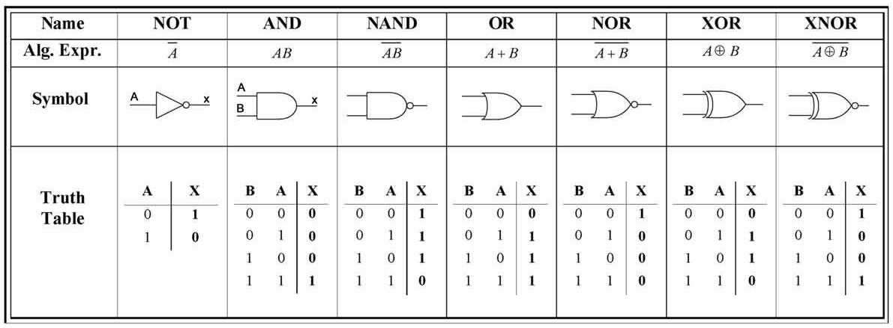

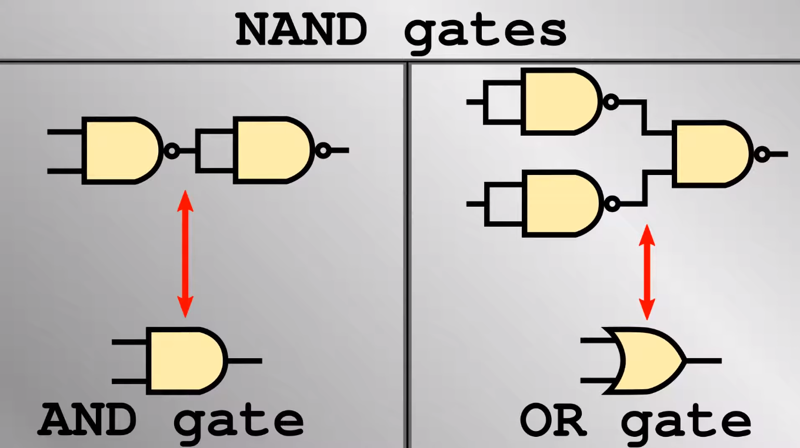

### Sistema Binário

**Tabela ASCII:** Associa números binários a letras/números/caracteres; 8bits = $$2^8$$ = 256 caracteres

* Números binários negativos → inverter os bits

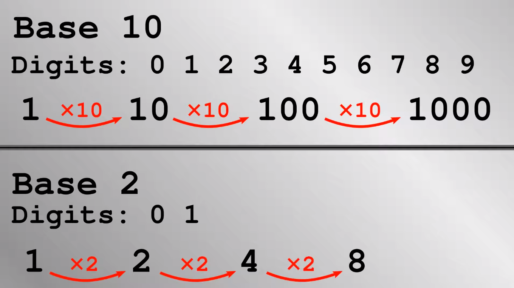

#### Binário para Decimal

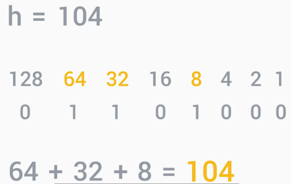

#### Operações em Binário

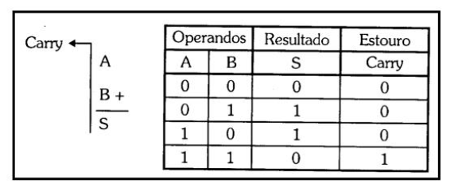

***

## Armazenamento

**Bit:** Binary digit; menor unidade de memória\
**Transmissão de dados:**

* Via cabo SATA: HD, SSD
* Via slot: NVMe (Express)

**Partição:** Divisão lógica de um dispositivo de armazenamento (em um único drive); dados são escritos em setores/_blocos de 512 bytes_\
**Volume:** Abstração de um dispositivo de armazenamento pelo Sistema Operacional; forma de organizar partições em um ou mais dispositivos de armazenamento,

### Logical Block Addressing (LBA)

* Lista linear de endereços (metadados) para mapeamento de setores
* Cada elemento da lista aponta para um setor (partição)

**Master Boot Record (MBR)**

* 32 bits; sistema antigo
* Setor especial no primeiro cilindro é reservado como setor de boot; permite registro de até 4 partições
* $$2³² * 512 bytes = 2 TB$$

**GUID Partition Table (GPT)**

* 64 bits
* Usa GUIDs (identificadores universais únicos) para identificar partições e seu tipo
* Necessita de partição ESP (EFI System Partition)
* $$2⁶⁴ * 512 bytes = 8 ZB$$ (Zettabyte)

### Memórias

* Em processos de leitura e escrita em um local na memória principal, primeiro o processador checa se o dado já está na cache
  * Se estiver, utiliza o dado da cache ao invés de uma memória mais lenta

#### Hierarquia de Memórias

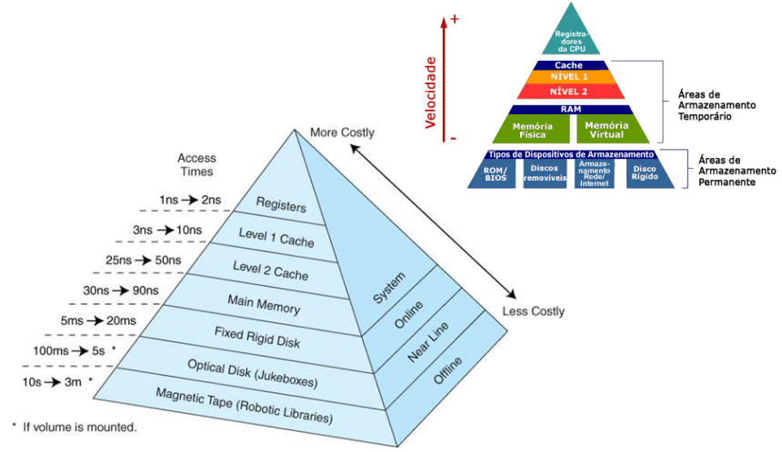

#### Cache do Processador

* Armazena dados recentes e frequentemente acessados
* Menor e mais rápida memória utilizada pela CPU
* Armazena cópias de dados da memória local/disco (HD/SSD)
* Diminui tempo e energia de acesso a RAM
* Transferência de dados em blocos fixos (linha ou bloco de cache)

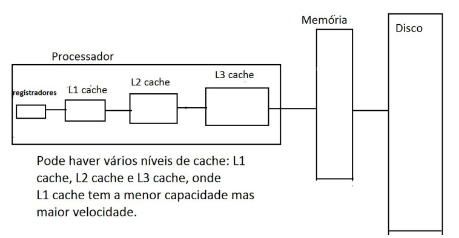

**Entrada de Cache**

* Quando um bloco de dados (linha de cache) é copiada da memória para a cache, uma entrada cache é criada, contendo os dados e endereço (tag)

* _linha/bloco de cache_ → dados
* _tag_ → endereço
* _flag de bits_ → somente um bit de flag (valid bit), que indica se um dado bloco foi carregado com dados válidos ou não

#### RAM

> Random Access Memory

* Memória Principal
* Armazenamento de dados temporários dos aplicativos; acesso extremamente rápido à qualquer parte do dispositivo
* Utiliza capacitores

**Memory Controller Chip (MCC):** Ponte entre a CPU e a RAM\
**External Data Bus (EDB):** Linha de fios que interconectam as partes do computador\
**Address Buss:** Conecta a CPU a MCC e envia o endereço de memória do dado

**CPU** → _Address Bus_ → **MMC**\
↳ envia endereço do dado\
**MCC** → busca na **RAM** o dado a partir do endereço\
**MCC** → _EDB_ → **CPU**\
↳ envia o dado

**Célula**: Menor unidade endereçavel (8 bits / 1 byte)\
**Endereço:** Código de identificação da localização das células\
**Operações:**

* _Escrita:_ Transferência de informações de outro componente do sistema de computação para a memória (CPU → memória)
* _Leitura:_ Transferência de bits da memória para a CPU, disco

**Capacidade**

$$T = N * M$$\
_T_ = capacidade em bits\
_N_ = $$2^n$$ ; $$n$$ é o número de linhas do barramento de endereços\
_M_ = número de bits de cada célula

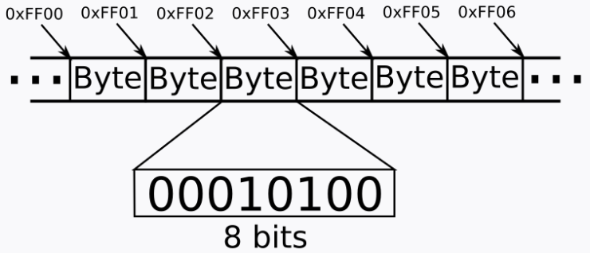

#### HD

> Hard Disk/Drive

* Eletromecânico; gravação magnética e aleatória
* HD Desktop = 3,5”/9cm
* HD Notebook = 2,5”/6cm
* Não desfragmentar com frequência
* Se apaga o caminho, não o dado
* É possível a sobrescrição de dados (porém HD busca sempre espaços vazios)
* Recuperação de dados → Lógica (recria endereços de dados) e Física

**Conexões**

* Interface IDE (PATA)
* Interface SATA (Serial ATA)
  * SATA I → até 150 MB/s
  * SATA II → até 300 MB/s
  * SATA III → até 600 MB/s
* Interface SESI

**Rotação**

* 4200/5400/7200 RPM
* SCSI (Banco de Dados) ➡ 1980 RPM

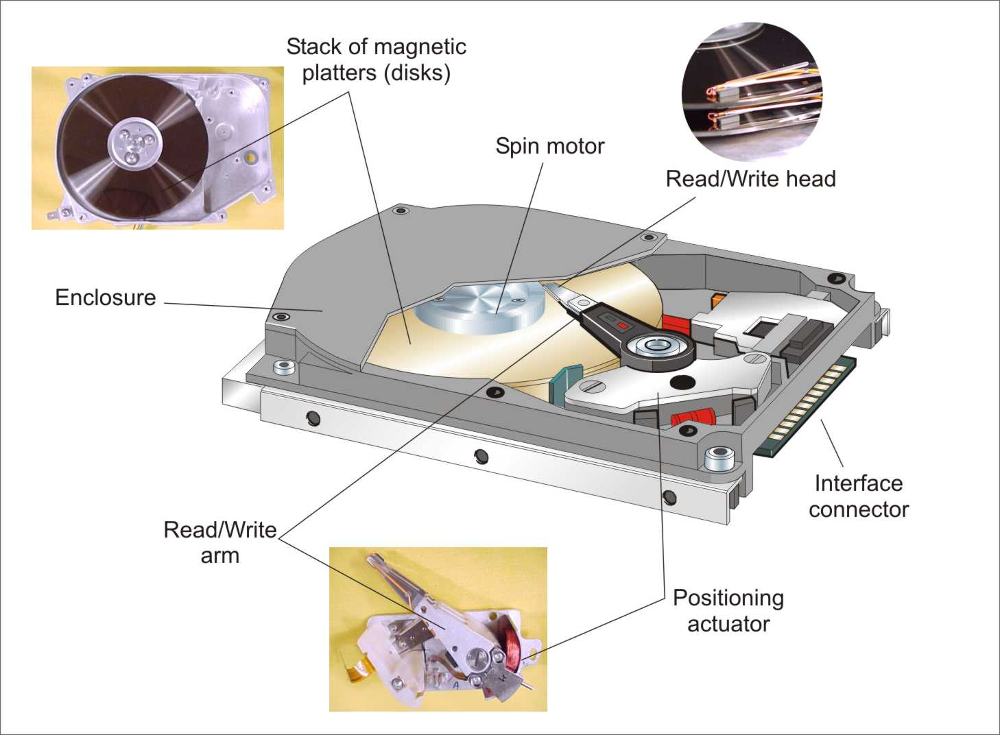

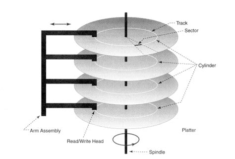

#### USB

> Universal Serial Bus

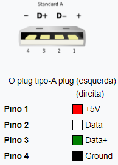

**Velocidades de Transferência USB**

* 2.0 = 480 Mb/s
* 3.0 = 5 GB/s
* 3.1 = 10 GB/s

**Cálculo de velocidade de transferência**

* Converter de bits/s para Bytes/s
* $$s = d/t$$
* _s_ - speed | _d_ - data size | _t_ - transfer time
* velocidade = tamanho do arquivo / taxa de transferência

_Exemplo:_ arquivo de 1 GB transferido via USB 2.0 (480 Mb/s)\
$$480 * 8 = 60 MB$$\
$$1GB = 1024 MB$$\
$$s = 1024 / 60$$\
$$s ≃ 17,07 s$$

**Conectores**

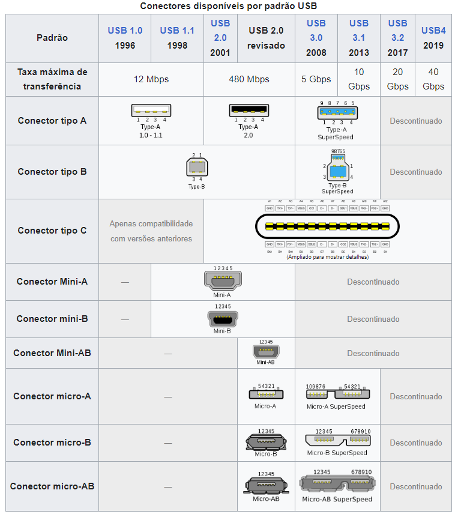

**RAID - Redundant Arrays of Independent Disks:** Técnica que utiliza uma combinação de vários discos em vez de um único, para aumentar o desempenho, a redundância de dados ou ambos

**DAS - Direct Attached Storage:** HD, SSD, USB\
**NAS - Network Attached Storage:** armazenamento via rede\
**SAN - Storage Area Network:** servidor envia pedidos por blocos específicos ou segmentos de dados de discos específicos (armazenamento de blocos); comunicação via rede

***

## Placa-mãe

* Circulação do sistema do computador que conecta todas as partes

**Form Factors:** ATX | ITX\
**Portas:** Pontos para conexão de dispositivos que estendem a funcionalidade do computador\
**Chipsets:** Northbridge | Southbridge\
**Periféricos:** Qualquer dispositivo conectado externamente que adicione alguma funcionalidade

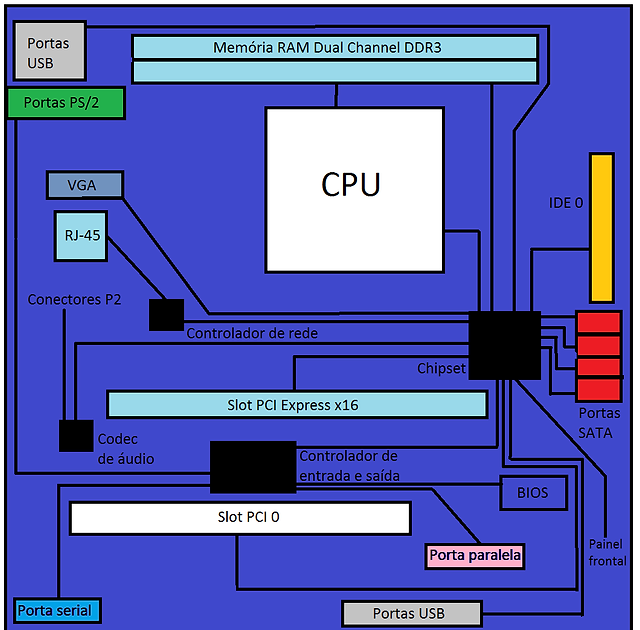

### Firmware

**ROM Chip (Read-only memory chip):** Armazena a BIOS, não volátil\
**Bateria CMOS:** Configurações de Boot, data, hora etc\
**Drivers:** Instruções para a o Firmware (BIOS ou UEFI) reconhecer um dispositivo externo\
**POST (Power-on self test):** Teste de componentes de hardware antes da inicialização dos drivers/SO\
**ACPI (Advanced Configuration and Power Interface):** Facilita que o SO encontre Hardware para configurar e gerenciar energia\
**AHCI (Advanced Host Controller Interface):** Comunicação com controladores SATA/HDs

### CPU

> Central Processing Unit

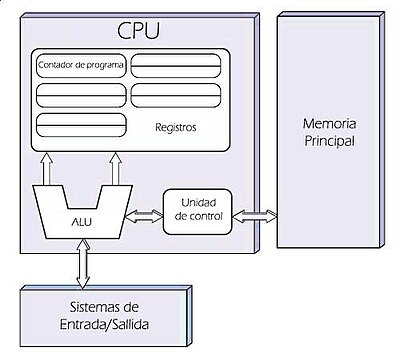

**Programa:** Instruções que dizem o que o computador deve fazer\
**Registradores:** Armazenamento dos dados utilizados pela CPU\
**Soquetes:** Land grid array _(LGA)_ | Pin grid array _(PGA)_

* Conjunto de instruções
  * 64 bits = endereços de memória c/ 64 bits de largura
  * nº de bits = número de linhas do barramento de dados

#### Ciclo de Instrução

* Primeiro bit significativo identifica se é positivo (unsigned - 0) ou negativo (signed - 1)

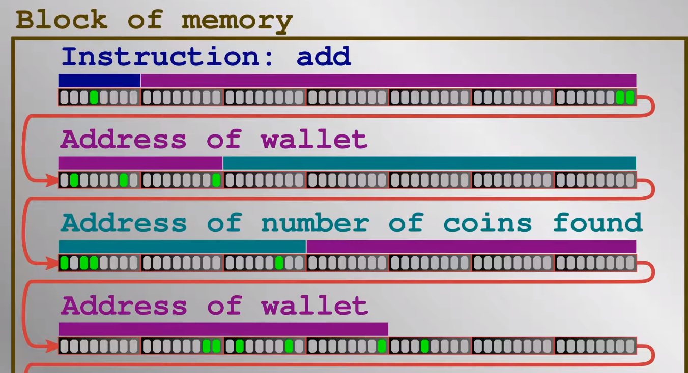

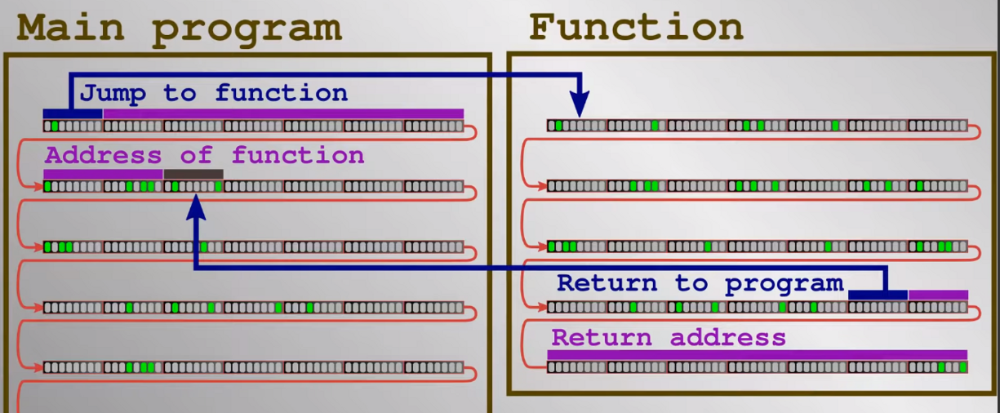

### Recursos Computacionais

#### Clock

* Sincroniza as operações de processamento (cálculos)
* GHz (bilhões/s)
  * _Clock Wire:_ Meio de transmissão do clock
  * _Clock Cicle:_ Pulso de voltagem que inicia ciclo
  * _Clock Speed:_ Medida em gigahertz (bilhões de ciclos por segundo)

**Overclocking:** Técnica para exceder o limite de ciclos do processador

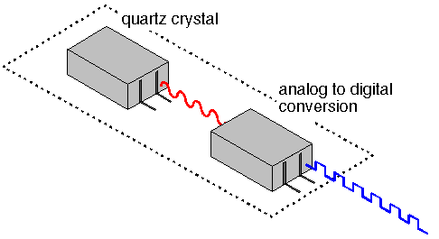

#### Pipeline

* “Segundo clock” do processador que aumenta a eficiência do processamento, acelera até 1,5x
* Divide a execução de instruções em várias etapas permitindo a execução simultânea de outras instruções
* Não acelera a execução individual de cada instrução, mas permite o paralelismo de instruções
  * _Pararelismo:_ Realização de tarefas executadas em simultâneo

> **Análise de Fluxo de Dados:** Análise da fila de instruções
>
> **Dependência de Dados Verdadeira:** Quando o processamento de uma instrução depende do resultado de outra

**Princípio Estatístico Comprovado:** Armazena _instruções repetidas pelo usuário_ com o objetivo de aumentar a eficiência e diminuir o processamento desnecessário de informações duplicadas

**Execução Especulativa:** Processador utiliza a análise de fluxo de dados para uma _decodificação antecipada_

**Predição de Desvio:** Processador utiliza a análise de fluxo de dados para encontrar uma _dependência de dados verdadeira_ , assim possibilitando um desvio, uma ordem específica de processamento que otimize sua execução e evita que o processador fique ocioso

* _Predição Estática:_ Avalia o conteúdo da memória cache e histórico de processamento.
* _Predição Dinâmica:_ Avalia toda a fila de processamento (memórias cache e RAM) e o histórico de processamento

***

## Desktop

**Cuidados**

* Descarga eletrostática causa danos
  * Fazer aterramento do corpo
* Utilizar sacos eletrostáticos para componentes

#### Montagem

* **Fixação da Placa-mãe**
* **CPU**
  * Adicionar pasta térmica (melhor transferência de calor)
  * Instalar dissipador de calor
* **RAM**
  * Intercalar slots
* **HD/SSD**
* **Ventoinha (fan) do Gabinete**
* **Fonte de Alimentação**
  * Fixar no gabinete
  * Conectores
    * ATX 20+4 pinos | Alimentação placa mãe
    * Molex 8 pinos | CPU
    * SATA | Alimentação
    * PCI Express 6 pinos | Placa de vídeo
    * IDE | _ultrapassado_
    * EPS 4+4 pinos | _Alimentação antiga_
    * Floppy Drive | _ultrapassado_
* **Placa de vídeo**
  * Slot PCI-Express
  * Prender no gabinete (se for o caso)
