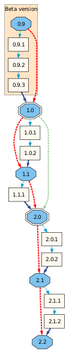
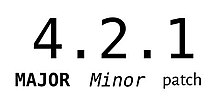
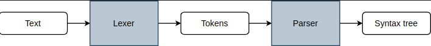
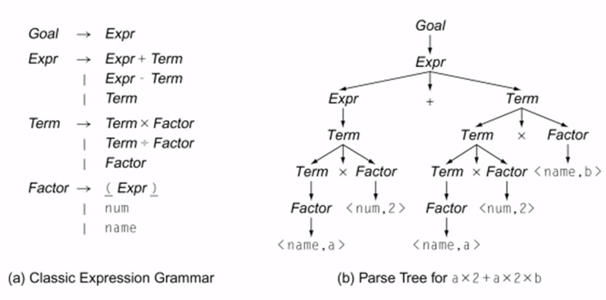
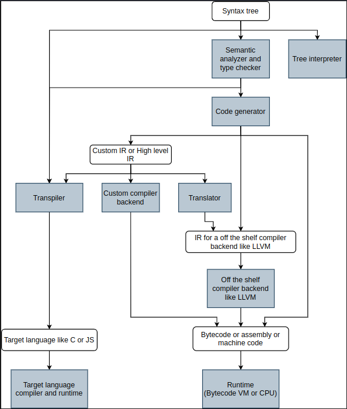
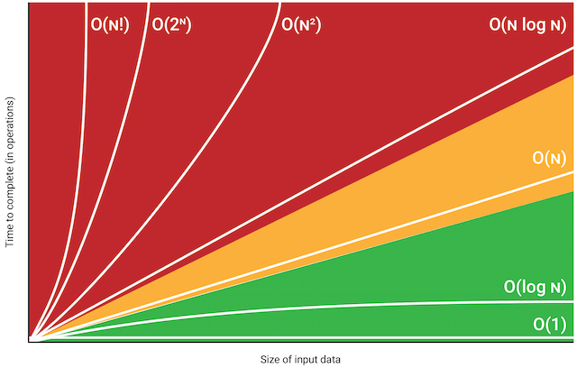

# Software

## Versionamento de Software

### Identificadores Baseados em Sequência

* São usados para transmitir a _significância das alterações_ entre as versões
  * Potencial impacto em adotar uma nova versão
  * Risco de bugs ou alterações não declaradas de quebra
  * Grau de alterações no layout visual
  * Número de novos recursos
* Há uma variedade de esquemas de versionamento numérico

### Versionamento Semântico

**Major (alto risco):** Modificações Breaking Change (modificação que quebra a compatibilidade da API); identificado nos commits pelo símbolo **!**\
**Minor (médio risco):** Modificações sem quebra\
**Patch (menor-risco):** Incrementos de patch\
**Pre-release tag:** Indica estágios de desenvolvimento; _alpha(a), beta(b), release candidate(rc), 0.x_

> Os desenvolvedores podem optar por **pular várias versões menores ao mesmo tempo** para indicar que recursos significativos foram adicionados, mas não são suficientes para justificar o incremento de um número de versão principal; ex: de 5.1 para 5.5

Outros esquemas conferem significado em sequências individuais:

* `major.minor[.build[.revision]]` (ex: _1.2.12.102_)
* `major.minor[.maintenance[.build]]` (ex: _1.4.3.5249_)

### Versionamento por Status mais Recente

**Sufixo Alfanumérico:** Esquema adotado pela versão semântica; traço e caracteres alfanuméricos para indicar status\
**Status Numérico:** Esquema que usa números para indicar status como se fosse parte da sequência; escolha típica é a terceira posição para o versionamento de quatro posições\
**Numeric 90+:** Esquema que também usa números, mas sob série de uma versão anterior; grande número na última posição, tipicamente 90 ou superior, comumente usado por projetos de código aberto mais antigos

| Estágio de Desenvolvimento | Versionamento Semântico | Status Numérico | Numeric90+ |
| -------------------------- | ----------------------- | --------------- | ---------- |
| Alpha                      | 1.2.0-a.1               | 1.2.0.1         | 1.1.90     |
| Beta                       | 1.2.0-b.2               | 1.2.1.2         | 1.1.93     |
| Release candidate (RC)     | 1.2.0-rc.3              | 1.2.2.3         | 1.1.97     |
| Release                    | 1.2.0                   | 1.2.3.0         | 1.2.0      |
| Post-release fixes         | 1.2.5                   | 1.2.3.5         | 1.2.5      |

***

## Linguagem de Programação

**Abstração:** Mascara um sistema complexo oferecendo uma interface comum\
**Assembly (bytecode):** Linguagem de baixo nível; somente compatível em uma CPU específica

### Syntax Tree

**Lexer (Análise Léxica):** Lexing ou Tokenização; processo de agrupar caracteres em lexemas e produzir uma sequência de símbolos léxicos conhecidos como _tokens_; primeira etapa do processo de compilação\
**Parser:** Transforma os tokens em uma _Parse Tree_, estrutura de dados que se pode manipulada

> Parse Tree é transformada em uma _Abstract Syntax Tree (AST)_ e em seguida, é otimizada por um compilador ou interpretador, para a geração de um código de máquina

**Tree interpreter:** Executa o programa passando pela Syntax Tree ou verificando cada nó e seus nós filhos, assim por diante; utilizado para linguagem extremamente simples ou DSLs (domain-specific language) pequenas\
**Analisador semântico e verificador de tipos:** Anda pela Syntax Tree e verifica a semântica e tipagem; retorna erros tipo "Não é possível atribuir string para um inteiro" ou "Faltando ponto-vírgula"\
**Gerador de Código:** Anda pela Syntax Tree e gera um IR ou diretamente um bytecode (assembly)

**Intermediate Representation (IR):** Microlinguagem intermediária projetada para representa o código fonte em compiladores, antes de ser transformada em código de máquina

* _Compilador Backend:_ Aceita IR como input, otimiza e retorna ou um bytecode para Máquinas Virtuais ou instruções de máquina para CPUs

#### Linguagens Compiladas

* Converte instruções humanas em instruções de máquina
* Bytecode gerado antes para execução na hora de execução _(Just in Time)_
* _.ELF (Executable and Linkable Format):_ formato de arquivo padrão comum para arquivos executáveis, código de objeto, bibliotecas compartilhadas

#### Linguagens Interpretadas

* Não são compiladas antes; funcionamento a base de scripts
* Bytecode gerado depois para compilar continuamente enquanto executa _(Ahead of Time)_

**Interpretador:** AST (Abstract Syntax Tree) modificável\
**Script:** Código executado por interpretador que converte em instruções à CPU em sua execução\
**Linguagens Dinâmicas:** Que possuem a capacidade de injeção de novos códigos em tempo de execução

***

## Algoritmos

### Variáveis tipo Float

**Algarismos significativos:** número de casas decimais do resultado será igual ao do número com menor número de casas decimais\
_Exemplo:_ $$23,965 + 20,3 = 44,265$$ → $$44,3$$

* Números reais são representados por notação científica multiplicada por uma potência de base
* Seu processamento pode se dar pela “quebra” do número em parte inteira e parte decimal

**Erros de arredondamento:** Por armazenar números em formato binário, algumas frações decimais não podem ser representadas exatamente, onde o valor armazenado pode ser ligeiramente diferente do valor real

* _Acumulação de erros:_ Operações repetidas com números de ponto flutuante acumulam os erros de arredondamento, resultando em desvios significativos dos valores esperados

### Complexidade do Código

> Notação $$Big O$$

* Levar em consideração apenas _repetições de código_
* Verificar funções/métodos próprios da linguagem
* Ignorar constante e utilizar termo de maior grau (pior caso)

### Revisão de Código

