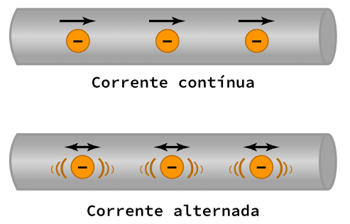
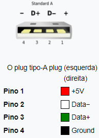

<h1 align="center"> Hardware </h1>

## Índice

- [Fornecimento de Energia](#fornecimento-de-energia)  
		  * [Unidades de Medida](#unidades-de-medida)  
		  * [Campo Elétrico](#campo-elétrico)  
- [Litografia](#litografia)  
- [Lógica Digital](#lógica-digital)  
		  * [Dimensão dos Dados](#dimensão-dos-dados)  
		  * [Portas Lógicas](#portas-lógicas)  
		  * [Sistema Binário](#sistema-binário)  
- [Armazenamento](#armazenamento)  
		  * [Logical Block Addressing (LBA)](#logical-block-addressing-lba)  
		  * [Memórias](#memórias)  
		  * [RAID](#raid)  
- [Placa-mãe](#placa-mãe)  
		  * [Firmware](#firmware)  
		  * [CPU](#cpu)  
		  * [Recursos Computacionais](#recursos-computacionais)  
- [Desktop](#desktop)  

---

# Fornecimento de Energia

**Tensão:** Diferença no potencial elétrico  
**Corrente Elétrica:** Quantidade de elétrons em um tempo x  
- É gerada através do movimento dos elétrons
- Energia Potencial (tensão) > Energia Sinética (movimento)
**DC (Direct Current):** Contínua (pilhas/baterias)  
**AC (Alternating Current):** Alternada (tomada)  
**Resistor:** Resistência elétrica, controla a passagem dos elétrons  
**Efeito Joule:** Energia cinética transformada em energia térmica no Resistor

## Unidades de Medida

- *Volt (V) =* TensãoVOLTS
- *Ampere (Amps/A) = Corrente elétrica
- *Ohm (Ω) =* Resistência
- *Watt (W) =* Potência, eficácia elétrica

> **WATTS** = VOLTS *X* AMPERES  
> *potência = tensão X corrente elétrica*

## Campo Elétrico

### Corrente AC/DC

---

# Litografia

[How to Make a CPU: From Sand to Shelf | bit-tech.net](IT-DOCS/BASE/Images/Hardware/https://bit-tech.net/reviews/tech/cpus/how-to-make-a-cpu-from-sand-to-shelf/2/)  

- Gravura em placas de silício; construção de transistores em chips de processadores  
**Nanômetro (nm):** Unidade de medida utilizada para chips  
	$1nm = 1 metro / 10⁹$ (um bilhão)  

---

# Lógica Digital

## Dimensão dos Dados

## Portas Lógicas

- George Boole / Álgebra Booleana
- Adição → OR | Multiplicação → AND
**Portas:** Objeto que recebe uma entrada binária e retorna uma saída binária

## Sistema Binário

**Tabela ASCII:** Associa números binários a letras/números/caracteres; 8bits = $2^8$ = 256 caracteres
- Números binários negativos > inverter os bits

### Binário para Decimal

### Operações em Binário

---

# Armazenamento

**Bit:** Binary digit; menor unidade de memória  
**Transmissão de dados via cabo SATA:** HD, SSD  
**Transmissão de dados via slot:** NVMe (Express)  
**Sistema de Arquivos:** NTFS (Miscrosoft)

**Partição:** Divisão lógica de um dispositivo de armazenamento (em um único drive); dados são escritos em setores/*blocos de 512 bytes*
**Volume:** Abstração de um dispositivo de armazenamento pelo sistema operacional; forma de organizar partições em um ou mais dispositivos de armazenamento,

## Logical Block Addressing (LBA) 

- Lista linear de endereços (metadados) para mapeamento de setores  
- Cada elemento da lista aponta para um setor (partição)  

**Master Boot Record (MBR)**   
- 32 bits; sistema antigo  
- Setor especial no primeiro cilindro é reservado como setor de boot; permite registro de até 4 partições  
$` 2³² * 512 bytes = 2 TB`$   

**GUID Partition Table (GPT)**  
- 64 bits  
- Usa GUIDs (identificadores universais únicos) para identificar partições e seu tipo  
$` 2⁶⁴ * 512 bytes = 8  ZETTABYTE`$   
- Necessita de partição ESP (EFI System Partition)  

## Memórias

- Em processos de leitura e escrita em um local na memória principal, primeiro o processador *checa se o dado já está na cache
    - Se estiver, utilizada o dado da cache ao invés de uma memória mais lenta
    
**NAS (Network Attached Storage):** armazenamento anexado em rede; PC em uma rede com vários HDs

### Hierarquia de Memórias

### Cache do Processador

- Armazena dados recentes e frequentemente acessados
- Menor e mais rápida memória utilizada pela CPU
- Armazena cópias de dados da memória local/disco (HD/SSD)
- Diminui tempo e energia de acesso a RAM
- Transferência de dados em blocos fixos (linha ou bloco de cache)

#### Entrada de Cache

- Quando um bloco de dados (linha de cache) é copiada da memória para a cache, uma entrada cache é criada, contendo os dados e endereço (tag)

- *linha/bloco de cache* → dados
- *tag* → endereço
- *flag bits* → somente um bit de flag (valid bit), que indica se um dado bloco foi carregado com dados válidos ou não

### RAM - Random Access Memory

- Memória Principal
- Armazenamento de dados temporários dos aplicativos; acesso extremamente rápido à qualquer parte do dispositivo
- Utiliza capacitores
**Memory Controller Chip (MCC):** Ponte entre a CPU e a RAM  
**External Data Bus (EDB):** Linha de fios que interconectam as partes do computador  
**Address Buss:** Conecta a CPU a MCC e envia o endereço de memória do dado  
- *DDR SDRAM:* Double Data Rate SDRAM

**CPU** > *Address Bus*  > **MMC**  
  ↳ envia endereço do dado  
**MCC** > busca na **RAM** o dado a partir do endereço  
**MCC** > *EDB* → **CPU**  
  ↳ envia o dado  
  
**Célula**: menor unidade endereçavel (8 bits – 1 byte)  
**Endereço:** código de identificação da localização das células  
**Operações:**
- *Escrita:* transferência de informações de outro componente do sistema de computação para a memória (CPU → memória)
- *Leitura:* transferência de bits da memória para a CPU, disco

#### Capacidade

$T = N x M$  
**T** = capacidade em bits  
**N** = $2^n$, n é o número de linhas do barramento de endereços  
**M** = número de bits de cada célula  

### HD

> Hard Disk/Drive  

- Eletromecânico; gravação magnética e aleatória
- HD Desktop = 3,5”/9cm
- HD Notebook = 2,5”/6cm
- Não desfragmentar com frequência
- Se apaga o caminho, não o dado
- É possível a sobrescrição de dados (porém HD busca sempre espaços vazios)
- Recuperação de dados > Lógica (recria endereços de dados) e Física

**Conexões**
- Interface IDE (PATA)
- Interface SATA (Serial ATA)
    - SATA I → até 150 MB/s
    - SATA II → até 300 MB/s
    - SATA III → até 600 MB/s
- Interface SESI

**Rotação**
- 4200/5400/7200 RPM
- SCSI (Banco de Dados) → 1980 RPM

  

  

### USB

> Universal Serial Bus  

  

**Velocidades de Transferência USB**
- 2.0 = 480 Mb/s
- 3.0 = 5 Gb/s
- 3.1 = 10 Gb/s

**Cálculo de tempo de transmissão**
- Converter de bits/s para Bytes/s
- tam arquivo *(bytes)* / tax transf *(velocidade)*
    - ex: arquivo de 1GB para 1 USB 2.0
    - 1 GB = 1024 MB
	    - *Tempo* = 1024 MB / 60 MBps
	    - Tempo = aproximadamente 17,07 segundosUntitled

#### Conectores

## RAID

- Redundant Arrays of Independent Disks  
- Técnica que utiliza uma combinação de vários discos em vez de um único, para aumentar o desempenho, a redundância de dados ou ambos  

**DAS - Direct Attached Storage:**  HD, SSD, USB
**NAS - Network Attached Storage:** armazenamento via rede
**SAN - Storage Area Network:** servidor envia pedidos por blocos específicos ou segmentos de dados de discos específicos (armazenamento de blocos); comunicação via rede

---

# Placa-mãe

- Circulação do sistema do computador que conecta todas as partes

**Form Factors:** ATX | ITX  
**Portas:** pontos para conexão de dispositivos que estendem a funcionalidade do computador  
**Chipsets:** Northbridge | Southbridge  
- Slots de expansão
**Periféricos:** qualquer dispositivo conectado externamente que adicione alguma funcionalidade  

  

## Firmware

**ROM Chip (Read-only memory chip):** Armazena a BIOS, não volátil  
**Bateria CMOS:** Configurações de Boot, data, hora etc  
**Drivers:** Instruções para a o Firmware (BIOS ou UEFI) reconhecer um dispositivo externo  
**POST (Power-on self test):** teste de componentes de hardware antes da inicialização dos drivers/SO  
**ACPI (Advanced Configuration and Power Interface):** facilita que o SO encontre Hardware para configurar e gerenciar energia  
**AHCI (Advanced  Host Controller Interface):** Comunicação com controladores SATA/HDs  

## CPU

> Central Processing Unit  

**Programa:** Instruções que dizem o que o computador deve fazer  
**Registradores:** Armazenamento dos dados utilizados pela CPU  
**Soquetes:** Land grid array *(LGA)* | Pin grid array *(PGA)*  
- Conjunto de instruções
    - 64 bits = endereços de memória c/ 64 bits de largura
    - nº de bits = número de linhas do barramento de dados

### Ciclo de Instrução

- Primeiro bit significativo identifica se é positivo (unsigned - 0) ou negativo (signed - 1)

## Recursos Computacionais

### Clock

- Sincroniza as operações de processamento (cálculos)
- GHz (bilhões/s)
    - *Clock Wire:* meio de transmissão do clock
    - *Clock Cicle:* pulso de voltagem que inicia ciclo
    - *Clock Speed:* medida em gigahertz (bilhões de ciclos por segundo)
**Overclocking:** exceder o limite de ciclos do processador

### Pipeline

- “Segundo clock” do processador que aumenta a eficiência do processamento, acelera até 1,5x
- Divide a execução de instruções em várias etapas permitindo a execução simultânea de outras instruções
- Não acelera a execução individual de cada instrução, mas permite o paralelismo de instruções
    - *Pararelismo:* Realização de tarefas executadas em simultâneo

> **Análise de Fluxo de Dados:** Análise da fila de instruções
> **Dependência de Dados Verdadeira:** Quando o processamento de uma instrução depende do resultado de outra

**Princípio Estatístico Comprovado:** Armazena *instruções repetidas pelo usuário* com o objetivo de aumentar a eficiência e diminuir o processamento desnecessário de informações duplicadas  
**Execução Especulativa:** Processador utiliza a análise de fluxo de dados para uma *decodificação antecipada*  
**Predição de Desvio:** Processador utiliza a análise de fluxo de dados para encontrar uma *dependência de dados verdadeira* , assim possibilitando um desvio, uma ordem específica de processamento que otimize sua execução e evita que o processador fique ocioso  
- *Predição Estática:* Avalia o conteúdo da memória cache e histórico de processamento.
- *Predição Dinâmica:* Avalia toda a fila de processamento (memórias cache e RAM) e o histórico de processamento

---

# Desktop

**Cuidados**  
- Descarga eletrostática causam dano
    - Fazer aterramento do corpo
- Utilizar sacos eletrostáticos para componentes

### Montagem

- **Fixação da Placa-mãe**  
- **CPU**
	- Adicionar pasta térmica (melhor transferência de calor)
	- Instalar dissipador de calor
- **RAM** 
	- Intercalar slots
- **HD/SSD**  
- **Ventoinha (fan) do Gabinete**
- **Fonte de Alimentação**
	- Fixar no gabinete
	- Conectores
		- ATX 20+4 pinos | Alimentação placa mãe
		- Molex 8 pinos | CPU
		- SATA | Alimentação
		- PCI Express 6 pinos | Placa de vídeo
		- IDE | *ultrapassado*
		- EPS 4+4 pinos | *Alimentação antiga*
		- Floppy Drive | *ultrapassado*
- **Placa de vídeo**  
	- Slot PCI-Express
	- Prender no gabinete (se for o caso)