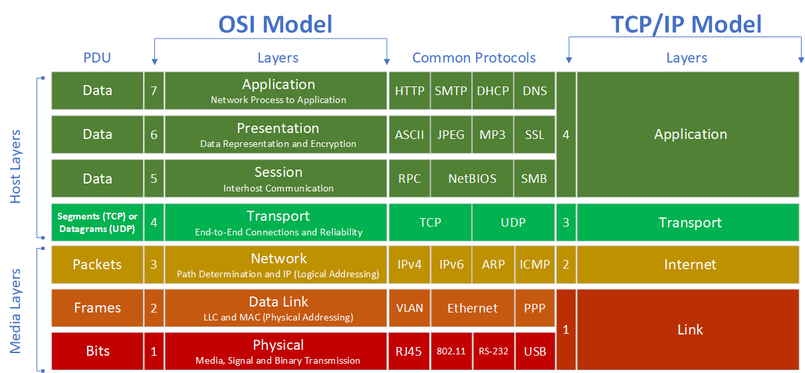
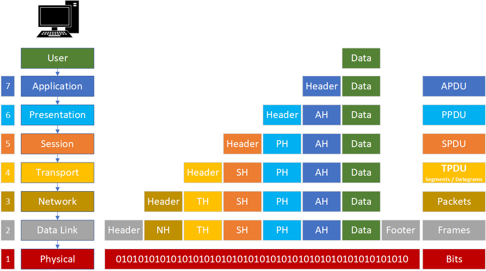
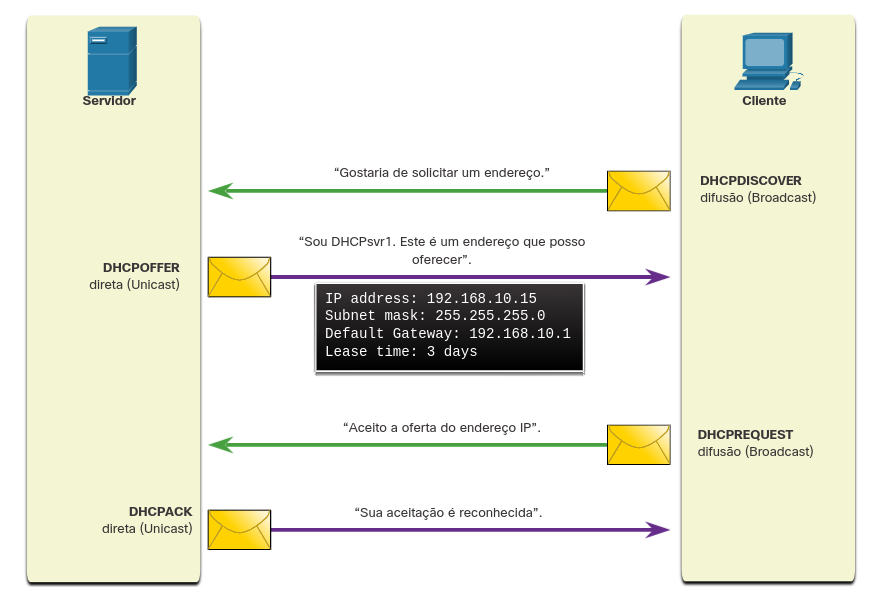
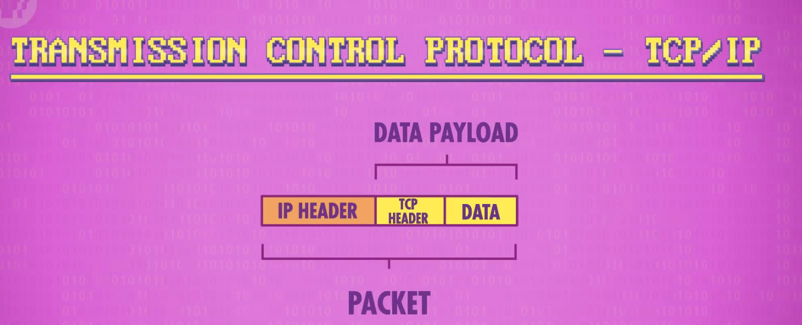
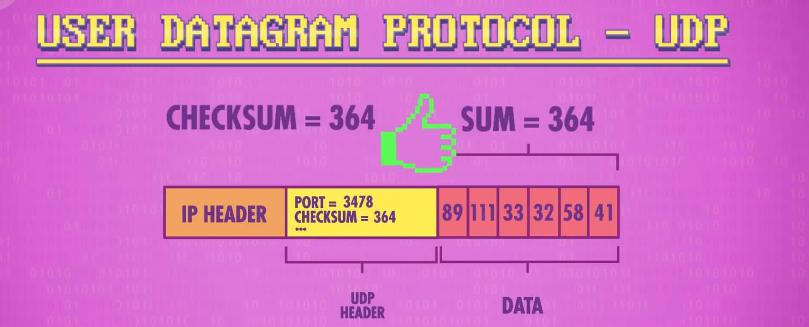
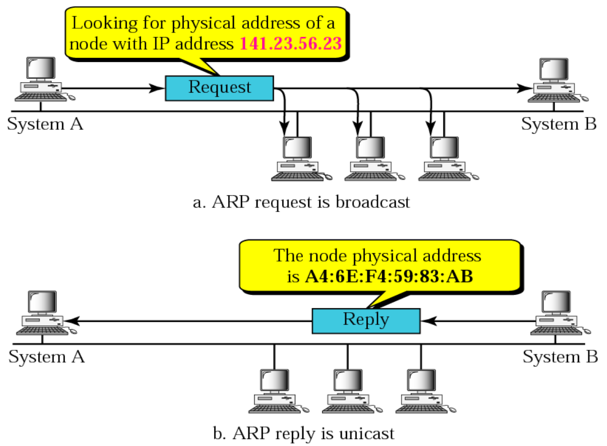

# Redes

## Conceitos Básicos

* Comunicação de dados é troca de informação entre dois dispositivos através de um meio de comunicação

**Sistema básico de Comunicação**

* Transmissor
* _Mensagem:_ Informação; texto, números, imagem, audio, video etc
* _Protocolo:_ Conjunto de regras que governa a comunicação; acordo entre dispositivos
* _Meio:_ Caminho físico
* Receptor

**Linhas de Comunicação:** Ponto a ponto, Multiponto (cliente/servidor)

**Métodos de Transmissão de Dados**

* Simplex (unidirecional)
* Half-duplex (bidirecional alternado)
* Full-duplex (bidirecional simultânea)

**Tolerância a falhas:** Limitar o número de dispositivos afetados durante uma falha; recuperação rápida; load balancer

* _Redundância:_ Vários caminhos para um destino; se um caminho falhar, as mensagens serão instantaneamente enviadas por um link diferente
* _Comutação de Pacotes:_ Divide dados do tráfego em pacotes; cada pacote tem as informações do endereço de origem e destino da mensagem

**Qualidade de serviço (QoS):** Classifica o tráfego em categorias (voz, vídeo, dados críticos) e atribui prioridades; chamadas VoIP recebem maior prioridade; faz gerenciamento de largura de banca, aloca recursos conforme necessidades; controle de latência

***

## Estrutura de Redes

* **Servidores:** Se conectam diretamente a internet; armazenam e fornecem conteúdos requisitados por clientes
* **ISP (Internet Service Provider):** Conectam os clientes aos servidores; fornecem conexão de cabos

> Internet ➡ Infraestrutura\
> Web ➡ Serviço construído sobre a infraestrutura

**Meios de Transmissão de dados**

➡ _Cabeamento de Cobre_ (pulsos elétricos)

* Interconexão de dispositivos de LAN (switches, roteadores e access points)
* Cabo coaxial
* Cabo par-trançado
  * UTP - não blindado
  * STP - blindado

➡ _Fibra óptica_ (pulsos de luz)

* Transmite dados por longas distâncias e a larguras de banda mais altas
* Monomodo (SMF)
* Multiumodo (MMF)

➡ _Wireless_ (frequências de ondas eletromagnéticas)

* Conexão de dispositivos sem fio em uma LAN
* Wi-Fi
* Bluetooth
* WiMAX
* Zigbee (IoT)

**Representações**

* _Placa de interface de rede (NIC):_ Conecta fisicamente ou virtualmente o dispositivo final à rede (wi-fi também é NIC)
* _Porta física:_ Conector ou tomada em um dispositivo de rede onde a mídia se conecta a um dispositivo final ou outro dispositivo de rede
* _Interface:_ Portas especializadas em um dispositivo de rede que se conectam a redes individuais

**Largura de Banda (Bandwidth)**

* Não é a velocidade em que os dados trafegam na rede
* Mas sim a medida da _quantidade de dados_ que é transferida em 1s
* Medido em bits por segundo (bps)
* _Latência:_ Qnt tempo (incluindo atrasos) para dados viajarem de um ponto a outro
* _Rendimento:_ Medida da transferência de bits através de um meio físico durante um tempo _x_
* _Goodput:_ Medida de dados úteis transferidos por um tempo _x_

> $$\text{Goodput = Throughput} - \text{sobrecarga de tráfego}$$

**Taxa de Transferência (Throughput)**

* Quantidade _real de dados úteis transmitidos_ por um meio em um período, considerando perdas e overheads
* Sempre menor ou igual à largura de banda

***

## Classificação de Redes

### Topologia

> Não existe _necessariamente_ ligação entre topologia física e lógica

**Topologia Física** ➡ Como uma rede se comunica com diversos dispositivos

* _Barramento / Bus:_ Compartilham mesmo cabo; dificuldade para expansões; ao desconectar qualquer cabo, rede inteira fica inoperante; estrutura barata, antiga e não mais utilizada
* _Ring:_ Semelhante ao barramento, porém em formato circular; cada nó da rede atua como um "buster" reforçando o sinal e mantendo a direção do fluxo; se um nó falhar a rede a partir dele fica inoperante
* _Star:_ Cada nó conectado a um elemento central (hub ou switch); de fácil implantação e expansão; a rede só fica inoperante se o equipamento central falhar
* _Malha / Mesh:_ Cada nó coopera com toda rede, se conectando diretamente com outros nós e criando uma "malha" complexa; redundância entre nós conectados ao original
  * Raramente utilizados em LANs pela complexidade da implementação
  * A Internet (WAN) é um exemplo de rede mesh, porém de roteadores

**Topologia Lógica** ➡ Como dados são transmitidos através da rede

* _Arcnet:_ Token ring lógico; utilizada na 1ª era de microcomputadores nos anos 80, não mais utilizada; transmissão de 2,5 Mbps
* _Token Ring:_ Desenvolvida pela IBM; apenas uma máquina pode enviar pacotes (token) de cada vez; eficiente com grande volumes de dados; custo elevado; transmissão de 16 Mbps
* _Ethernet:_ Consórcio entre a DEC, Intel e Xerox; topologias físicas de estrela ou barramento; atualmente adotada por toda a Internet

***

## Abrangência

***

## Dispositivos de Rede

**Host:** Qualquer dispositivo que envia ou recebe tráfego; identificado por um endereço IP

* _Clientes:_ Inicia requisições
* _Servidores:_ Responde requisições

> Definição de cliente e servidor depende da comunicação em que ocorre
>
> * Servidor web tem papel de servidor para requisições feitas por um browser cliente
> * O mesmo servidor web, ao atualizar seus arquivos fazendo uma requisição a um servidor de arquivos, atua como cliente nesta comunicação

**Elementos de Interconexão**

> Hubs e Switches são utilizados dentro de LANs. Para troca de dados fora da própria rede, é necessário a leitura de endereços IP, que é feita pelo Roteador.

**Repetidor / Hub**

* Cria conexão entre dispositivos em uma rede interna
* Dispositivo não inteligente, não diferencia conexões nas portas; repete pacotes para todos os hosts conectados (broadcast)
* Os dispositivos ligados através de um repetidor se encontram em um mesmo domínio de colisão e de broadcast
* Frames podem ser enviados por uma longa distância
* Soluciona problemas causados pela distorção dos sinais (ruído, atenuação e eco)
* Um repetidor introduz sempre um retardo na rede ➡ O número de repetidores em uma rede é limitado, no máximo 2
* Em redes com topologia em barramento deve-se evitar caminhos fechados, pois os sinais podem ser retransmitidos infinitamente

**Switch**

* Cria conexão entre dispositivos em uma rede interna
* Atribui endereço MAC de cada host a uma porta e armazena em uma tabela
* Segmentação da rede ➡ Divide um domínio de colisão em dois ou mais domínios menores
  * Cada porta do switch corresponde a um domínio de colisão diferente
* Velocidade interna bastante elevada
* Suporte a diversos tipos de interfaces
* Realiza comutação de quadros
* Implementação por software e hardware

**Roteador**

* Conecta duas ou mais LAN’s
* Gerencia o tráfego de uma rede local e controla o acesso aos seus dados, de acordo com administrador da rede
* Pode ser uma máquina dedicada (equipamento de rede específico) ou pode um software instalado em um computador
* Implementado no nível de rede
* Retransmite pacotes entre várias redes (contém switch interno)
* Filtragem e retransmissão baseada em endereço de rede (ex: IP)
* Utiliza protocolo de roteamento para construir a tabela de roteamento
* Fundamental para conexões WAN
* Permite interligar redes com diferentes tecnologias
* Divide um domínio de broadcast em dois ou mais domínios de broadcast menores

**Access Point**

* Hub sem fio (wireless)
* Repete sinal do Roteador para dispositivos sem fio

***

## Modelos de Referência

* Modelos de referência para delegar responsabilidades as camadas da comunicação de redes
* Comunicação ocorre nas duas direções das camadas
  * Para baixo ➡ Encapsulamento
  * Para cima ➡ Desencapsulamento
* Internet utiliza pilha de protocolos mista
* **Pilha de Protocolos da Internet** ➡ Modelo OSI + Modelo TCP/IP

> **PDU** ➡ Protocol Data Unit

<figure><figcaption></figcaption></figure>

### Modelo OSI

> Open Systems Interconnection

* Desenvolvido pela International Organization for Standardization (ISO) no final da década de 1970
* Padronização para os protocolos de rede
* Cada camada é responsável por um protocolo específico

**Encapsulamento:** Cada camada recebe as informações da camada imediatamente superior, acrescenta informações pelas quais é responsável, e passa para a camada inferior

### Modelo TCP/IP

* Conjunto de padrões de redes que permitem interconexão de redes e sistemas heterogêneos
  * Redes físicas com diferentes tecnologias de acesso
* Divide e organiza os problemas de comunicação em camadas hierárquicas
* Cada camada é responsável por uma função específica e usa as funções oferecidas pelas camadas inferiores
* **Arquitetura de Rede:** Combinação dos diversos protocolos nas várias camadas

***

## Camada de Aplicação

**Sockets:** Porta de saída das aplicações

### Arquiteturas de Aplicação

**Cliente/Servidor**

* Apresenta hierarquia, servidor comanda
  * Não há comunicação entre clientes
* Mais rápido e mais seguro ➡ GPO
* _Cliente:_ Qualquer computador conectado a uma rede que possuem um endereço IP
* _Servidor:_ Computadores com software para fornecer informações requisitadas pelos clientes e hardware específico para suportar muitas requisições

**Peer to Peer (P2P)**

* Não há hierarquia, qualquer computador conectado na rede pode ser cliente e servidor
  * Um computador pode se comunicar com qualquer outro computador na rede
* Fácil implementação; menor custo
* Menos segura; não escalável

### Protocolos

#### DNS

> Domain Name System

* Serviço automatizado que traduz nomes de domínios em endereços de rede numérico (IPv4 ou IPv6)
* Inclui formato para consultas, respostas e dados e usa os registros de recursos (RR) para identificar o tipo de resposta DNS
* Comunicações utilizam formato único chamado mensagem, utilizado para todos os tipos de consultas de cliente, respostas de servidor, mensagens de erro e transferência de informações entre servidores

> Primeiramente o servidor DNS procura em seus próprios registros Se não puder resolver, entra em contato com outros servidores

**Hierarquia DNS**

**URL (Uniform Resource Locator)**

* Endereço de recurso único na Web
* _scheme_ > protocolo
* _authority_
  * domain name > servidor requisitado
  * port
* _porta para o arquivo_
* _parâmetros_
* _âncora_ > área específica da página

**HTTP / HTTPS**

> Hypertext Transfer Protocol\
> Secure Hypertext Transfer Protocol

* Protocolo para visualização de páginas web
* Ao buscar uma URL em um navegador, este estabelece uma conexão com o serviço Web utilizando o protocolo HTTP
* HTTP utiliza texto puro na transferência de dados; método inseguro
* HTTPS adiciona a camada de segurança com o protocolo SSL (Segure Sockets Layer)
  * SSL utiliza chave pública para criptografar dados na comunicação
  * Cliente requisita certificado SSL ao servidor para validar identidade autenticidade do website
* HTTPS também utiliza o protocolo TLS (Transport Layer Security), sucessor do SSL
  * Autentica servidor, cliente e criptografa dados

_HTTP/2_

* Nova versão do HTTP, mais rápida
* A forma como os dados são enviados é diferente, em formato binário, headers comprimidos e múltiplas requisições podem ser enviadas na mesma conexão
* Métodos, códigos de status, corpo de requisição/resposta e headers mantém o mesmo; muda apenas o host header
* Muitos softwares (CDNs, ngix) permitem clientes conectarem com HTTP/2 mesmo se o servidor só suportar HTTP/1.1

**Request / Response**

* GET ➡ Requisição do cliente para obter dados
* POST ➡ Requisição para enviar arquivos de dados para o servidor como formulários de dados
* PUT ➡ Carrega recursos ou conteúdos para o servidor

#### FTP

> File Transfer Protocol

* Protocolo para transferência de arquivos
* Primeiro o cliente estabelece uma conexão para controle de tráfego, utilizando a porta TCP 21
* Depois o cliente estabelece uma segunda conexão para transferência de dados, utilizando a porta TCP 20; conexão criada toda vez que houver dados a serem transferidos
* Transferência de dados pode acontecer em ambas direções; download de dados do servidor ou upload de dados para o servidor

#### Protocolos de E-mail

**SMTP (Simple Mail Transfer Protocol)**

* Protocolo utilizado para envio de email
* Exige cabeçalho de mensagem, com o endereço de email do destinatário, e um corpo, contendo a mensagem
* Cliente utiliza protocolos POP e IMAP para _recuperação_ de emails do servidor -> Envia requisição para conexão TCP com servidor

**POP (Post-Office Protocol)**

* Mensagens de email são baixadas para o cliente e removidas do servidor
* Não há local centralizado para manter os emails

**IMAP (Internet Message Transfer Protocol)**

* Mensagens originais são mantidas no servidor até que sejam excluídas manualmente
* Cliente de email exibe cópias de mensagens
* Usuários podem criar hierarquia de arquivos para organização que é duplicada entre servidor e cliente de email
* Quando usuário exclui mensagem, o servidor sincroniza a ação e exclui no servidor

#### DHCP

> Dynamic Host Configuration Protocol

* Servidor que fornece dinamicamente informações de configuração de IPv4 aos clientes
* Também atribui uma máscara de sub-rede, um gateway padrão e um servidor DNS
* Host envia broadcast na rede para requisitar um endereço IP
* Possui um escopo com o intervalo de endereços IP que pode alocar (emprestar)
  * Cada IP tem um tempo limitado para pertencer a um host
  * Ao final do tempo limite, o host solicita renovação do endereço IP, confirmando que ainda esta em uso
    * Caso não solicite a renovação, o endereço IP fica disponível novamente no _pool_ do servidor DHCP
  * Assegura que o servidor DHCP não fique sem endereços IP

**Operação / Negociação**

* Host ➡ Broadcast com DHCP DISCOVER
* Servidor ➡ Resposta com DHCP OFFER
* Host ➡ Resposta com DHCP REQUEST
* Servidor ➡ Confirmação com DHCP PACK

#### SMB / SAMBA

> Server Message Block

* Protocolos para compartilhamento de arquivos e impressoras
* SAMBA é a versão do protocolo para sistemas UNIX/LINUX
* Descreve estrutura de recursos de rede compartilhados (diretórios, arquivos, impressoras e portas seriais)
* Protocolo Requisição/Resposta
* Diferente do FTP, clientes estabelecem conexão de longo prazo com os servidores
* Após conexão, cliente pode acessar recursos no servidor como se fosse local

***

## Camada de Transporte

### TCP

### UDP

* Usado por DNS, DHCP, TFTP, NFS e SNMP
* Protocolo de camada de transporte não orientado à conexão, sobrecarga muito mais baixa que o TCP
* Usado com aplicações em tempo real, como streaming de mídia ou VoIP
* Usado para situações onde não é necessário uma confirmação do recebimento do pacote
* Especifica porta para programa que deve receber o pacote
* Checksum = parte do cabeçalho que verifica se dados estão corrompidos ou não, a partir da soma dos bits

> IP leva o pacote até o computador certo, mas UDP leva o pacote até o programa correto naquele computador

***

## Camada de Rede / Internet

* Fornece serviços para permitir que dispositivos finais troquem dados

### Protocolos

#### IP

> Internet Protocol

* Fornece funções necessárias para entregar um pacote de um host de origem a um host de destino por meio de interconexão de redes
* Endereço IP é determinado pelo protocolo da Camada de Rede -> Visa facilitar o roteamento
* Para enviar e receber dados através da rede, é necessário ambos os endereços **IP** e **MAC**
* Embora os pacotes IP sejam enviados com informações sobre o local da entrega, eles não contêm informações para confirmar a entrega ao remetente
* Independente de Mídia (meio físico)

#### ARP

> Address Resolution Protocol

* Solicitações ARP são utilizadas para determinar o endereço MAC de um host a partir de um endereço IP (dispositivo correspondente envia resposta ARP)
* Todos os hosts na sub-rede recebem e processam solicitações ARP

> Qualquer cliente pode enviar uma resposta ARP não solicitada denominada "ARP gratuito". Outros hosts na sub-rede armazenam o endereço MAC e o endereço IP contidos no ARP gratuito em suas tabelas ARP

#### ICMP

> Internet Control Message Protocol

* Desenvolvido para transportar mensagens de diagnóstico e relatar condições de erro quando rotas, hosts e portas não estão disponíveis

***

## Camada de Enlace de Dados

* Prepara os dados da rede para a rede física
* Responsável pelas comunicações NIC para NIC dentro da mesma rede
* Nó ➡ Dispositivo que pode receber, criar, armazenar ou encaminhar dados por um caminho de comunicação; pode ser um dispositivo final ou intermediário
* Endereços Físicos

> Os endereços físicos não indicam em qual rede o dispositivo está localizado. Um dispositivo ainda funcionará com o mesmo endereço físico da Camada 2, mesmo que se mova para outra rede ou sub-rede.
>
> Endereços de Camada 2 são usados apenas para conectar dispositivos dentro da mesma mídia compartilhada, na mesma rede IP.

**Padrões IEEE 802 LAN/MAN:** Específicos para LANs Ethernet, WLANs, WPAN e outros tipos de redes locais e metropolitanas;

➡ Subcamadas do Padrão IEEE 802:

* **Logical Link Control (LLC):** Comunica entre o software de rede nas camadas superiores e o hardware do dispositivo nas camadas inferiores; identifica qual protocolo de camada de rede está sendo usado para o quadro
  * permite que vários protocolos como IPv4 e IPv6 usem a mesma interface de rede e mídia
* **Controle de Acesso a Mídia (MAC):** Implementa a subcamada (IEEE 802.3, 802.11 ou 802.15) no hardware; responsável pelo encapsulamento de dados e controle de acesso à mídia; fornece endereçamento de camada de link de dados e é integrado com tecnologias de camada física

***

