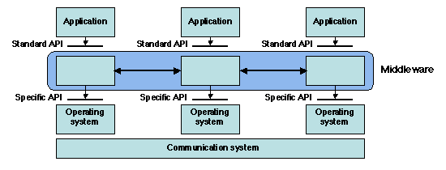
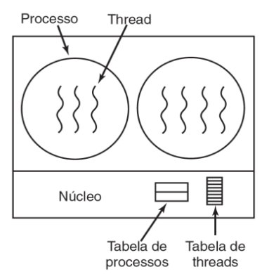

# Sistemas Distribuídos

* Coleção de _computadores independentes_ conectados por uma rede e equipados com um software distribuído
* Ao usuário dão a impressão de um sistema único
* Um único sistema _middleware_

**Características**

* Compartilhamento de recursos
* Concorrência de processos ➡ Acesso concorrente e recursos compartilhados requer _sincronização_
* Heterogeneidade ➡ Implementação de diferentes desenvolvedores; middleware para suportar heterogeneidade e oferecer sistema único

### Objetivos

* **Acesso** ➡ Ligação entre usuários e recursos
* **Transparência** ➡ Oculta o funcionamento real para o usuário, aparenta ser um único sistema
* **Flexibilidade / Extensibilidade** ➡ Adicionar novos componentes deixar aparente para o usuário
* **Escalabilidade** ➡ Capacidade do sistema em lidar facilmente com uma quantidade crescente de trabalho
  * **Medição da escalabilidade:** Tamanho (nº de processos/usuários), Geográfica (distância max entre nós) e Administrativa (nº de domínios administrativos)

**Gargalos em SD:** Serviços Centralizados, Dados Centralizados e Algoritmos

## Middleware

* Software que conecta programas separados
* Conjunto de serviços que permite a interação via rede de múltiplos processos em 1/+ máquinas
* Fica entre aplicação e SO
* Pode estar em organizações diferentes
* Processos em execução da App A se comunicam com os processos da App B

**Vantagens**

* Interface (API) padrão e provê serviços comuns de troca de mensagens entre componentes do sistema, reduz complexidade p/ camadas de baixo nível (interface específica)
* Transparência de localização
* Cliente e servidor não precisam se conhecer diretamente
* Isolamento de componentes da aplicação

> **Computação distribuída X Computação paralela**\
> Distribuído ➡ fracamente acoplado Paralelo ➡ fortemente acoplada

## Tipos de Sistemas Distribuídos

**Computação em Cluster (Cluster Computing)**

* Homogênea
* Hardware ➡ Conjunto de PCs semelhantes
* Conexão entre hardware ➡ LAN
* Software ➡ Mesmo SO, geralmente único programa executado em paralelo
* Usado para computação paralela
* Fortemente acoplado entre os nós

**Computação em Grade (Grid Computing)**

* Heterogeneidade
* Hardware diferente
* Rede de pesquisa mundial para criar novos serviços de rede
* RNP faz parte

**Computação em Nuvem (Cloud Computing)**

* Uso de recurso de computação
* Igual ao consumo de eletricidade (serviço terceirizado)
* Alternativa a construir e manter infraestrutura de computação
* Empresas utilizam para backup

**Sistemas Distribuídos Pervasivos**

* Instabilidade é o comportamento esperado desses sistemas (instabilidade dos componentes)
* Dispositivos de computação moveis e embarcados
* Alimentação por bateria, mobilidade, conexão sem fio
* Ausência de controle administrativo, podem ser configurados pelos proprietários

### Sistemas de Informação Distribuídos

* Sistemas corporativos p/ integrar aplicações prezando a interoperabilidade
* Sistemas de processamento de Transações

#### Processamento de Transações

**Primitivas especiais:** BEGIN\_TRANSACTION, END\_TRANSACTION, ABORT\_TRANSACTION, READ, WRITE

**Transações ACID**

* Atômicas ➡ Indivisível
* Consistentes ➡ Dados válidos antes e depois da transação de transferência
* Isoladas ➡ Transações concorrentes não interferem uma com as outras
* Duráveis ➡ Alterações são permanentes após transação finalizada

**Transação aninhada:** Transação com subtransações (ex. pix de um banco para outro banco, duas bases de dados diferentes)

* _Monitor de processamento de transação (TP)_ ➡ Permite que app acesse vários servidores e BDs oferecendo um modelo transacional, monitora efetivação das transações e retorna para app cliente
* _Características_ ➡ Interfaces bem definidas e totalmente disponíveis (públicas); IDL (Linguagem de Definição de Interface) - nomes das funções, tipos de parâmetros, valores de retorno e possíveis execuções
  * IDL ➡ linguagem de definição, não de programação, utilizada para definir interfaces

**Integração de Aplicações Corporativas**

* Necessidade das aplicações se comunicarem
* Middleware de comunicação ➡ RPC, RMI, MOM
  * Reusabilidade
  * Cliente não sabe de detalhes da implementação

***

## Estilos Arquitetônicos

* Um estilo arquitetônico é determinado por:
  * Componentes ➡ Unidade modular com interfaces bem definidas; substituível dentro do ambiente
  * Conexões
  * Dados intercambiados
  * Formas de configuração

**Arquitetura em Camadas**

* Componentes organizados em camadas
* Componente da camada N tem permissão para chamar componentes da camada N-1
* Exemplo: camadas de redes TCP/IP

**Arquitetura baseadas em Objetos**

* Objetos são componentes ➡ pode ser um objeto, procedimento, função, ou até 4/5 linhas de código assembly
* Objetos são conectados a outros por chamada remota de métodos
* Utilizada em sistemas cliente-servidor

**Arquitetura centradas em Dados**

* Componentes de comunicam através de um repositório comum (como uma "caixa postal" fracamente acoplada)
* Utilizado em sistemas pervasivos

**Arquitetura baseadas em Eventos**

* Sistema publish-subscribe
* Componentes publicam eventos e somente os que se subscreveram recebem estes eventos
* Fracamente acoplados -➡ não invocam explicitamente um ao outro (ex. Apache Kafka)

***

## Arquiteturas de Sistemas

### Arquiteturas Centralizadas

➡ Netflix, site de notícias, online bank, etc

**Modelo Cliente-Servidor**

* Papéis bem definidos de servidor e cliente
* Processos são divididos em 2 grupos
  * Servidor ➡ Implementa um serviço especifico
  * Cliente ➡ Requisita um serviço ao servidor
* Forma de interação ➡ Request-response

**Arquitetura centralizada com camadas de aplicação**\
Considerando muitas aplicações e a sua escalabilidade, modelo cliente-servidor pode ser dividido em 3 camadas:

* Nível de Interface de usuário
* Nível de processamento
* Nível de dados

**Arquitetura centralizada com arquiteturas multidivididas**\
Gerenciamento de sistema:

* Clientes gordos (fat clients)
* Clientes magros (thin clients)

Distinção clara:

* Arquitetura de duas divisões
* (cliente e servidor)

Arquitetura de três divisões -➡ Recebe e faz a requisição

1. Cliente
2. Servidor
3. Servidor que pode agir como cliente

> Servidor de aplicação se destina apenas a processar requisições, os dados são manipulados na Base de Dados

### Arquiteturas Descentralizadas

➡ Sistemas Peer-to-Peer (P2P), como o Chord

* Possuem 2 distribuições

**Distribuição Vertical**

* Componentes logicamente diferentes em máquinas diferentes
* Cada máquina executa um conjunto específico e pré-determinado de funções
* Papéis bem definidos

**Distribuição Horizontal**

* Cliente ou servidor pode ser fisicamente subdividido em partes logicamente equivalentes
* Pode possuir porção própria de dados (dividir tarefas)
* Balanceamento de carga
* Papéis não muito bem definidos

#### Peer-to-Peer (P2P)

* Processos são todos iguais e flat
* Cada processo age ao mesmo tempo como cliente e servidor (servente = servidor + cliente)
* Cliente que inicia a requisição
* Arquiteturas estruturadas e não-estruturadas

> **Rede de Sobreposição** ➡ Rede onde nós são formados pelos processos e os enlaces denotam os canais de comunicação

**Estruturada**

* Rede de sobreposição é construída usando mecanismo determinístico e “estruturado”
* Mecanismo usado comumente: DHT (Distribuited Hash Table)
* Dados e nós recebem uma chave aleatória (128-160 bits)
* Requisição é roteada entre os nós até alcançar o nó com o dado solicitado

> Chord ➡ Implementação de um DHT para redes P2P ➡ Nós logicamente organizados em anel ➡ Cada nó recebe identificador aleatório

**Não-estruturada**

* Algoritmos aleatórios são usados na construção da rede de sobreposição
* Cada nó mantém uma lista de nós vizinhos (não tem uma visão global da rede)
* Dados são também armazenados aleatoriamente
* Busca da dados ➡ Inunda toda a rede; tempestade de broadcast; não é uma rede que possui bom desempenho

**Superpares**

* Nós "diretórios" e/ou intermediários
* A medida que a rede cresce, localizar itens de dados em sistemas P2P não estruturados pode ser problemático
* Sempre que um nó comum se junta a rede, se liga a um dos superpares
* Problema: Seleção do líder
* Superpar cuida de um conjunto de nós e distribui as requisições
  * Atua como um GATEWAY

### Arquiteturas Híbridas

* Soluções de cliente-servidor (centralizadas) combinadas com a funcionamento da arquitetura descentralizada
* Híbrida = centralizada + descentralizada
  * Centralizada = Utilização de DNS
  * Descentralizada = Distribuição de conteúdo. Ex.: Skype, BitTorrent, WhatsApp

**Sistemas distribuídos colaborativos**

1. Esquema de procura pelo cliente-servidor tradicional
2. Nó junta-se para dar um mecanismo descentralizado de colaboração

**Interceptadores**

* Solução para reconfigurar a necessidade da aplicação
* Construção de software que interrompe fluxo de controle usual de execução
* Em uma chamada desvia para outra chamada
* Em tempo de execução

***

## Processos e Threads

**Processo**

* Programa em execução
* Normalmente são independentes
* Espaços de endereçamento separados
* Interage com outros processos por meio de IPC (Inter Process Communication) ➡ Mecanismo de comunicação entre os processos

**Thread**

* São linhas (thread) de execução dentro de um único processo (subconjunto de processos)
* Compartilham o mesmo espaço de endereçamento e alguns dados da tabela de processos

➡ Servidor de arquivos com **um único fluxo** faz requisição do disco e espera resultado ➡ O mesmo servidor com múltiplos fluxos (**multithreading**) pode atender a solicitações de outros usuários ➡ Aumento do **throughtput** (taxa de transferência) e do desempenho

**Time Line:** Threads dentro de um processo não ocorrem ao mesmo tempo mas sim concomitantemente (concorrente)

**Multithreading:** Execução em massa de várias threads em um mesmo processo (introduzida pela Intel no processador Xeon em 2002)

**Threads em nível de usuário**

* Apesar da versatilidade e velocidade, há desvantagens
* Chamada bloqueante pode bloquear todo o processo e não apenas a thread em questão
* Maioria dos processos que usam threads fazem pela I/O bound (bloqueio do sistema sempre que fizer I/O)

**Threads em nível de kernel:** Cuida da criação e escalonamento das threads de todos os processos

