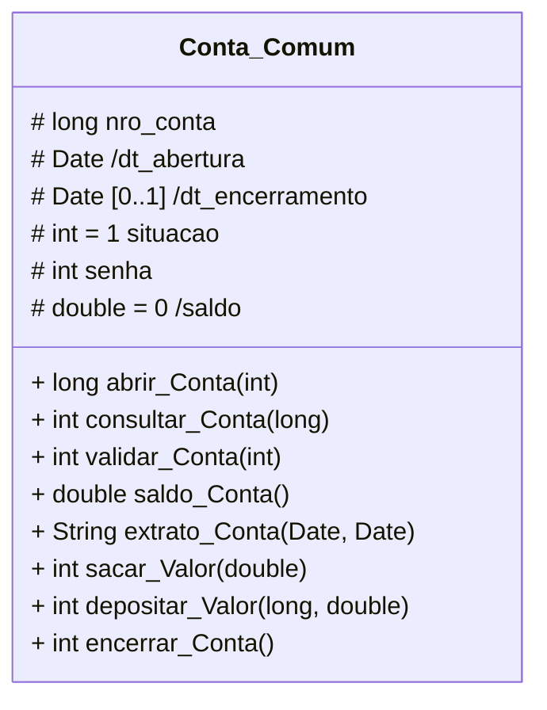

**Links Úteis**  
-  [Visual Paradigm  |  Editor de Diagramas Online](https://online.visual-paradigm.com/drive/#diagramlist:proj=0&dashboard)  
- [Draw.io  |  Editor de Diagramas Online](https://www.drawio.com)  
- [nomnoml  |  Editor Diagramas UML via texto](https://nomnoml.com)  

---

# Modelagem de Software

> *Modelo* ➡ Simplificação da realidade  

**Importância:** parte central de todas as atividades que levam a implantação de um bom software  
- Comunicar a estrutura e o comportamento desejados do sistema
- Visualizar e controlar a arquitetura do sistema
- Compreender melhor o sistema que estamos elaborando, muitas vezes expondo oportunidades de simplificação e reaproveitamento
- Construirmos modelos para gerenciar riscos

# Diagramas UML

- Unified Modeling Language
- Visualização de forma *padronizada* o projeto de um sistema
- Visualização das classes (métodos e atributos) que irão compor o sistema; relacionamento entre classes  
- Utilização na fase de *análise do projeto*

## Estrutural

- **Estática (estrutural):** Objetos, operações, relações e atributos  

### Diagrama de Classes

**Classes:** Blocos de construção mais importantes de sistemas orientado a objetos; abstração de um conjunto de objetos que possuem os mesmos tipos de características e comportamentos  
**Objetos:** Qualquer coisa que possua características e comportamentos
- *Diagrama de Objetos:* Mostra um conjunto de objetos e seus relacionamentos em um ponto do tempo; cobre conjunto de instâncias dos itens encontrados dos diagramas de classe (ex, `OBJ:Classe`, `:Classe`,`Objeto`)

**Representação Gráfica da Classe**  
- *Nome:* Nome simples, qualificando-a; substantivos com o 1º caractere maiúsculo
- *Atributos:* Propriedade nomeada de uma classe que descreve um intervalo de valores que a instância (objeto) pode apresentar; nome é dado por um substantivo (ex. `suporteDeCarga`)
- *Operações:* Comportamentos; implementação de um serviço que pode ser solicitado por algum objeto da classe para modificar o comportamento (ex. `adicionar()`, `esta_vazio()`)

**Visibilidade (modificadores de acesso)**  

- *(-) Privado:* Somente a classe pode ver o valor do atributo  
- *(+) Público:* Qualquer classe pode ver o valor do atributo  
- *(#) Protegido:* Somente a própria classe ou suas filhas por herança podem ver o valor
- *(~) Pacote:* Somente classes do mesmo pacote podem ver o valor do atributo

> `/` antes dos atributos significa que os valores sofrem algum tipo de cálculo  

**Relacionamentos**  

  

- *Dependência:* Dependência fraca; ilustra que uma classe usa informações e serviços de outra classe em algum momento; pode existir sem a outra classe, porém, depende desta para seu funcionamento  
	- Carro depende da Roda  
- *Associação:* Existe independente da outra classe; indica que a classe mantém referência a outra classe ao longo do tempo; podem conectar mais de duas classes
	- Pessoa assina Revista  
- *Associação Ternária:* Conecta objetos de três (ou mais) classes; losango indica ponto de convergência (conexão)
	- Professor leciona para Turma, Turma possui um professor, Professor/Turma utiliza Sala
- *Agregação:* Indica que uma classe é um contêiner/coleção de outras classes; classes contidas não dependem do contêiner 
	- Departamento possui Gerente(s)
- *Composição:* Variação específica da agregação; indica dependência forte entre classes, se o contêiner é destruído, seu conteúdo também
	- Cidade faz parte do Estado  
- *Herança:* Subclasse herda propriedades (atributos e métodos) da superclasse  
	- *Generalização/Especialização:* Relacionamento entre itens gerais (superclasses / classe-mãe) e mais específicos (subclasses / classe-filha)
		- Peixe é um tipo de Animal 
- *Classe Associativa:* Quando ocorrem associações com multiplicidade muitos ( * ) em todas as extremidades; atributos de associação que não podem ser armazenados em nenhuma das classes envolvidas

  

**Multiplicidade**

`[0..1] - máx 1` ➡ Obj da classe associada não precisam necessariamente estar relacionados  
`[1..1] - 1 e somente 1` ➡ Apenas um obj da classe se relacionada com os objetos da outra classe  
`[0..*] - muitos` ➡ Podem haver muitos obj de classe envolvidos no relacionamento  
`[1..*]- 1 ou muitos` ➡ Pelo menos um obj envolvido no relacionamento
`[3..5]` ➡ Valores específicos

### Diagrama de Implantação

- Configuração e arquitetura de um sistema em que estarão ligados seus componentes
- **Características:** Estrutura da plataforma em que o sistema será executado; pode representar qualquer dispositivo (gerenciador de BD, servidores, computadores, etc)  

### Diagrama de Pacotes

- Subsistemas ou submódulos englobados por um sistema de forma a determinar as partes que o compõem
- **Dependência:** Pacotes normalmente possuem dependências entre si

## Comportamental

- **Dinâmica (comportamental):** Relação entre objetos e mudanças em seus estados internos  

### Diagrama de Casos de Uso

- Utilizado para captar o *comportamento pretendido* de um sistema, sem especificar como esse comportamento é implementado
- Finalidades:
1. **Definir escopo:** Funcionalidades
2. **Identificar papéis:** Quem interage com o sistema e com quais funcionalidades

  

  

**Exemplo**  

  

### Diagrama de Sequência

- Ordem temporal da *troca de mensagens* entre elementos  
- Casos de Uso são refinados em um ou mais Diagramas de Sequência

**Elementos**  
- *Atores:* Usuários do sistema  
- *Objetos:* Participantes da interação; objetos que iniciam a interação a esquerda, objetos subordinados a direita  
- *Linha de vida (do objeto):* Período de tempo no qual o objeto existe  
- *Caixa de Ativação ou Foco de Controle:* Período no qual o objeto está participando ativamente de um processo  
- *Mensagens (e seus parâmetros):* Ocorrência de eventos; chamada de métodos  
	- Síncrona
	- Assíncrona
	- Auto-Mensagem
	- Resposta
	- Criação/Exclusão de Participante
	- Mensagem de Guarda (condicional)  

*Esteriótipos:* Representações permitem destacas componentes que têm função especial  
- `<<entity>>`: Armazena informações referentes ao problema em questão; torna explícito que a classe contém informações recebidas e armazenadas/geradas pelo sistema 
- `<<boundary>>`: Fronteira; interface; identifica uma classe que serve de comunicação entre atores externos e o sistema
- `<<control>>`: Identifica classes que fazem intermédio entre classes *boundary* e as demais classes; interpreta eventos ocorridos sobre estes objetos (movimento do mouse, pressionamento de botão)

  

  

### Diagrama de Atividades

- Representa graficamente o fluxo de controle de uma atividade para outra, com descrição de ações passo-a-passo em um sistema
- Especifica a transformação de entradas em saídas por meio de uma sequência controlada temporal de ações
- Semelhante a um fluxograma, porém com suporte a concorrência (paralelismo) e sincronismo de atividades
- Variação do diagrama de estados, que permite modelar comportamento baseado em fluxo

**Atividade:** É um processo de negócio, geralmente descreve a implementação de um caso de uso; uma *ação* é um passo individual dentro de uma atividade

**Elementos**  
- *Nó-Inicial:* Ponto de início da atividade modelada
- *Fluxo/arestas:* (Transição) Descreve a sequência na qual as atividades se realizam; conexões entre duas ações representada por uma seta
- *Decisão:* Um único fluxo de entrada e vários fluxos de saída
- *Intercalação:* Vários fluxos de entrada e uma única de saída
- *Divergência:* Ponto no qual duas ou mais tarefas podem se iniciar em paralelo
- *Convergência:* Ponto no qual duas ou mais tarefas paralelas se unem para dar início a uma nova tarefa única
- *Nó final da atividade:* Ponto onde termina atividade
- *Partições:* Mostra quem faz o que  
- *Sinais ou mensagens:* Envio ou recebimento de sinais ou mensagens por uma ação

 

### Diagrama de Máquina de Estado

- Diagrama comportamental para descrever como um sistema se comporta quando um evento ocorre, considerando todos os estados, transições e ações possíveis de um objeto
- Representa o estado ou situação na qual um objeto pode se encontrar ao longo da execução dos processos em um sistema
- Mostra como o elemento se comporta por meio de um cojunto de transições de estado (máquina de estado)
- Serve para modelar comportamento de interfaces, casos de uso, instâncias da classe e na modelagem de sistemas relativos

**Elementos**  
- *Estado(simples):* Condição ou situação na vida de um objeto que satisfaz alguma condição, realiza alguma atividade ou espera um evento
- *Estado inicial:* Determina o início da modelagem dos estados de um elemento
- *Estado final:* Indica o final dos estados modelados para o elemento
- *Estado composto:* Estado que possui sub-estados
- *Atividade:* É uma execução não atômica en andamento em uma máquina de estado
- *Evento:* É a especificação de uma ocorrência significativa que tem uma localização no tempo e no espaço
- *Transição:* É um relacionamento entre dois estados

