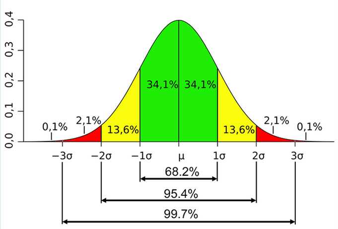
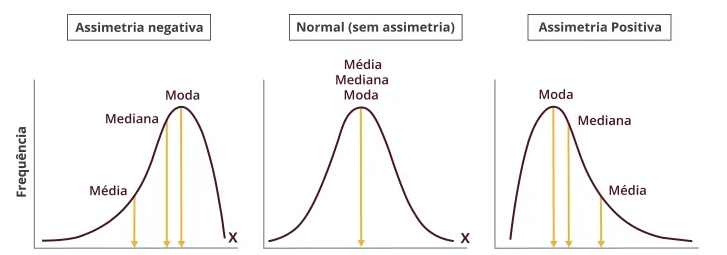
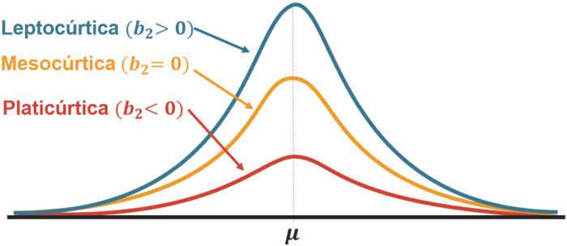

## Distribuição de Frequência

Número total de dados $$(n)$$\
Classe $$(i)$$\
Número total de classes $$(k)$$\
Limites de Classe

* $$(l_i)$$ inferior
* $$(L_i)$$ superior

**Determinar Número de Classes** $$(k)$$\
$$n \leq 50 \rightarrow \sqrt n$$\
$$n > 50 \rightarrow 1 + 3,322 * \log n$$

**Amplitude do Intervalo de Classe** $$(h_i)$$\
_arredondar p/ +_\
$$h_i = L_i-l_i$$

**Amplitude Total**$$(AT)$$\
_delta entre maior e menor valor da amostra_\
$$AT = L(max) - l(min)$$

**Amplitude Amostral** $$(AA)$$\
_delta entre maior e menor valor das classes_\
$$AT = x(max) - x(min)$$

**Ponto Médio** $$(x_i)$$\
$$\Large x_i = \frac{l_i+L_i}{2}$$

### Tipos de Frequência

**Frequência Simples/Absoluta** $$(f_i)$$\
$$\large \displaystyle\sum_{i=1} ^{k} f_i = n$$

$$k$$ - _último elemento a ser somado_\
$$i$$ - _primeiro elemento a ser somado_\
$$f_i$$ - _nome dos termos a serem somados_

**Frequência Relativa** $$(fr_i)(\%)$$\
$$\large fr_i = \frac{fi}{n}(·100)$$

**Frequência Acumulada** $$(Fac)$$\
$$Fac_k = f_1 + f_2 + f_3 + ... + f_k$$

**Frequência Acumulada Relativa** $$(Frac)(\%)$$\
$$\large Frac_i = \frac{Fac}{n}$$

***

## Medidas de Posição

### Média Aritmética $$(\bar x)$$

$$\Large \bar x = \frac{\sum x_i}{n}$$

* Desvio em relação a média $$(d_i)$$ $$\Large d_i = x_i - \bar x$$

#### Dados Agrupados

**a) Sem intervalo de classe**

$$\Large \bar x = \frac{\sum x_i f_i}{n}$$

Exemplo:

| $$x_i$$ | $$f_i$$         | $$x_i f_i$$     |
| ------- | --------------- | --------------- |
| 0       | 2               | 0               |
| 1       | 6               | 6               |
| 2       | 10              | 20              |
| 3       | 12              | 36              |
| 4       | 4               | 16              |
|         | $$\Sigma = 34$$ | $$\Sigma = 78$$ |

$$\bar x = \frac{78}{34} = 2,29 \rightarrow 2,3$$

**b) Com intervalo de classe**

* _Ponto Médio_\
  $$\Large x_i = \frac{l_i + L_i}{2}$$
* *Média*  
  $$\Large \bar x = \frac{\sum x_i f_i}{n}$$  

Exemplo:  
	
| $$i$$ | estaturas (cm)     | $$f_i$$         | $$x_i$$ | $$x_i f_i$$        |
| ----- | ------------------ | --------------- | ------- | ------------------ |
| 1     | 150 $$\vdash$$ 154 | 4               | 152     | 608                |
| 2     | 154 $$\vdash$$ 158 | 9               | 156     | 1.404              |
| 3     | 158 $$\vdash$$ 162 | 11              | 160     | 1.760              |
| 4     | 162 $$\vdash$$ 166 | 8               | 168     | 1.312              |
|       |                    | $$\Sigma = 32$$ |         | $$\Sigma = 5.084$$ |

$$\bar x = \frac{5.084}{33} = 158,87 cm$$

### Moda $$(Mo)$$

#### Dados Não Agrupados

7, 8, 9, **10, 10, 10**, 11, 12, 13, 15 → Amodal\
2, 3, **4, 4, 4**, 5, 6, **7, 7, 7**, 8, 9 → Bimodal

#### Dados Agrupados

**a) Sem intervalo de classe**\
_Mo = elemento que apresenta maior frequência_

Exemplo:

| $$x_i$$ | $$f_i$$         |
| ------- | --------------- |
| 0       | 2               |
| 1       | 6               |
| 2       | 10              |
| 3       | 12              |
| 4       | 4               |
|         | $$\Sigma = 34$$ |

$$Mo=3$$

**b) Com intervalo de classe**

$$\Large Mo = l_{mo} + (\frac{d_1}{d_1+d_2})· h_{mo}$$

> _Classe modal (mo)_ = classe de maior frequência
>
> > $$l{mo}$$ = limite inferior classe modal\
> > $$h{mo}$$ = amplitude da classe mo\
> > $$d_1 = f{mo} - f{ant}$$\
> > $$d_2 = f{mo} - f{pos}$$

Exemplo:

| $$i$$ | estaturas (cm)     | $$f_i$$         |
| ----- | ------------------ | --------------- |
| 1     | 150 $$\vdash$$ 154 | 4               |
| 2     | 154 $$\vdash$$ 158 | 9               |
| 3     | 158 $$\vdash$$ 162 | 11              |
| 4     | 162 $$\vdash$$ 166 | 8               |
|       |                    | $$\Sigma = 32$$ |

$$d_1 = 11 - 9 = 2$$\
$$d_2 = 11 - 8 = 3$$\
$$Mo = 158 + (\frac{2}{2+3})· 4$$\
$$Mo = 158 + 0,4 · 4$$\
$$Mo = 158 + 1,6$$\
$$Mo = 159,6cm$$

***

## Medidas Separatrizes

* Mediana
* Quartil
* Decil
* Percentil

Fórmula padrão para separatrizes:\
$$\Large l_\ast + [\frac{\frac{n}{\ast} - Fac_{ant}}{f_\ast}] · h_\ast$$

> $$l$$ = limite inferior da classe separatriz  
> $$Fac_{ant}$$ = Fac da classe anterior a classe separatriz  
> $$f$$ = frequência da classe separatriz  
> $$h$$ = amplitude da classe separatriz

### Mediana $$(Md)$$

#### Dados Não Agrupados

**a) Ímpar**\
$$\large \frac{n+1}{2} =$$ posição do termo

**b) Par**

1. $$\large \frac{n}{2}$$ e $$\large \frac{n+1}{2}$$
2. média $$\bar x$$ dos termos

#### Dados Agrupados

**a) Sem Intervalo de Classe**

* $$\Large PosM_d = Fac > \frac{n}{2}$$
* elemento $$x_i$$ de maior Fac

**b) Com Intervalo de Classe**

$$\Large PosM_d = Fac > \frac{n}{2}$$

$$\Large Md = l_{md} + [\frac{\frac{n}{2} - F_{ant}}{f_{md}}] · h_{md}$$

Exemplo:

| $$i$$ | estaturas (cm)     | $$f_i$$         | $$Fac$$ |
| ----- | ------------------ | --------------- | ------- |
| 1     | 150 $$\vdash$$ 154 | 4               | 4       |
| 2     | 154 $$\vdash$$ 158 | 9               | 13      |
| 3     | 158 $$\vdash$$ 162 | 11              | 24      |
| 4     | 162 $$\vdash$$ 166 | 8               | 32      |
|       |                    | $$\Sigma = 32$$ |         |

$$PosM_d = \frac{32}{2} = 16$$\
$$Fac_3 = 24 \rightarrow 24 >16$$

$$Md = 158 + \frac{16-13}{11} · 4$$\
$$Md = 158 + 0,2\bar7 · 4$$\
$$Md = 158 + 1,08 = 159,08 cm$$

### Quartil $$(Q_k)$$

* $$Q_1 = 25\%$$
* $$Q_2 = 50\% (Md)$$
* $$Q_3 = 75 \%$$

#### Dados Não Agrupados

$$\Large PosQ_k = \frac{k · n}{4}$$\
$$k = 1, 2, 3$$

#### Dados Agrupados

**a) Sem Intervalo de Classe**\
$$\Large PosQ_k = \frac{k · n}{4}$$

**b) Com Intervalo de Classe**\
$$\large PosQ_k = Fac > \frac{k · n}{4}$$

$$\Large Q_k = l_{qk} + [\frac{\frac{k · n}{4} - Fac_{ant}}{f_{qk}}] · h_{qk}$$

Exemplo:

| peso (kg)        | $$f_i$$          | $$Fac$$ |
| ---------------- | ---------------- | ------- |
| 0 $$\vdash$$ 5   | 52               | 52      |
| 5 $$\vdash$$ 10  | 36               | 88      |
| 10 $$\vdash$$ 15 | 30               | 118     |
| 15 $$\vdash$$ 20 | 41               | 159     |
| 20 $$\vdash$$ 25 | 25               | 184     |
| 25 $$\vdash$$ 30 | 28               | 212     |
| 30 $$\vdash$$ 35 | 18               | 230     |
|                  | $$\Sigma$$ = 230 |         |

$$PosQ_3 = Fac > \frac{3 · 230}{4} = 172,5$$

$$Q_3 = 20 + [\frac{172,5 - 159}{25}] · 5$$\
$$Q_3 = 20 + 0,54 · 5$$\
$$Q_3 = 20 + 2,7$$\
$$Q_3 = 22,7$$

### Percentil $$(P_k)$$

$$\Large PosP_k = \frac {k · n}{100}$$

$$\Large P_k = l_{pk} + [\frac{\frac{k · n}{100} - Fac_{ant}}{f_{pk}}] · h_{pk}$$

***

## Medidas de Dispersão ou Variabilidade

### Variância $$(s²)$$

* Nível de diversificação entre valores e sua média; desvio médio

#### Dados Não Agrupados

$$\Large s² = \frac{1}{n} · [{\Sigma x_i²} - \frac{(\Sigma x_i)²}{n}]$$

#### Dados Agrupados

$$\Large s² = \frac{1}{n} · [{\Sigma x_i²f_i} - \frac{(\Sigma x_i f_i)²}{n}]$$

> $$\Large \frac{1}{n-1}$$ para amostras

Exemplo:

| $$x_i$$ | $$f_i$$         | $$x_i f_i$$     | $$x_i f_i · xì$$ |
| ------- | --------------- | --------------- | ---------------- |
| 0       | 2               | 0               | 0                |
| 1       | 6               | 6               | 6                |
| 2       | 12              | 24              | 48               |
| 3       | 7               | 21              | 63               |
| 4       | 3               | 16              | 48               |
|         | $$\Sigma = 30$$ | $$\Sigma = 63$$ | $$\Sigma = 165$$ |

$$s² = \frac{1}{30} · [165 - \frac{63²}{30}]$$\
$$s² = 0,0\bar3 · [165 - 132,3]$$\
$$s² = 0,0\bar3 · 32,7$$\
$$s² = 1,09$$

### Desvio Padrão $$(S)$$

* Útil para compreender a dispersão dentro de um único conjunto de dados

$$\Large S = \sqrt s²$$

**Propriedades em Curvas Normais**

### Coeficiente de Variação $$(CV)$$

* Grau de concentração em torno da média; proporção do desvio padrão em relação à média
* Útil para comparar variabilidade entre diferentes conjuntos de dados ou entre diferentes momentos

$$\Large CV = \frac{S}{\bar x}$$ $$(· 100)$$

| CV (%)             | Dispersão |
| ------------------ | --------- |
| < 15               | baixa     |
| $$\geq$$ 15 e < 30 | média     |
| $$\geq$$ 30        | alta      |

***

## Medidas de Assimetria

#### Coeficiente de Assimetria de Pearson

* A medida que a distribuição deixa de ser simétrica, a média, moda e mediana vão se afastando, aumentando cada vez mais a diferença entre elas

$$\Large A_s = \frac{3 · (\bar x - Md)}{S}$$

* _Nulo -_ Curva simétrica
* _Positivo -_ Assimetria positiva
* _Negativo -_ Assimetria negativa

| As                         | Assimetria |
| -------------------------- | ---------- |
| < 0,15                     | fraca      |
| $$\geq$$ 0,15 e $$\leq$$ 1 | moderada   |
| > 1                        | forte      |

***

## Medidas de Curtose

* Grau de achatamento de uma distribuição em relação a uma distribuição normal

**Leptocúrtica -** dados muito concentrados\
**Mesocúrtica -** curva normal\
**Plasticúrtica -** dados muito espalhados

### Coeficiente Percentílico de Curtose

* Grau de curtose; propensão a produzir extremos

$$\Large C = \frac{Q_3 - Q_1}{2 · (P_{90} - P_{10})}$$

| C        | Distribuição  |
| -------- | ------------- |
| = 0, 263 | Mesocúrtica   |
| < 0, 263 | Leptocúrtica  |
| > 0, 263 | Plasticúrtica |
