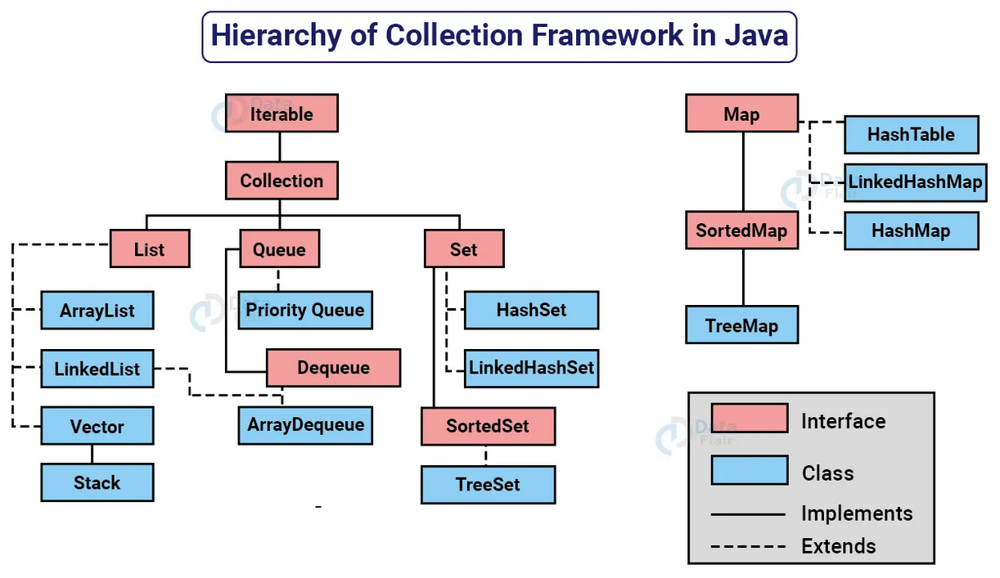
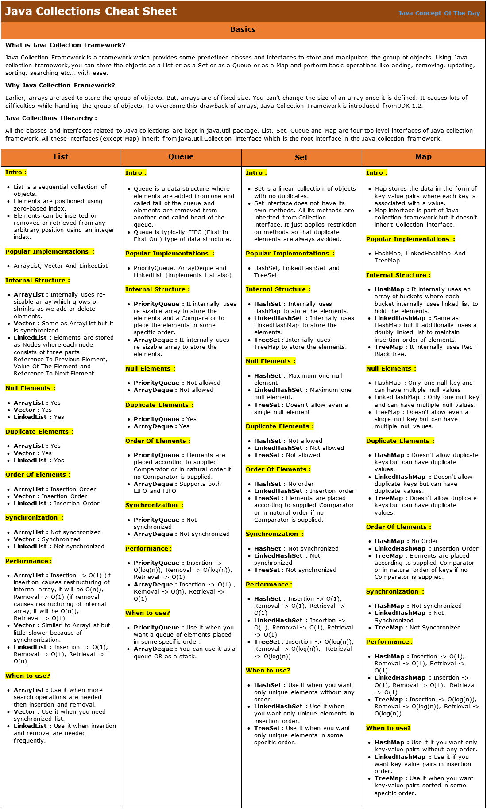
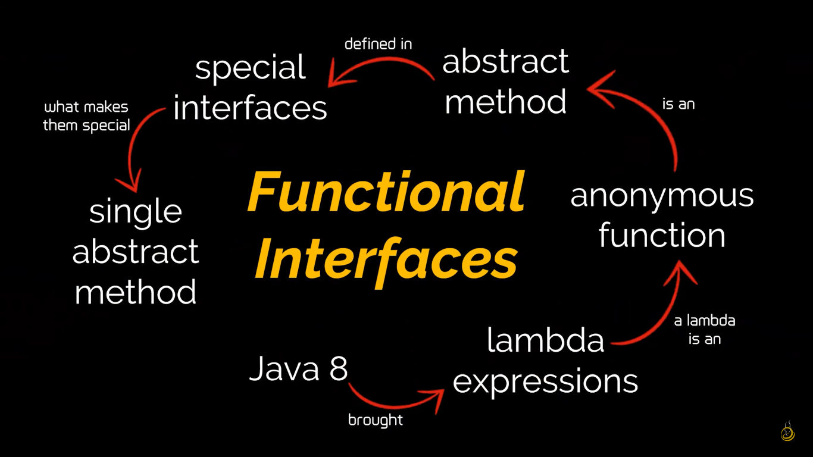
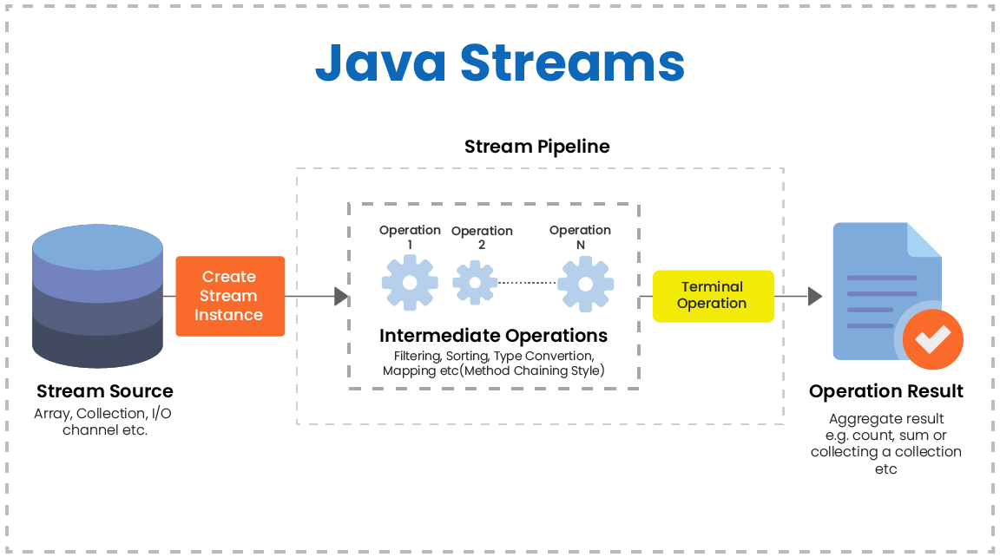

## Learning

📌 [abc Treinamentos  |  Dev Java Full Stack](https://abctreinamentos.com.br/?ref=C81744704X)  
📌 [Java 101 - Vepo dev](https://blog.vepo.dev/posts/java-101)  

---

# Java Avançado

## Exceções

**Erro:** Algo irreparável, a aplicação trava ou é encerrada drasticamente    
**Exceções:** Fluxo inesperado, não previstos pela aplicação   
	
```java 
try {
  //  bloco de código conforme esperado
}
catch(Exception e) { // identifica exceção
  // bloco de código que captura as exceções que podem acontecer
  // em caso de um fluxo não previsto
}
finally {
// bloco de código a ser executado, independente de ocorrer um erro ou não
}
```
	
> O bloco **try / catch** pode conter um conjunto de catchs, correspondentes a cada exceção prevista em uma funcionalidade do programa  

### Hierarquia das exceções

**Checked Exceptions:** São aquelas que são verificadas em tempo de compilação; o compilador exige que qualquer método que possa lançar uma exceção checada declare essa exceção (throws) ou trate a exceção (try-catch)  
**Unchecked Exceptions:**  São aquelas que não precisam ser declaradas ou tratadas explicitamente pelo compilador, incluem subclasses de *RuntimeException* e erros de tempo de execução, representam erros de programação, como acessar um objeto nulo (NullPointerException) ou realizar operações matemáticas inválidas (ArithmeticException)  
	
> A principal diferença é a obrigatoriedade de tratamento ou declaração dessas exceções no código  
> > Exceções *checadas* exigem tratamento explicito, garantindo que o código seja robusto frente a *condições excepcionais conhecidas*   
	
	
**Exceções customizadas**  
-  Pode-se criar exceções personalizadas, baseadas em regras de negócio  
	
```java
static String cepFormat(String cep) throws InvalidCepException{
        if(cep.length() != 8)
          throw new InvalidCepException();
        
          // simulando um cep formatado
          return "23.765-064";
    }

----

public class InvalidCepException extends Exception { 

}

```

## Interface

- Tipo abstrato utilizado para especificar o comportamento de uma classe, dado que o Java não permite *Herança Múltipla*  
- Todos os métodos são implicitamente públicos e abstratos  
- Uma interface *não pode conter um método construtor*, não é possível criar uma instância da própria interface --> É preciso criar uma instância de alguma classe que implemente a interface para fazer referência a ela  
	
```java
public interface Vehicle {
    public String license = "";
    public float maxVel;
    
    public void start();
    public void stop();
    
    default void honk() {
        System.out.println("Honking");
    }
}

public class Car implements Vehicle {
    public void start() {
        System.out.println("Starting the engine...");
    }
    
    public void stop() {
        System.out.println("Stoping the engine...");
    }
}
```

```java
Vehicle tesla = new Car();

tesla.start(); 
```


---

# Collection Framework API 

- Uma coleção (collection) é uma *estrutura de dados* que serve para *agrupar* muitos elementos em uma única unidade
- Aceita somente objetos como elementos
- Pode ter coleções homogêneas e heterogêneas, normalmente se utiliza coleções homogêneas de um tipo específico  
	
--> Contém:  
**Interfaces:** Tipos de dados abstratos que representam coleções; permitem manipular a coleção independentemente do nível de detalhe que elas representam  
**Implementações:** Estruturas de dados reutilizáveis; implementações concretas das interfaces de coleta  
**Algoritmos:** Funcionalidades reutilizáveis; métodos que executam cálculos úteis, como pesquisa e classificação, em objetos que implementam interfaces de coleta; são *polimórficos*, isto é, o mesmo método pode ser usado em muitas implementações diferentes da interface de coleta apropriada  
	
> Todas as interfaces e classes são encontradas dentro do pacote `java.util.` 

**Collections (classe):** Classe utilitária do Java para operações comuns em coleções; fornece métodos para ordenação, busca, manipulação e sincronização de coleções  
	
  
	
> Embora a interface Map não seja filha direta da interface Collection, ela também é considerada uma coleção devido à sua função.



## Generics

-  Classe (ou interface) genérica ou uma interface que é parametrizada em relação a tipos  
- O símbolo `<>` é chamado de "diamond" ou "diamond operator" (introduzido no Java 7) e é usado no contexto de tipos genéricos em Java para *inferir automaticamente* o tipo com base no contexto  
- Uma variável de tipo pode ser qualquer tipo não primitivo  
- Sem o Generics, seria necessário realizar um Casting (conversão) do tipo da variável
	
```java
public class Box <T> { // parâmetro; tipo de valor sendo armazenado

    private T t;

    public void set(T t) { 
	    this.t = t; 
	}
    public T get() { 
	    return t; 
	}
}
```
	
Os nomes de parâmetros de tipo mais comumente usados são:
- E - Element (usado extensivamente pelo Java Collections Framework)
- K - Key
- N - Number
- R - Result
- T - Type
- V - Value
- S, U, V, etc. - 2º, 3º, 4º tipos

**Bounds**  
- Estabelece um *limite* (bound) dos tipos que podem ser passados como parâmetro
- Também pode ser utilizado com interfaces, porém necessita na sintaxe `extends` ao invés de "implements"
- Podem haver mais de um bound, com apenas uma classe, pois Java não comporta múltiplas Heranças de classes (listar classes primeiro)
	- `public class Printer <T extends Animals & Serializable> {}`

```java
public class Animals {
	String name;
	int age;


	public void eat() {
		System.out.println("eating...");
	}
}


public class Printer <T extends Animals> { // bounding generic
	T thingToPrint;
	K id;

	public Printer(T thingToPrint) {
		this.thingToPrint = thingToPrint;
	}

	public void print() {
		thingToPrint.eat();
		System.out.println(thingToPrint)
	}
	
	// MÉTODO GENÉRICO
	public <T> void status(<T> thingToCheck) {
		System.out.println(thingToCheck)
	}

	public <T, K> void status2(<T> thingToCheck, <K> id) {
		System.out.println("ID: " + id + ", STATUS: " + thingToCheck)
	}
}
```

**Wildcards**  
- (?) símbolo que representa um tipo desconhecido  

```java
public static void main() {
	List<Integer> intList = new ArrayList<>();
	intList.add(2);
	printList(intList);

	List<Cat> catsList = new ArrayList<>();
	catsList.add(new Cat());
	printList(catstList);
}

private static void printList(List<?> myList) {
	System.out.println(myList);
}
```

---

# Interfaces Funcionais

 - Single Abstract Method (SAM) Interfaces
 - São interfaces que possuem um *único método abstrato* a ser implementado
 - Podem conter métodos `default` e `static`, mas ainda assim são consideradas interfaces funcionais
 - Foram incluídos no Java 8 junto das expressões Lambda e referências de método para tornar o código mais legível, limpo e direto
	
> A anotação `@FunctionalInterface` é recomendada para interfaces funcionais, pois além de um indicador, também permite que o compilador gere um erro caso a interface não cumpra com as condições de ser uma interface funcional
	

	
**Runnable:** É frequentemente usado para executar tarefas em threads separados | `run()`  
**Callable:** Similar ao Runnable, mas tem um retorno de valor e lança exceções | `call()`  
**ActionListener:** É usado principalmente para manipular eventos de UI | `actionPerformed()`  
**Comparator:** Usado para comparar dois objetos | `compare()`  
**Predicate:** Representa uma operação booleana que aceita um argumento e retorna verdadeiro ou falso | `test()`  
**Function:** Aceita um argumento e retorna um resultado | `apply()`  
**Consumer:** Aceita um argumento e não retorna nenhum resultado | `accept()`  
**Supplier:** Não aceita argumentos e retorna um resultado | `get()` 
**BiConsumer, BiFunction, BiPredicate, Supplier:** Variantes de Consumer, Function, Predicate, e Supplier que aceitam dois argumentos em vez de um  	
**Optional:** Usado para evitar a necessidade de verificar explicitamente para null antes de acessar métodos ou campos de um objeto; reduz a chance de NullPointerExceptions (Exceções de Ponteiro Nulo)  

## Comparable X Comparator

**Comparable**  
	
- Fornece uma única sequência de ordenação de coleções 
- Afeta a classe original; a classe atual é modificada  
- Método `compareTo()` para ordenar elementos  
- Está presente no pacote `java.lang.` 
- Ordenação dos elementos da lista do tipo Comparable usando o método `Collections.sort(List)` 

**Comparator**  

- Fornece múltiplas sequências de ordenação de coleção (com base em multiplos elemento, como id, nome e preço)  
- Não afeta a classe original
- Método `compare()` para ordenar elementos  
- Está presente no pacote `java.util.` 
- Ordenação dos elementos da lista do tipo Comparator usando o método `Collections.sort(List, Comparator)` 

```java
// Uma classe 'Livro' que implementa Comparable
class Livro implements Comparable<Book> {
	private String title;
	private String author;
	private int year;

	// Construtor
	public Livro(String title, String author, int year) {
		this.title = title;
		this.author = author;
		this.year = year;
	}

	// Usado para ordenar livros por titulo
	public int compareTo(Book b) {
		return title.compareTo(b.title);
	}

}
```

```java
import java.util.Comparator;

// Classe para comparar Livro por autor
class CompareAuthor implements Comparator<Book> {
  @Override
  public int compare(Book b1, Book b2) {
		return b1.getAuhtor().compareTo(b2.getAuthor());
	}
}

// Classe para comparar Livro por ano
class CompareYear implements Comparator<Book> {
  @Override
  public int compare(Book b1, Book b2) {
		if (b1.getYear() < b2.getYear())
			return -1;
		if (b1.getYear() > b2.getYear())
			return 1;
		else
			return 0;
	}
}

class CompareYearAuthorTitle implements Comparator<Book> {
	@Override
	public int compare(Book b1, Book lb) {
		int year = Integer.compare(b1.getYear(), b2.getYear());
		if (year != 0)
			return year;
		int author = b1.getAutor().compareTo(b2.getAutor());
		if (author != 0)
			return author;
		return b1.getTitle().compareTo(b2.getTitle());
	}
}
```

---

# Stream API

- Foca no total da aplicação ao invés de elementos individuais; se preocupa com O QUE precisa ser feito, 
- Traz princípios da *programação funcional*, de maneira declarativa
- Usado com Collections
- Combinado com as Expressões Lambda e Method reference  
- Um *pipeline de Stream*, consistem em uma fonte, seguido por zero ou mais operações intermediárias e uma operação terminal.
	

	
**Operações Intermediárias:** Retornam uma nova Stream e permitem encadear várias operações, formando um *pipeline de processamento de dados*  
	
- `filter(Predicate<T> predicate)` -> Filtra os elementos da Stream com base em um predicado; retorna uma nova Stream contendo apenas os elementos que atendem ao critério do predicado | exemplo: *stream.filter(n -> n > 5)*  
- `map(Function<T, R> mapper)` -> Transforma cada elemento da Stream usando a função especificada e retorna uma nova Stream contendo os elementos resultantes | exemplo: *stream.map(s -> s.toUpperCase())*  
- `sorted()` -> Classifica os elementos da Stream em ordem natural (se os elementos forem comparáveis) ou de acordo com um comparador fornecido | exemplo: *stream.sorted()*  
- `distinct()` -> Remove elementos duplicados da Stream, considerando a implementação do método equals() para comparação | exemplo: *stream.distinct()*  
- `limit(long maxSize)` -> Limita o número de elementos da Stream aos maxSize primeiros elementos | exemplo: *stream.limit(10)*  
- `skip(long n)` -> Pula os primeiros n elementos da Stream e retorna uma nova Stream sem eles | exemplo: *stream.skip(5)*  
	
**Operações Terminais:** São aquelas que *encerram o pipeline* e produzem um resultado final  
	
- `forEach(Consumer<T> action)` -> Executa uma ação para cada elemento da Stream | exemplo: *stream.forEach(System.out : : println)*  
- `toArray()` -> Converte a Stream em um array contendo os elementos da Stream | exemplo: *stream.toArray()*  
- `collect(Collector<T, A, R> collector)` -> Coleta os elementos da Stream em uma estrutura de dados específica, como uma lista ou um mapa | exemplo: *stream.collect(Collectors.toList())*  
- `count()` -> Retorna o número de elementos na Stream | exemplo: *stream.count()*  
- `anyMatch(Predicate<T> predicate)` -> Verifica se algum elemento da Stream atende ao predicado especificado | exemplo: *stream.anyMatch(s -> s.startsWith("A"))*  
- `allMatch(Predicate<T> predicate)` -> Verifica se todos os elementos da Stream atendem ao predicado especificado | exemplo: *stream.allMatch(n -> n > 0)*  
- `noneMatch(Predicate<T> predicate)` -> Verifica se nenhum elemento da Stream atende ao predicado especificado | exemplo: *stream.noneMatch(s -> s.isEmpty())*  
- `min(Comparator<T> comparator)` e `max(Comparator<T> comparator)` -> Encontra o elemento mínimo e máximo da Stream, respectivamente, de acordo com o comparador fornecido | exemplo: *stream.min(Comparator.naturalOrder())* ou *stream.max(Comparator.naturalOrder()*  
- `reduce(T identity, BinaryOperator<T> accumulator)` -> Combina os elementos da Stream usando o acumulador especificado e retorna o resultado final | exemplo: *stream.reduce(0, (a, b) -> a + b)*  
	
## Lambdas 
	
- Expressões lambda permitem *representar interfaces funcionais* de forma mais concisa
	
**Função lambda:** Função sem declaração; não é necessário colocar um nome, tipo de retorno e modificador de acesso; método é declarado no mesmo lugar em que será usado  
- *Sintaxe:* (argumento) --> {corpo}  
	
```java
// SEM LAMBDA

Runnable traditional = new Runnable() {
	@Override
	public void run() {
		System.out.println("Hello World!")
	}
}

// COM LAMBDA
Runnable traditional = () -> {
	System.out.println("Hello World!");
};
```
	
**Method Reference:** Tipo especial de expressão lambda para referenciar métodos existentes  
	
```java
// COM LAMBDA
list.forEach(s -> System.out.println(s)); 

// COM METHOD REFERENCE
list.forEach(System.out::println);  
```
