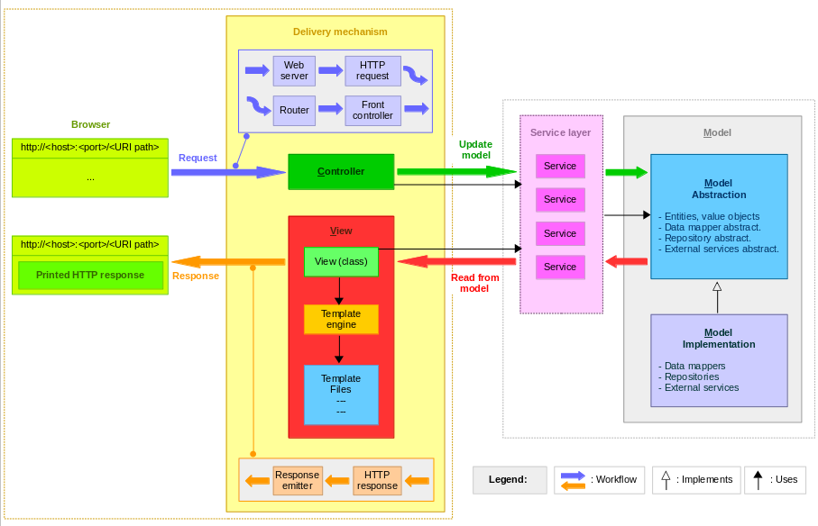

# Spring Boot

## Cliente/Servidor

* Conjunto de computadores interligados, compartilhando recursos

**Servidor:** Equipamentos com maior poder de processamento e armazenamento que visa a fornecer recursos/serviços a uma rede de computadores

* Execução contínua
* Recebe e responde a solicitações dos Clientes
* Presta serviços distribuídos
* Atende a diversos clientes simultaneamente

**Cliente:** Entidade que consome os serviços de um servidor através do uso de uma rede de computadores

* Inicia pedidos para servidores; espera por respostas; recebe respostas;
* Conecta-se a um pequeno número de servidores de uma só vez
* Interage diretamente com os usuários finais por uma interface de usuário

### Comunicação

* Computador que executa aplicações para oferecer recursos Web baseados em requisições e respostas HTTP
* Ou Software responsável por aceitar pedidos HTTP de clientes (navegadores) e servir respostas HTTP, incluindo opcionalmente dados, geralmente páginas web (docs HTML com objetos embutidos, imagens)

**Servidor Web:** Gerencia sistema virtual de arquivos e diretórios; interpreta requisições (HTTP) de clientes, envia respostas (HTTP) com os dados solicitados; pode se comunicar com outros servidores para atender uma solicitação específica

***

## API Restful

* Application Programming Interface
* _Conjunto de rotinas e padrões_ estabelecidos por uma aplicação A, para que outras aplicações consigam utilizar suas funcionalidades _sem precisar conhecer detalhes da implementação_ do software
* "Ponte" entre o cliente e o servidor do banco de dados
  * O cliente pode ser o browser com a aplicação front-end ou outra API/sistema
* Permitem interoperabilidade entre aplicações; comunicação entre aplicações e usuários
* Simplifica desenvolvimento, não necessita de uma tela para cada funcionalidade como antigamente
  * Desacoplação -> Hoje se desenvolvem diversas funcionalidades para uma tela
* Fácil integração com sistemas, apenas dando respostas

**Tipos de API**

* Pública -> Disponibilizada para qualquer um que acessar; sem necessidade de autenticação
* Privada -> Criada para utilização entre sistemas internos de uma empresa; requer autenticação
* Terceiros -> API como produto, pode ser integrada em um sistema; requer autenticação

**Comunicação:** Normalmente feita através de XML ou JSON; requisições e respostas são feitas através do HTTP

**Endpoint**

* URL que acessamos da API para extrair uma resposta
* Acompanhado do domínio da API
* Técnicas para reduzir complexidade e aplicar padrão REST

**Stateless:** A cada nova requisição é recebido infos necessárias p/ funcionalidade pedida por cliente **Statefull:** Estado de cada cliente é mantido no servidor; cliente fica logado

### REST

* Representational State Transfer
* Padrão/conceito de arquitetura ligado a APIs e o protocolo HTTP
* Composto por 6 partes para tornar uma API em RESTful

1. **Uniformidade:** Todas as requisições para o mesmo endpoint, devem receber a mesma resposta, independente de onde vieram
2. **Stateless:** As requisições não tem state, ou seja, cada uma é única e essa responsabilidade de sessão é dada a aplicação que a consulta
3. **Cacheavel:** Quando possível as respostas devem ser cacheadas, melhorando a performance
4. **Desacoplação:** A API deve ser independente de um client, não pode interagir com a aplicação, apenas retornar respostas, baseadas na requisição
5. **Arquitetura de camadas:** A arquitetura da API pode ser composta por camadas, fazendo com que um componente não possa acessar um superior, sem passar pelo intermediário
6. **Code on demand (opcional):** Em alguns casos pode haver código que precisa ser executado para rodar (Java applets), nestes casos o código deve rodar por demanda

**REST vs. RESTfull**

* REST-> Estilo de arquitetura de software que define um _conjunto de restrições_ a serem usadas para a criação de web service
* RESTful -> Capacidade de determinado sistema aplicar os princípios de REST

> **Postman** ➡ Software que permite testar APIs; facilita o desenvolvimento, exclui a necessidade de fazer o Front-end antes do Back-end para testar a API

***

## Padrão MVC

* Padrão de arquitetura de aplicações
* Separa a aplicação em 3 componentes para organizar a interface do usuário (UI) e a lógica de negócio
* **Model:** Define modelo ou domínio da aplicação; regras de negócio (camada de serviços - leitura, manipulação e validação de dados); persistência de dados
* **Controller:** Camada intermediária; recebe as requisições do usuário; interage com a Model para resposta a ser retornada ao usuário
* **View:** Interação com usuário; representa entrada e saída de dados; exibe os dados em formatos HTML, XML e JSON

### Arquitetura em Camadas

* Organiza back-end em camadas com responsabilidades específicas
* Segue o princípio de separação de interesses

**Repository**\
➡ Camada de Acesso a Dados

* Responsável por interagir diretamente com o BD (operações CRUD)
* Usa o _Spring Data JPA_ para simplificar consultas (métodos como findAll(), save(), findById() são gerados automaticamente)
* Isola a lógica de acesso a dados, tornando o código menos acoplado ao banco de dados
* Facilita a troca de banco de dados (ex: de MySQL para PostgreSQL) sem afetar outras camadas
* Pode aplicar a anotação @Repository em uma classe ou implementar uma das interfaces pré-definidas do JPA

> Substituí a classe DAO, que é uma implementação manual de acesso a dados

**Service**\
➡ Camada de Lógica de Negócio

* Atua entre Controller e Repository
* Separa a lógica de negócio da camada de apresentação (Controller)
* Usa o Repository para persistir/recuperar dados
* Garante a aplicação das regras de negócio antes de acessar os dados (regras de validação, cálculos, fluxos complexos)
* Não lida com HTTP diretamente; apenas processa dados
* Permite reutilização (um Service pode ser usado por múltiplos Controllers)

**Controller**\
➡ Camada de Apresentação / API

* Recebe requisições HTTP (GET, POST, PUT, DELETE) e retorna respostas (JSON, XML, HTML)
* Delega a lógica de negócio para a camada Service
* Mapeia URLs e parâmetros de entrada/saída
* Isola a comunicação externa (clientes como navegadores, apps móveis, Postman)
* Define claramente os endpoints da API (contrato entre frontend e backend)

```java
@RestController // Camada Controller
@RequestMapping("/api/alunos")
public class AlunoController {

    @Autowired
    private AlunoService alunoService; // Camada Service

    @GetMapping
    public List<Aluno> listAll() {
        return alunoService.listAll();
    }
}

@Service // Camada Service
public class AlunoService {
    @Autowired
    private AlunoRepository alunoRepository; // Camada Repository

    public List<Aluno> listAll() {
        return alunoRepository.findAll();
    }
}

public interface AlunoRepository extends JpaRepository<Aluno, Integer> { } // Camada Repository
```



***

### HTTP

**Protocolo HTTP (Hypertext Transfer Protocol):** Protocolo de comunicação utilizado para sistemas de informação de hipermídia, distribuídos e colaborativos; base p/ comunicação de dados da World Wide Web

* Define forma de conversação _request-response_ entre cliente (browser) e um servidor web
* Conversação se dá em formato ASCII (texto puro), por conjunto de comandos simples que forma uma mensagem


* &#x20;**Método:** Determinar se está buscando algo ou enviando algo
* **Path:** Basicamente a URL que está acessando
* **Versão do protocolo:** Qual a versão do HTTP está sendo utilizada
* **Headers:** Configurações da requisição, como o tipo de dado que estamos enviado (JSON)
* **Dados**


**Métodos de Requisições HTTP** ➡ **Verbos**

* GET -> Primeiro método criado para envio de dados da Internet; resgatar dados (objetos e conteúdos) de um servidor utilizando a barra de endereços do navegador
  * http://www.banco.com.br/acessar.jsp?conta=2245\&agencia=335
  * Trecho após interrogação (?) é conhecido como parâmetros de requisição ou Query String
* POST -> Criado para superar limitações do GET; enviar dados para a API sem exibir na barra de endereço
* PUT -> Enviar recursos ao servidor; atualização de registros
* DELETE -> Excluir recursos do servidor
* HEAD -> Igual ao GET, mas sem o corpo da resposta
* PATCH -> Atualização parcial de registros

**Conceitos**

* Idempotente -> Se uma requisição idêntica pode ser feita 1/+ vezes em sequência com o mesmo efeito enquanto deixa o servidor no mesmo estado
* Cacheável -> Armazenar o resultado da requisição para quando quiser repeti-la, pegar o resultado da cache ao invés de contatar novamente o servidor

| Verbo HTTP | Corpo na Requisição | Corpo na Resposta | Idempotente | Seguro | Cacheável |
| ---------- | ------------------- | ----------------- | ----------- | ------ | --------- |
| **GET**    | NÃO                 | SIM               | SIM         | SIM    | SIM       |
| **POST**   | SIM                 | SIM               | NÃO         | NÃO    | NÃO       |
| **PUT**    | SIM                 | SIM               | SIM         | NÃO    | NÃO       |
| **DELETE** | NÃO                 | SIM               | SIM         | NÃO    | NÃO       |
| **HEAD**   | NÃO                 | NÃO               | SIM         | SIM    | SIM       |

**Códigos de Status**

* 2xx -> Sucesso
* 3xx -> Redirecionamento/cache
* 4xx -> Erro no lado do cliente
* 5xx -> Erro no lado do servidor

***

## Spring

* Conjunto de projetos modulares que ajudam a criar aplicações Java com simplicidade e flexibilidade
* Ecossistema que cobre várias áreas de desenvolvimento
* **Spring Framework** -> Suporte essencial para aplicativos Web com MVC, acesso a dados, gerenciamento de transações, injeção de dependências, entre outros
* **Spring Data** -> Abordagem mais consistente de acesso a dados (relacional, não relacional)
* **Spring Security** -> Suporte de segurança ao aplicativo (autenticação e autorização)
* **Spring Boot** -> Fornece todo um processo de automatização de geração e configuração de projetos Spring

### Spring Boot

* Módulo do Spring que fornece funcionalidades RAD (Rapid Application Development)
* Fornece uma maneira mais fácil e rápida de configurar e executar aplicativos simples e baseados na web
* Combinação do Spring Framework e Servidores Incorporados
  * Spring Boot -> Spring Framework + Incorporação de Servidores HTTP (Tomcat, Jetty) - Configurações XML
* Vantagens -> injeção de dependência; recursos de gerenciamento de transações de banco de dados; simplifica integração com outros frameworks do Java (ex. JPA, Struts)

> Quando lidando com dependências, é uma boa prática remover a tag de versão e deixar o Spring Boot gerenciar as versões

**Mapeamento Objeto-Relacional (ORM):** Ferramentas para auxiliar desenvolvimento de Banco de Dados **Hibernate:** Ferramenta ORM open sourcem líder de mercado, sendo a inspiração para a especificação Java Persistence API (JPA)

* Hibernate é uma das especificações que implementa o JPA

#### Anotações Spring

* Base do funcionamento do Spring consiste em metadados
* Diretivas no código como um descritivo para que o Spring trate-o de alguma forma ao executá-lo
* Podem ser declarados por arquivos XML ou anotações Java (@exemplo)

**@RestController**

* Criar serviços da Web RESTful usando Spring MVC
* Cuida do mapeamento dos dados da solicitação para o método do manipulador de solicitação definido
* Depois que o corpo da resposta é gerado a partir do método do manipulador, ele o converte em resposta JSON ou XML

-> Anotações que podem substituir o uso de `@RequestMapping`

* `@GetMapping`, `@PostMapping`, `@PutMapping` e `DeleteMapping`

**Passagem de parâmetros via URL**

```java
@RestController
public class TesteController {

	@GetMapping("/soma")
	public String somar() {
		int a, b, soma;
		a = 10; b = 15;
		soma = a+b;
		return (a + " + " + b + " = " + soma);
	}
	
}

```

**@RequestParam** e **@PathVariable**

```java
@RestController
public class TesteController {

	@GetMapping("/soma")
	public String somar(
		@RequestParam("valorA") int a,
		@RequestParam("valorB") int b ) {
		int soma = a+b;
		return (a + " + " + b + " = " + soma);
	}

	@GetMapping("/calculo/{a}/{b}")
	public String calculo(
		@PathVariable("a") int a,
		@PathVariable("b") int b ) {
		int soma = a+b;
		return (a + " + " + b + " = " + soma);
	}
	
}

```

**@Repository** camada de persistência. Normalmente anotamos classes que representam um DAO, Repositório etc.

**Controller**

```java

@RestController

@RequestMapping("hello-world")
# oferece mapeamento para endpoint
public class HelloWorldController {

	# define verbo HTTP que método atende
	# pode definir path -> @GetMapping("\hello1")
	
	@GetMapping
	public String helloWorld() {
		return "Hello World"
	}
}

```

@RestController -> @Controller + @ResponseBody

* Indica que classe é uma REST Controller

@Controller

* Pode também retornar uma página HTML
* Utilizando antigamente, quando o servidor além de tratar as regras de negócio, também retornava as páginas HTML (front + back juntos)

@ResponseBody

* Retorna XML ou JSON pelo HTTP

***

### Statefull vs Stateless

**Stateless**

* Aplicação ou processo stateless são recursos isolados
* Nenhuma referência ou informação sobre transações antigas são armazenadas
* Aplicações stateless fornecem função ou serviço e usam a rede de entrega de conteúdo (CDN), a web ou servidores de impressão para processar essas solicitações a curto prazo
* Se uma transação for interrompida ou encerrada repentinamente, será necessário iniciar outra

**Stateful**

* Aplicações e processos que podem ser usados mais de uma vez, como e-mails e serviços bancários online
* São executados com base no contexto das transações anteriores; dependendo das ações realizadas, pode afetar as transações atuais
* Usam os mesmos servidores sempre que processam uma solicitação do usuário
* Se uma transação stateful for interrompida, é possível retomá-la praticamente de onde parou já que o contexto e o histórico são armazenados
* Acompanham informações como localização da janela, preferências de configuração e atividades recentes

### Spring Security


* **JWT (JSON Web Token):** Token simples utilizado para aplicações stateless
* **OAuth2 e OpenID Connect:** Protocolos que definem como a autorização e autenticação são implementadas, frequentemente integrados com plataformas sociais (Google, Facebook etc)
* `SecurityConfig` - OK
  * `securityFilterChain()`
    * Define permissão de acesso aos endpoints pelos cargos
    * Define autenticação para requisições
    * Define gerenciamento de sessão como stateless
    * Define provedor de autenticação (JWT)
    * logout
  * `@Bean userDetailsService()`
  * `@Bean authenticationProvider()` / AuthenticationManager
  * \`@Bean passwordEncoder()
* JWT
  * `JwtFilter` ou `SecurityFilter` - OK
    * Valida token
  * `JwtUtil` ou `TokenService` - OK
    * `generateToken()`
    * \`validateToken()
    * `getExpirationDate()`
* USER
  * `UserRole` - OK
  * `UserController` ou AuthController
    * endpoints para login, registro de usuário
  * `UserEntity` - OK
  * `UserRepository` - OK
  * DTOS
    * `Authentication`
    * `Login`
    * `Register`
