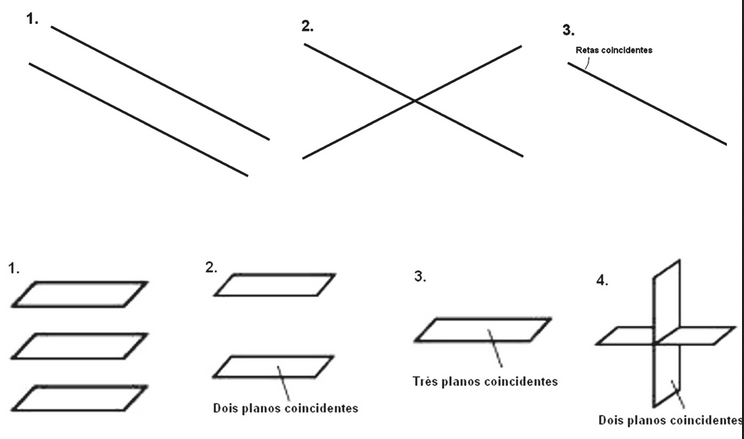
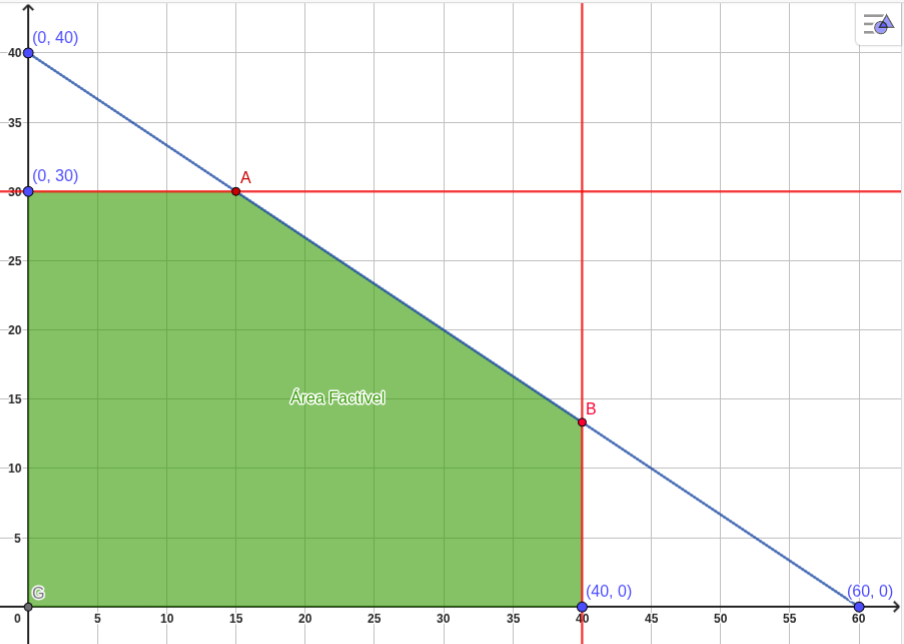

# Sistemas Lineares

Defini-se uma **equação linear** nas $n$ variáveis $x_1, x_2, . . . , x_n$ como uma equação que pode ser expressa na forma

$$a_1x_1 + a_2x_2 +· · · + a_n x_n = b$$ 
Em que $a_1, a_2, . . . , a_n$ e $b$ são **constantes**, sendo que nem todos os $a$ são nulos, as variáveis $x,y,z$ são denominadas **incógnitas**  

Um **sistema linear** arbitrário de $m$ equações nas $n$ incógnitas $x_1, x_2, . . . , x_n$ pode ser escrito como:

$$
\begin{align}
a_{11} x_1 + a_{12} x_2 & + ... + a_{1n} x_n = b_1 \\
a_{21} x_1 + a_{22} x_2 & + ... + a_{2n} x_n = b_2 \\
                 &\vdots \\
a_{m1} x_1 + a_{m2} x_2 & + ... + a_{mn} x_n = b_m
\end{align}
$$

--> Um sistema linear não envolve produtos ou raízes, todas as variáveis ocorrem somente na *primeira potência*

A **solução** de um sistema nas $n$ incógnitas $x_1, x_2, . . . , x_n$ é uma sequência de $n$ números $s_1, s_2, . . . , s_n$  

Para os quais a substituição $x_1 = s_1, x_2 = s_2, . . . , x_n = s_n$ faz de cada equação uma afirmação verdadeira  

## Representação gráfica

Uma solução $x = n, y = m$ pode ser escrita como $(x, y)$, o que nos permite interpretar soluções geometricamente como **pontos** nos espaços bi e tridimensionais  

Sistemas lineares em duas incógnitas são relacionados com **retas** e em três incógnitas a **planos**  

Cada solução de um sistema corresponde a um ponto de **interseção das retas ou planos**, de modo que há três possibilidades:  

1. **Paralelas e distintas:** Não há interseção e, consequentemente, não existe solução
2. **Interseção em um único ponto:** Exatamente uma solução
3. **Coincidir:** Há uma infinidade de pontos de interseção e, consequentemente, uma infinidade de soluções

> Um sistema linear é **consistente** se possuir pelo menos uma solução e **inconsistente** se não tiver solução

## Classificação

Os sistemas lineares podem ser classificados conforme o número de soluções possíveis
- **Sistema Possível e Determinado (SPD):** Apenas uma solução possível, quando o determinante é diferente de zero (D ≠ 0)
- **Sistema Possível e Indeterminado (SPI):** Soluções possíveis são infinitas
- **Sistema Impossível (SI):** Não é possível apresentar qualquer tipo de solução

---

# Resolução de Sistemas Lineares

## Método da Substituição

- Isolar uma das incógnitas em uma das equações e substituir o seu valor na outra equação
- Resulta em uma equação com uma só incógnita para ser resolução

> **Exemplo:**  
> $x + y = 3$  
> $2x + 3y = 8$    

 1. Isolar uma das incógnitas em uma das equações  
$$\begin{align}
x + y = 3 \\ 
x = 3 - y   
\end{align}$$
  
1. Substituir a incógnita na outra equação e resolver

$$\begin{align}
2( 3- y ) + 3y & = 8 \\
6- 2y + 3y & = 8 \\ 
6- y & = 8 \\  
y & = 8 - 6 \\  
y & = 2
\end{align}$$

1. Substituir na equação do passo 1 o valor encontrado no passo 2

$$\begin{align}
& x = 3 - y \\
& x = 3 - 2 \\
& x = 1
\end{align}$$

--> $S = (1, 2)$  

## Método da Eliminação/Adição

- Somar ou subtrair as equações buscando o cancelamento de termos opostos (um positivo e um negativo), para eliminar uma das incógnitas
- Resolver a equação com uma só incógnita

> **Exemplo 1:**  
> $x - y = -1$  
> $x + y = 3$    

 1. Somar equações para cancelar uma das incógnitas 

$$\begin{align}
x + x + y - y & = 3 - 1 \\
x + x + \cancel{y} - \cancel{y} & = 3 - 1 \\
2x & = 2 \\
x & = 1
\end{align}$$
 2. Substituir em uma das equações o valor encontrado para a incógnita

$$\begin{align}
x + y & = 3\\
1 + y & = 3\\
y & = 3 - 1\\
y &= 2
\end{align}$$

--> $S =(1, 2)$  
   
   
>**Exemplo 2:**  
> $3x + 6y = 18$  
> $2x + 3y = 10$    

 1. Caso não seja possível cancelar, multiplicar uma das equações por uma constante, para que uma das incógnitas se torne o inverso aditivo de outra incógnita

$$\begin{align}
2x + 3y & = 10 \cdot (−2) \\  
− 4x − 6y & = −20
\end{align}$$

2. Somar equações para cancelar uma das incógnitas 
$$\begin{align}
3x + \cancel{6y} & = 18 \\ 
-4x - \cancel{6y} & = -20 \\ 
\hline -x + 0 & = -2 
\end{align}$$

$$\begin{align}
-x = -2 \\
x = 2
\end{align}$$

 3.  Substituir em uma das equações o valor encontrado para a incógnita
 
$$\begin{align}
3x + 6y & = 18 \\ 
3 \cdot 2 + 6y & = 18 \\
6 + 6y & = 18 \\
6y & = 18 - 6 \\
6y & = 12 \\
y & = \frac{12}{6} \\
y & = 2
\end{align}$$

--> $S = (2, 2)$  

--- 

# Programação Linear

## Método Gráfico

### Interpretação do enunciado

1. Definir Variáveis
2. Definir Restrições
3. Definir Objetivo da Função (max ou min) e montar estrutura da função

**Dois casos possíveis para restrições:**  
 1. Com duas restrições que formam inequações
	 - Que posteriormente serão transformadas em equações, para que se determinem os pares de coordenadas das retas
 2. Uma restrição de inequação e outras que são constantes
	 - No gráfico, as constantes são representadas por retas em que o $x$ ou $y$ será 0

### 1 - Transformar Inequações em Equações

1. Montar as equações
2. Assumir que uma variável tem o valor igual a 0 e calcular o valor da outra variável
3. A partir dos valores, definir coordenadas para o gráfico

### 2 - Montar Gráfico

1. Traçar retas com base nas variáveis
2. Identificar área factível (sempre abaixo das retas de restrição)
3. Identificar pontos possíveis

## 3 - Teste das soluções

1. Testar pontos possíveis na Função Objetivo
2. Identificar ponto que satisfaz o objetivo

# Exemplos

## Caso 2

- Uma restrição de inequação e outras que são constantes  

Certa empresa fabrica 2 produtos **P1 e P2**. O **lucro por unidade** de P1 é de **100 u.m.** e o de P2 é de **150 u.m**. Para a **fabricação unitária** de cada produto, a empresa necessita de **2 horas** para P1 e **3 horas** para P2. O **tempo mensal** disponível para essas atividades é de **120 horas**. As **demandas esperadas** para os 2 produtos levaram a empresa a decidir que os montantes produzidos não devem ultrapassar **40 unidades** de P1 e **30 unidades** de P2 **por mês**. Construa o modelo do sistema de produção mensal com o objetivo de maximizar o lucro da empresa.

--> **Interpretação do enunciado**
 
1 - Variáveis   

> $x_1 = \text{produção de P1}$  
> $x_2 = \text{produção de P2}$  

2 - Restrições   

- Tempo de Fabricação
	- P1 -> 2h
	- P2 -> 3h
	- Tempo mensal = 120h
>  $2x_1 + 3x_2 \leq 120$  

- Demandas esperadas (montantes por mês)
	- P1 -> 40 unidades
	- P2 -> 30 unidades
> $x_1 \leq 40$
   $x_2 \leq 30$

3 - Objetivo = Maximização de lucro   
- Lucro por unidade
	- P1 -> 100 u.m.
	- P2 -> 150 u.m.	
>  $L = 100x_1 + 150x_2$

--> **Transformar Inequações em Equações**  

1 - Montar equação   

>  $2x_1 + 3x_2 = 120$   
  
2 - Assumir que uma variável tem o valor igual a 0 e calcular o valor da outra variável   

-> $2x_1 + 3x_2 \leq 120$   

>  $2x_1 + 3x_2 = 120$  
>  $x_1 = 0$ | $x_2 = 40$   
>  $x_1 = 60$ | $x_2 = 0$   

 -> $x_1 \leq 40$ | $x_2 \leq 30$   
 
> $x_1 = 40$  
> $x_2 = 30$

3 - A partir dos valores, definir coordenadas para o gráfico

> $(60,40)$
> $(40, 0)$
> $(0, 30)$

--> **Montar Gráfico**  $(x, 30)$

1 - Traçar retas com base nas variáveis
- $(60, 40)$ - azul
- $(40, 0)$ - vermelho
- $(0, 30)$ - vermelho
2 - Identificar área factível
3 - Identificar pontos possíveis
- A -> $(x, 30)$
- B -> $(40, x)$

> A -> $2x_1 + 3x(30) = 120$   
>   $2x_1 + 90 = 120$   
>   $2x_1 = 120 - 90$   
>   $2x_1 = 30$   
>   $x_1 = 15$   
>   $A = (15, 30)$   

B -> $2(40) + 3x_2 = 120$   
>   $80 + 3x_2 = 120$    
>   $3x_1 = 120 - 80$   
>   $3x_1 = 40$   
>   $x_1 = \frac{40}{3}$ ou  $13.33$   
>   $B = (40, \frac{40}{3})$   

--> **Teste das soluções**  

1. Testar pontos possíveis na Função Objetivo

>  $A = (15, 30)$

> $L = 100(15) + 150(30)$   
> $L = 1500 + 4500$   
> $L = 6000$   

> $B = (40, \frac{40}{3})$   

> $L = 100(40) + 150(\frac{40}{3})$   
> $L = 4000 + 2000$   
> $L = 6000$   

2. Identificar ponto que satisfaz o objetivo

- Pontos A ou B resultam no mesmo valor
- Porém, considerando quantidades em unidades para produção, o ponto A apresenta valores inteiros
- Sendo assim -> Lucro máximo = 6000 u.m.
- Quando a produção mensal for:
	- P1 -> 15 unidades
	- P2 -> 30 unidades

---

# Programação Linear

## Método Simplex

-> Problema de maximização

**Maximizar:** $Z = 3x₁ + 2x₂$

**Restrições técnicas**  
- $2x₁ + x₂ ≤ 18$
- $2x₁ + 3x₂ ≤ 42$
- $3x₁ + x₂ ≤ 24$
- $x₁, x₂ ≥ 0$

### 1 - Transformar para Forma Padrão

**1.1 Adicionar Variáveis de Folga**  
- Para cada restrição ≤, adicionar uma variável de folga $f_*$
	- $2x₁ + x₂ + f₁ = 18$
	- $2x₁ + 3x₂ + f₂ = 42$
	- $3x₁ + x₂ + f₃ = 24$

**1.2 Função Objetivo**  
- $Z - 3x₁ - 2x₂ = 0$  

### 2 - Montar a Tabela Simplex Inicial

| Base | Z   | x₁  | x₂  | f₁  | f₂  | f₃  |     |
| ---- | --- | --- | --- | --- | --- | --- | --- |
| Z    | 1   | -3  | -2  | 0   | 0   | 0   | 0   |
| L₁   | 0   | 2   | 1   | 1   | 0   | 0   | 18  |
| L₂   | 0   | 2   | 3   | 0   | 1   | 0   | 42  |
| L₃   | 0   | 3   | 1   | 0   | 0   | 1   | 24  |

### 3 - Teste de Otimalidade

**3.1 Verificar Linha Z**  
- Se todos os coeficientes das variáveis não-básicas na linha Z forem ≥ 0, a solução é ótima.  
- **Primeira iteração:** Temos -3 e -2 < 0, então não é ótima.  

**3.2 Escolher Variável de Entrada**  
- Escolher a variável com o coeficiente mais negativo na linha Z.
- **Variável de entrada:** x₁ (coeficiente -3)

### 4 - Teste da Razão (Escolher Variável de Saída)

**4.1 Calcular Razões**  
- Para cada linha com coeficiente positivo na coluna pivô:
	- L₁: 18/2 = 9
	- L₂: 42/2 = 21
	- L₃: 24/3 = 8 ← **menor razão**
- **Variável de saída:** f₃

**4.2 Elemento Pivô**  
- O elemento pivô é 3 (intersecção da coluna x₁ com a linha L₃)

### 5 - Operações de Pivotamento

**5.1 Nova Linha Pivô**  
- Dividir a linha L₃ por 3:
- | x₁ | 0 | 1 | 1/3 | 0 | 0 | 1/3 | 8 |

**5.2 Eliminar x₁ das Outras Linhas**   

**Linha Z:** L₀ + 3 × (nova linha x₁)
| Z | 1 | 0 | -1 | 0 | 0 | 1 | 24 |

**Linha 1:** L₁ - 2 × (nova linha x₁)
| f₁ | 0 | 0 | 1/3 | 1 | 0 | -2/3 | 2 |

**Linha 2:** L₂ - 2 × (nova linha x₁)
| f₂ | 0 | 0 | 7/3 | 0 | 1 | -2/3 | 26 |

### 6 - Nova Tabela Simplex

| Base | Z | x₁ | x₂  | f₁ | f₂ | f₃  | b |
|------|---|----|----|----|----|-----|-----|
| Z    | 1 | 0  | -1  | 0  | 0  | 1   | 24  |
| f₁   | 0 | 0  | 1/3 | 1  | 0  | -2/3| 2   |
| f₂   | 0 | 0  | 7/3 | 0  | 1  | -2/3| 26  |
| x₁   | 0 | 1  | 1/3 | 0  | 0  | 1/3 | 8   |

### 7 - Repetir o Processo

**7.1 Teste de Otimalidade**  
Ainda temos -1 < 0 na linha Z, então continuamos.

**7.2 Nova Variável de Entrada**  
**Variável de entrada:** x₂ (único coeficiente negativo)

**7.3 Teste da Razão**  
- f₁: 2/(1/3) = 6 ← **menor razão**
- f₂: 26/(7/3) = 78/7 ≈ 11.14
- x₁: 8/(1/3) = 24

**Variável de saída:** f₁
**Elemento pivô:** 1/3

### 8 - Segundo Pivotamento

**8.1 Nova Linha Pivô (x₂)**  
Multiplicar linha f₁ por 3:
| x₂ | 0 | 0 | 1 | 3 | 0 | -2 | 6 |

**8.2 Eliminar x₂ das Outras Linhas**  

**Linha Z:** L₀ + 1 × (nova linha x₂)  
| Z | 1 | 0 | 0 | 3 | 0 | -1 | 30 |

**Linha f₂:** L₂ - (7/3) × (nova linha x₂)  
| f₂ | 0 | 0 | 0 | -7 | 1 | 4 | 12 |

**Linha x₁:** L₃ - (1/3) × (nova linha x₂)  
| x₁ | 0 | 1 | 0 | -1 | 0 | 1 | 6 |

### 9 - Tabela Final

| Base | Z | x₁ | x₂ | f₁ | f₂ | f₃ | b |
|------|---|----|----|----|----|----|----- |
| Z    | 1 | 0  | 0  | 3  | 0  | -1 | 30  |
| x₂   | 0 | 0  | 1  | 3  | 0  | -2 | 6   |
| f₂   | 0 | 0  | 0  | -7 | 1  | 4  | 12  |
| x₁   | 0 | 1  | 0  | -1 | 0  | 1  | 6   |

## 10 - Verificação Final

Ainda temos -1 < 0 na linha Z. Continuando o processo (que envolve mais iterações), chegamos à solução ótima.

## Solução Ótima Final

Após completar todas as iterações:
- **x₁ = 3**
- **x₂ = 12**
- **Z máximo = 33**

## Resumo do Algoritmo

### Passos Gerais:
1. **Transformar para forma padrão** (adicionar variáveis de folga)
2. **Montar tabela inicial** com variáveis de folga como base
3. **Teste de otimalidade** (todos coeficientes ≥ 0 na linha Z?)
4. **Escolher variável de entrada** (coeficiente mais negativo)
5. **Teste da razão** para escolher variável de saída
6. **Pivotamento** (operações elementares de linha)
7. **Repetir** até encontrar solução ótima

### Critérios de Parada:
- **Solução ótima:** Todos coeficientes na linha Z ≥ 0
- **Solução ilimitada:** Variável de entrada com todos coeficientes ≤ 0
- **Solução inviável:** Detectada na montagem do problema

### Observações Importantes:
- O método sempre converge para problemas bem formulados
- Cada iteração melhora ou mantém o valor da função objetivo
- A solução é sempre encontrada em um vértice da região viável