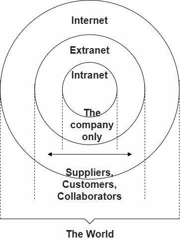
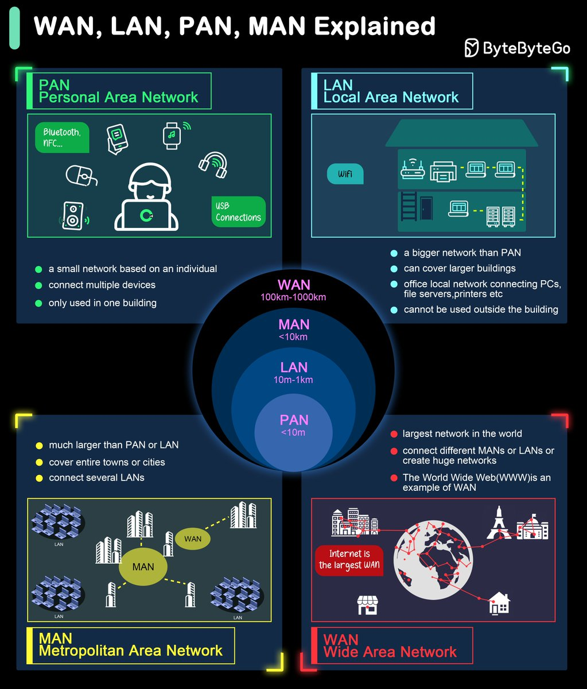
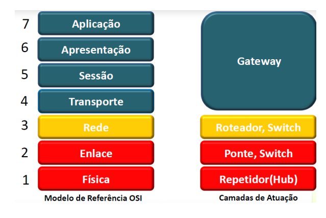
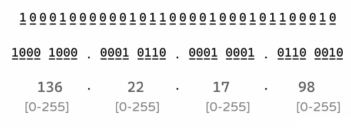
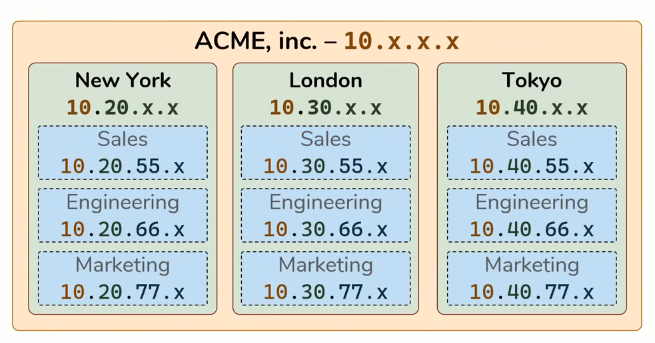

# Redes de Computadores  |  Prática

- [Networking Animated Videos](https://www.youtube.com/playlist?list=PL7zRJGi6nMRzg0LdsR7F3olyLGoBcIvvg) 

---

# Comandos de terminal

**WINDOWS**  

```cmd
# visualizar endereço MAC
ipconfig /all
getmac # powershell
```

**LINUX**  

```sh
ifconfig # visualizar endereço MAC

127.0.0.1 # endereço IP configurado para loopback de internet 

dig example.com A +short # descobrir IPV4
dig example.com AAAA +short # descobrir IPV4

ping <IP>t -c 3
	-c # contador; parar depois de x pings

# ferramentas
whois <IP> # informações sobre IP e registro de domínio
traceroute www.example.com # mapear rota de pacote de rede
```

---

# Estrutura de Redes

- **Servidores:** Se conectam diretamente a internet; armazenam e fornecem conteúdos requisitados por clientes  
- **ISP (Internet Service Provider):** Conectam os clientes aos servidores; fornecem conexão de cabos

> Internet ➡ Infraestrutura  
> Web ➡ Serviço construído sobre a infraestrutura



**Meios de Transmissão de dados**  

-> *Cabeamento de Cobre* (pulsos elétricos)
 - Interconexão de dispositivos de LAN (switches, roteadores e access points)   
- Cabo coaxial
- Cabo par-trançado
	- UTP - não blindado
	- STP - blindado

-> *Fibra óptica* (pulsos de luz)
- Transmite dados por longas distâncias e a larguras de banda mais altas 
- Monomodo (SMF)
- Multiumodo (MMF)

-> *Wireless* (frequências de ondas eletromagnéticas)
- Conexão de dispositivos sem fio em uma LAN
- Wi-Fi
- Bluetooth
- WiMAX
- Zigbee (IoT)

**Representações**  
- Placa de interface de rede (NIC) -> Conecta fisicamente ou virtualmente o dispositivo final à rede (wi-fi também é NIC)
- Porta física -> Conector ou tomada em um dispositivo de rede onde a mídia se conecta a um dispositivo final ou outro dispositivo de rede
- Interface -> Portas especializadas em um dispositivo de rede que se conectam a redes individuais

**Largura de Banda (Bandwidth)**   
- Não é a velocidade em que os dados trafegam na rede
- Mas sim a medida da *quantidade de dados* que é transferida em 1s
- Medido em bits por segundo (bps)
- Latência -> Qnt tempo (incluindo atrasos) para dados viajarem de um ponto a outro
- Rendimento -> Medida da transferência de bits através de um meio físico durante um tempo $x$
- Goodput -> Medida de dados úteis transferidos por um tempo $x$

> $\text{Goodput = Throughput} - \text{sobrecarga de tráfego}$  

 **Taxa de Transferência (Throughput)**   
 - Quantidade *real de dados úteis transmitidos* por um meio em um período, considerando perdas e overheads
 - Sempre menor ou igual à largura de banda
 

---

# Classificação de Redes

## Topologia

> Não existe *necessariamente* ligação entre topologia física e lógica

**Topologia Física** => Como uma rede se comunica com diversos dispositivos  
- Barramento / Bus -> Compartilham mesmo cabo; dificuldade para expansões; ao desconectar qualquer cabo, rede inteira fica inoperante; estrutura barata, antiga e não mais utilizada
- Ring -> Semelhante ao barramento, porém em formato circular; cada nó da rede atua como um "buster" reforçando o sinal e mantendo a direção do fluxo; se um nó falhar a rede a partir dele fica inoperante
- Star -> Cada nó conectado a um elemento central (hub ou switch); de fácil implantação e expansão; a rede só fica inoperante se o equipamento central falhar
- Malha / Mesh -> Cada nó coopera com toda rede, se conectando diretamente com outros nós e criando uma "malha" complexa; redundância entre nós conectados ao original
	- Raramente utilizados em LANs pela complexidade da implementação
	- A Internet (WAN) é um exemplo de rede mesh, porém de roteadores

**Topologia Lógica** => Como dados são transmitidos através da rede
- Arcnet -> Token ring lógico; utilizada na 1ª era de microcomputadores nos anos 80, não mais utilizada; transmissão de 2,5 Mbps
- Token Ring -> Desenvolvida pela IBM; apenas uma máquina pode enviar pacotes (token) de cada vez; eficiente com grande volumes de dados; custo elevado; transmissão de 16 Mbps
- Ethernet -> Consórcio entre a DEC, Intel e Xerox; topologias físicas de estrela ou barramento; atualmente adotada por toda a Internet

---

# Abrangência



---

# Dispositivos de Rede

**Host:** Qualquer dispositivo que envia ou recebe tráfego; identificado por um endereço IP
- Clientes -> Inicia requisições
- Servidores -> Responde requisições

> Definição de cliente e servidor depende da comunicação em que ocorre
> -> Servidor web tem papel de servidor para requisições feitas por um browser cliente
> -> O mesmo servidor web, ao atualizar seus arquivos fazendo uma requisição a um servidor de arquivos, atua como cliente nesta comunicação


**Elementos de Interconexão**  

  

> Hubs e Switches são utilizados dentro de LANs. 
> Para troca de dados fora da própria rede, é necessário a leitura de endereços IP, que é feita pelo Roteador.

**Repetidor / Hub**  
- Cria conexão entre dispositivos em uma rede interna
- Dispositivo não inteligente, não diferencia conexões nas portas; repete pacotes para todos os hosts conectados (broadcast)
- Os dispositivos ligados através de um repetidor se encontram em um mesmo domínio de colisão e de broadcast
- Frames podem ser enviados por uma longa distância
- Soluciona problemas causados pela distorção dos sinais (ruído, atenuação e eco)
- Um repetidor introduz sempre um retardo na rede -> O número de repetidores em uma rede é limitado, no máximo 2
- Em redes com topologia em barramento deve-se evitar caminhos fechados, pois os sinais podem ser retransmitidos infinitamente

**Switch**  
- Cria conexão entre dispositivos em uma rede interna
- Atribui endereço MAC de cada host a uma porta e armazena em uma tabela
- Segmentação da rede -> Divide um domínio de colisão em dois ou mais domínios menores
	- Cada porta do switch corresponde a um domínio de colisão diferente
- Velocidade interna bastante elevada
- Suporte a diversos tipos de interfaces
- Realiza comutação de quadros
- Implementação por software e hardware

**Roteador**  
- Conecta duas ou mais LAN’s
- Gerencia o tráfego de uma rede local e controla o acesso aos seus dados, de acordo com administrador da rede
- Pode ser uma máquina dedicada (equipamento de rede específico) ou pode um software instalado em um computador
- Implementado no nível de rede
- Retransmite pacotes entre várias redes (contém switch interno)
- Filtragem e retransmissão baseada em endereço de rede (ex: IP)
- Utiliza protocolo de roteamento para construir a tabela de roteamento
- Fundamental para conexões WAN
- Permite interligar redes com diferentes tecnologias 
- Divide um domínio de broadcast em dois ou mais domínios de broadcast menores

**Access Point**
- Hub sem fio (wireless) 
- Repete sinal do Roteador para dispositivos sem fio

--- 

# Endereçamento IP 

> Internet Protocol

- Endereço IP -> Identificador de um host
- Sistemas de numeração decimal
- Formado por 4 números -> X.X.X.X
	- Cada X é um **octeto** -> Representa 8 bits
	- $2^n \rightarrow 2 = \text{valores possíveis | n = quantidade de bits}$
	- $2⁸ = 256$ -> cada octeto pode ir de 0-255



## IPv4

- Sequencia de 32 bits
- Compostos por duas partes
	- NetID -> Id da rede à qual o dispositivo está conectado
	- HostID -> id do dispositivo (interface) dentro da rede

**Endereços Reservados**  
- Não roteáveis
- Não podem ser atribuído a nenhum dispositivo
1. Endereço de rede -> octeto final com 0
2. Endereço de broadcast -> Qualquer endereço de campo de HostIP que tenha todos os bits iguais a 1 (255)

### Classes IP

- Classes criadas para ajudar a distribuir ips de acordo com a quantidade de computadores
- As classes determinam quantos bits são usados para identificar a rede e a máquina

| Classe | Máscara       | CIDR | Endereços | 1º bits |
| ------ | ------------- | ---- | --------- | ------- |
| A      | 255.0.0.0     | /8   | 0 - 127   | 0       |
| B      | 255.255.0.0   | /16  | 128 - 191 | 10      |
| C      | 255.255.255.0 | /24  | 192 - 255 | 110     |

### Cálculo de Sub-Redes

- **Calcular bits emprestados**
	- $2^n = \text{nº de sub-redes}$
	- $n = \text{bits emprestados}$
- **Endereços por Sub-rede** 
	- $2^n$
	- $n = \text{bits do HostID}$
- **Endereços Válidos** 
	- $\text{Endereços por sub rede – 2 }\text{(rede e broadcast)}$ 
- **Nova Máscara**
	- Preencher tabela com número binário do HostID
	- Somar números que contém 1

#### Exemplo

> `192.168.0.0 /24`  

**Máscara**  
- NetID ➞ 24 bits
- HostID ➞ 8 bits

**Cálculo de Endereços**  
> 4 sub-redes  

- Verificar quantos bits emprestados são necessários
	- $2² = 4$
- HostID empresta 2 bits para NetID
- NetID ➞ 24 + 2 bits
- HostID ➞ 6 bits  

**Endereços por Sub-rede** ➞ $2⁶ = 64$  
**Endereços Válidos** ➞ $64 – 2 = 62$  

**Nova Máscara**  
- Preencher com binário do novo HostID
> `1111111` · `1111111` · `1111111` · `11000000`

| Potência  | 2⁷  | 2⁶  | 2⁵  | 2⁴  | 2³  | 2²  | 2¹  | 2⁰  |
| --------- | --- | --- | --- | --- | --- | --- | --- | --- |
| **Valor** | 128 | 64  | 32  | 16  | 8   | 4   | 2   | 1   |
|           | 1   | 1   | 0   | 0   | 0   | 0   | 0   | 0   |

- $128 + 64 = 192$
	- `255.255.255.192`
	- `/26`

**Divisão das Sub-redes**  
- 4 sub-redes com 64 endereços cada

| Sub-Rede  | NetID       | 1º IP Válido | Último IP Válido | Broadcast    |
| --------- | ----------- | ------------ | ---------------- | ------------ |
|  1    	| 192.168.0.0 | 192.168.0.1  | 192.168.0.62     | 192.168.0.63 |
|  2   		| .64         | .65          | .126             | .127         |
|  3  	    | .128        | .129         | .190             | .191         |
|  4   	    | .192        | .193         | .254             | .255         |


**Exemplo de sub-redes coorporativa**  


