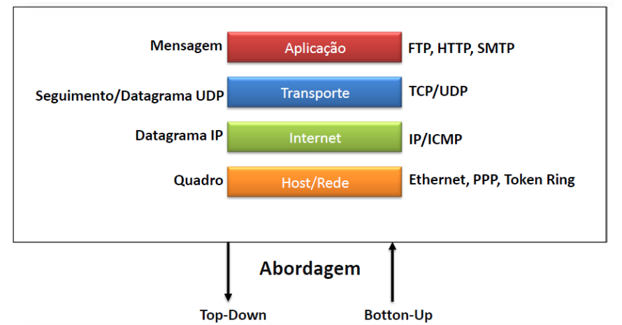
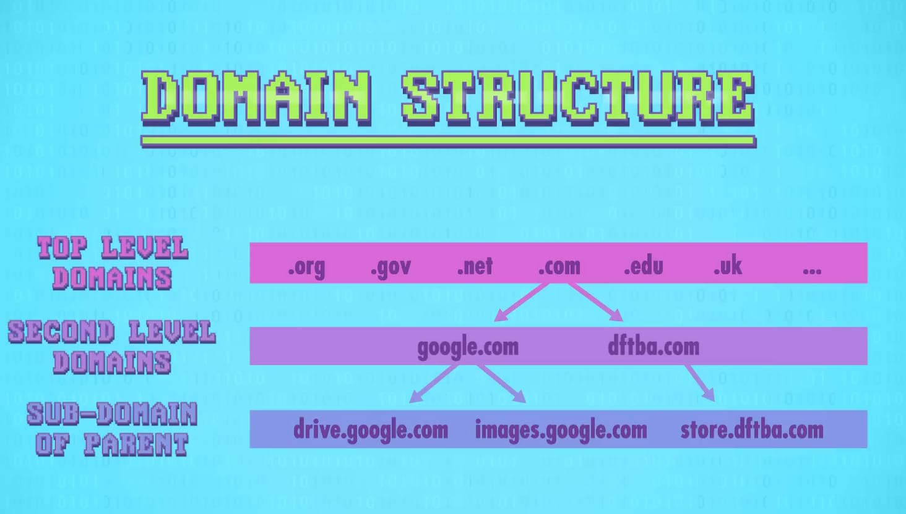
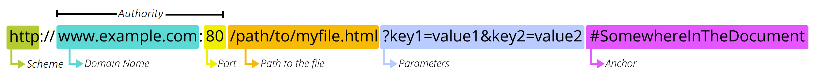
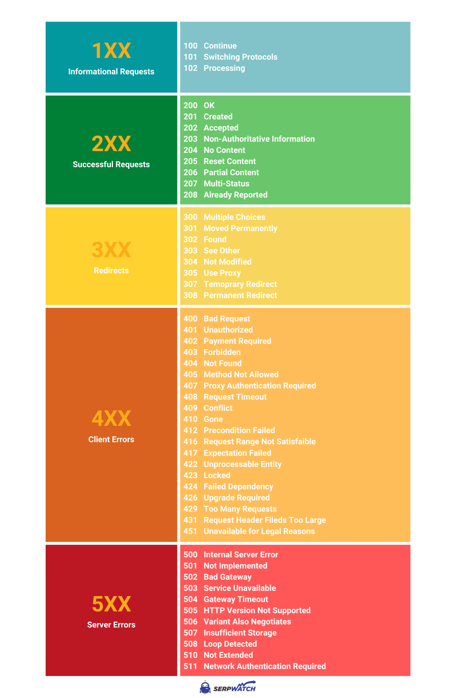
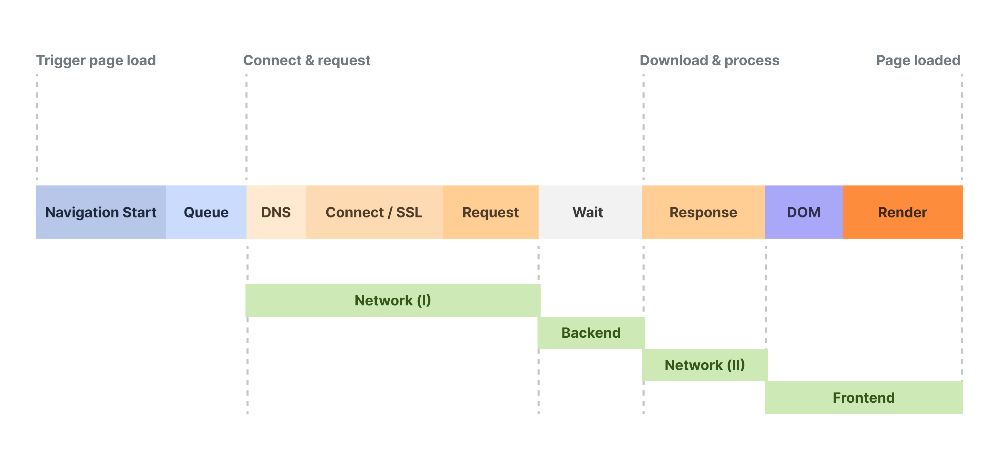
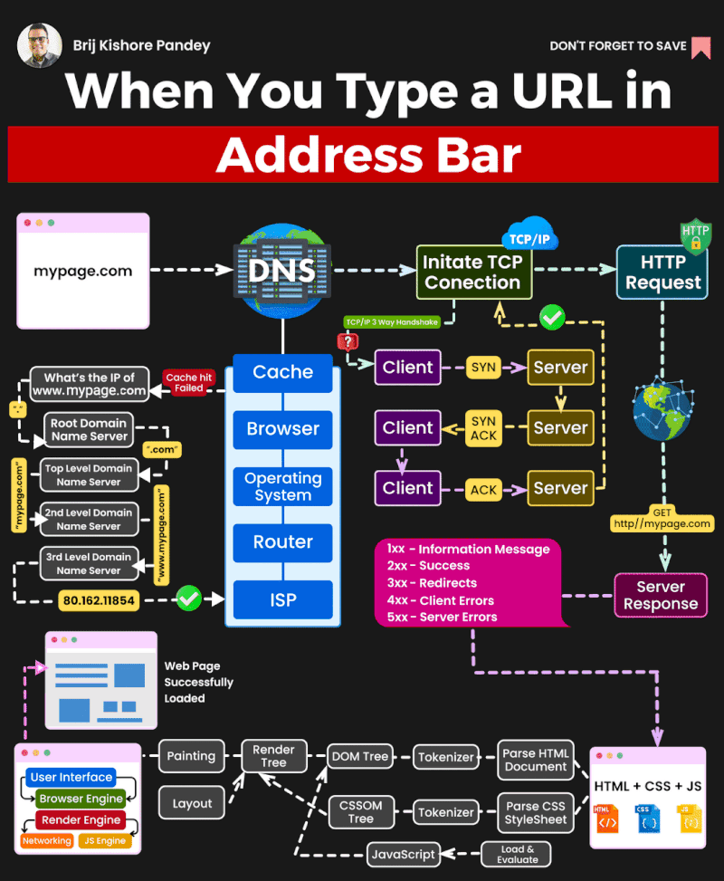

# Redes de Computadores  |  Teoria

- [Networking Fundamentals](https://www.youtube.com/playlist?list=PLIFyRwBY_4bRLmKfP1KnZA6rZbRHtxmXi) 

---

# Conceitos Básicos

- Comunicação de dados é troca de informação entre dois dispositivos através de um meio de comunicação

**Sistema básico de Comunicação**  
- Transmissor 
- Mensagem -> Informação; texto, números, imagem, audio, video...
- Protocolo -> Conjunto de regras que governa a comunicação; acordo entre dispositivos
- Meio -> Caminho físico
- Receptor

**Linhas de Comunicação:** Ponto a ponto, Multiponto (cliente/servidor) 

**Métodos de Transmissão de Dados**  
- Simplex (unidirecional)
- Half-duplex (bidirecional alternado)
- Full-duplex (bidirecional simultânea)

**Tolerância a falhas:** Limitar o número de dispositivos afetados durante uma falha; recuperação rápida; load balancer
- Redundância -> Vários caminhos para um destino; se um caminho falhar, as mensagens serão instantaneamente enviadas por um link diferente
- Comutação de Pacotes -> Divide dados do tráfego em pacotes; cada pacote tem as informações do endereço de origem e destino da mensagem

**Qualidade de serviço (QoS):** Classifica o tráfego em categorias (voz, vídeo, dados críticos) e atribui prioridades; chamadas VoIP recebem maior prioridade; faz gerenciamento de largura de banca, aloca recursos conforme necessidades; controle de latência  

---

# Modelos de Referência

- Modelos de referência para delegar responsabilidades as camadas da comunicação de redes
- Comunicação ocorre nas duas direções das camadas
	- Para baixo -> Encapsulamento
	- Para cima -> Desencapsulamento
- Internet utiliza pilha de protocolos mista
- **Pilha de Protocolos da Internet** -> Modelo OSI + Modelo TCP/IP 

> **PDU** -> Protocol Data Unit 

## Modelo OSI

> Open Systems Interconnection
 
- Desenvolvido pela International Organization for Standardization (ISO) no final da década de 1970
- Padronização para os protocolos de rede
- Cada camada é responsável por um protocolo específico

**Encapsulamento:** Cada camada recebe as informações da camada imediatamente superior, acrescenta informações pelas quais é responsável, e passa para a camada inferior  

**7 -> Aplicação**  
- Faz interface entre a pilha de protocolos e o aplicativo que requisitou ou irá receber a informação
- HTTP (Web), FTP (Arquivos), SMT (e-mail)

**6 -> Apresentação**  
- Converte o formato do dado recebido pela camada de Aplicação em um formato comum, ou seja, um formato estendido pelo protocolo usados
- Diretamente relacionada à sintaxe e à semântica das informações Criptografia e compressão de dados

**5 -> Sessão**  
- Permite que duas aplicações em computadores diferentes estabeleçam uma sessão de comunicação
- Diferentes usuários conectados -> sincronização

 **4 -> Transporte**  
- Camada de comunicação fim-a-fim
	- Process-to-process
	- Controle de fluxo e ordem

**3 -> Rede**  
- Endereçamento lógico dos pacotes -> tradução de endereços lógicos em endereços físicos
	- Os endereços IP são mapeados para cada endereço *MAC (Media Access Control)*, usando o procedimento *ARP (Address Resolution Protocol)*
- Qualidade de Serviço (QoS) -> Prioriza a entrega de determinado pacote
- Determinação de rota -> Baseia-se em condições de tráfego e prioirdades

**2 - Enlace de Dados (Data Link)**  
- Recebe pacotes oriundos da camada de Rede e transforma em:
	- Quadros (Ethernet - tamanho variável)
	- Células (ATM - tamanho fixo)
- Fornecer informações sobre os endereços físicos de origem e destino (MAC) do quadro 
- Todos os quadros da Camada 2 possuem Cabeçalho, Payload e Sequência de verificação de quadro (FCS - Frame Check Sequence)
- Endereço MAC (Media Access Controli) -> 48 bits, 3 octetos identificam o fabricante, 3 octetos identificam a interface

**1 - Física**  
- Recebe os quadros enviados pela camada de Enlace e os transforma em sinais compatíveis com o meio
	- Meio elétrico(0s e 1s convertidos em pulsos elétricos transmitidos pelo cabo)
	- Meio óptico(0s e 1s convertidos em sinais luminosos) 
- Papel desempenhado pela placa de rede
	- Quantidade de pinos deve ter o conector de rede e qual a finalidade de cada um deles

> Camadas de **rede** e de **enlace de dados** são responsáveis por entregar os dados do dispositivo origem para o dispositivo destino

**Endereços de Origem e Destino**
- Camada de Rede | Endereço Lógico (IP) -> Entregar pacote IP da origem original ao destino final; pode estar na mesma rede ou em rede remota
- Camada de Enlace de Dados |  Endereço Físico (MAC) -> Fornecer o quadro de enlace de dados de uma placa de interface de rede (NIC) para outra NIC na mesma rede

## Modelo TCP/IP

- Conjunto de padrões de redes que permitem interconexão de redes e sistemas heterogêneos
	- Redes físicas com diferentes tecnologias de acesso
- Divide e organiza os problemas de comunicação em camadas hierárquicas
- Cada camada é responsável por uma função específica e usa as funções oferecidas pelas camadas inferiores
- Arquitetura de Rede -> Combinação dos diversos protocolos nas várias camadas

**Camada Host/Rede**  
- Não é especificado o que ocorre nessa camada; única exigência é que host se conecte usando algum protocolo capaz de enviar pacotes IP
- Serviço não orientado a conexão
- Interface entre hosts e enlace de transmissão (canal)

**Camada Internet**  
- Também chamada de Inter-redes
- Permitir que hosts injetem pacotes em qualquer rede e garantir que eles trafegarão independentemente até o destino
- Não importa a ordem
- Define formato de pacote oficial e protocolo IP (Internet Protocol)
- Função é entregar pacotes IP

**Camada Transporte**  
- Permite a conversação entre hosts de origem e destino
- TCP (Transmission Control Protocol)
- Protocolo orientado a conexão
- UDP (User Datagram Protocol)
- Protocolo sem conexão

**Camada Aplicação**  
- Contém todos os protocolos de alto nível
- TELNET (Terminal Virtual)
- FTP (File Transfer Protocol)
- SMTP (Send Mail Transfer Protocol)
- DNS (Domain Name System)
- HTTP (Hypertext Transfer Protocol)

---

# Camada de Aplicação (5, 6, 7)

**Sockets:** Porta de saída das aplicações  

## Arquiteturas de Aplicação

**Cliente/Servidor**  
- Apresenta hierarquia, servidor comanda
	- Não há comunicação entre clientes
- Mais rápido e mais seguro -> GPO
- Cliente -> Qualquer computador conectado a uma rede que possuem um endereço IP
- Servidor -> Computadores com software para fornecer informações requisitadas pelos clientes e hardware específico para suportar muitas requisições  

**Peer to Peer (P2P)**  
- Não há hierarquia, qualquer computador conectado na rede pode ser cliente e servidor
	- Um computador pode se comunicar com qualquer outro computador na rede
- Fácil implementação; menor custo
- Menos segura; não escalável

## Protocolos

### DNS 

> Domain Name System 

- Serviço automatizado que traduz nomes de domínios em endereços de rede numérico (IPv4 ou IPv6)
- Inclui formato para consultas, respostas e dados e usa os registros de recursos (RR) para identificar o tipo de resposta DNS
- Comunicações utilizam formato único chamado mensagem, utilizado para todos os tipos de consultas de cliente, respostas de servidor, mensagens de erro e transferência de informações entre servidores

-> Primeiramente o servidor DNS procura em seus próprios registros
-> Se não puder resolver, entra em contato com outros servidores

**Hierarquia DNS**  

**URL (Uniform Resource Locator)**  
- Endereço de recurso único na Web
- *scheme* > protocolo
- *authority*
    - domain name > servidor requisitado
    - port
- *porta para o arquivo*
- *parâmetros*
- *âncora* > área específica da página

### HTTP / HTTPS

> Hypertext Transfer Protocol   
> Secure Hypertext Transfer Protocol

- Protocolo para visualização de páginas web
- Ao buscar uma URL em um navegador, este estabelece uma conexão com o serviço Web utilizando o protocolo HTTP
- HTTP utiliza texto puro na transferência de dados; método inseguro
- HTTPS adiciona a camada de segurança com o protocolo SSL (Segure Sockets Layer)
	- SSL utiliza chave pública para criptografar dados na comunicação
	- Cliente requisita certificado SSL ao servidor para validar identidade autenticidade do website
- HTTPS também utiliza o protocolo TLS (Transport Layer Security), sucessor do SSL
	- Autentica servidor, cliente e criptografa dados

**HTTP/2**  
- Nova versão do HTTP, mais rápida
- A forma como os dados são enviados é diferente, em formato binário, headers comprimidos e múltiplas requisições podem ser enviadas na mesma conexão
- Métodos, códigos de status, corpo de requisição/resposta e headers mantém o mesmo; muda apenas o host header
- Muitos softwares (CDNs, ngix) permitem clientes conectarem com HTTP/2 mesmo se o servidor só suportar HTTP/1.1

![[img/http2.png]]

**Request / Response**  
- GET -> Requisição do cliente para obter dados
- POST -> Requisição para enviar arquivos de dados para o servidor como formulários de dados
- PUT -> Carrega recursos ou conteúdos para o servidor

### FTP

> File Transfer Protocol

- Protocolo para transferência de arquivos
- Primeiro o cliente estabelece uma conexão para controle de tráfego, utilizando a porta TCP 21
- Depois o cliente estabelece uma segunda conexão para transferência de dados, utilizando a porta TCP 20; conexão criada toda vez que houver dados a serem transferidos
- Transferência de dados pode acontecer em ambas direções; download de dados do servidor ou upload de dados para o servidor

### Protocolos de E-mail

**SMTP (Simple Mail Transfer Protocol)**
- Protocolo utilizado para envio de email
- Exige cabeçalho de mensagem, com o endereço de email do destinatário, e um corpo, contendo a mensagem
- Cliente utiliza protocolos POP e IMAP para *recuperação* de emails do servidor -> Envia requisição para conexão TCP com servidor

**POP (Post-Office Protocol)**  
- Mensagens de email são baixadas para o cliente e removidas do servidor
- Não há local centralizado para manter os emails

**IMAP (Internet Message Transfer Protocol)**  
-  Mensagens originais são mantidas no servidor até que sejam excluídas manualmente
- Cliente de email exibe cópias de mensagens
- Usuários podem criar hierarquia de arquivos para organização que é duplicada entre servidor e cliente de email
- Quando usuário exclui mensagem, o servidor sincroniza a ação e exclui no servidor

### DHCP

> Dynamic Host Configuration Protocol

- Servidor que fornece dinamicamente informações de configuração de IPv4 aos clientes  
- Também atribui uma máscara de sub-rede, um gateway padrão e um servidor DNS
- Host envia broadcast na rede para requisitar um endereço IP
- Possui um escopo com o intervalo de endereços IP que pode alocar (emprestar)
	- Cada IP tem um tempo limitado para pertencer a um host
	- Ao final do tempo limite, o host solicita renovação do endereço IP, confirmando que ainda esta em uso
		- Caso não solicite a renovação, o endereço IP fica disponível novamente no *pool* do servidor DHCP
	- Assegura que o servidor DHCP não fique sem endereços IP

**Operação / Negociação**  
- Host -> Broadcast com DHCP DISCOVER
- Servidor -> Resposta com DHCP OFFER
- Host -> Resposta com DHCP REQUEST
- Servidor -> Confirmação com DHCP PACK

### SMB / SAMBA

> Server Message Block  

- Protocolos para compartilhamento de arquivos e impressoras
- SAMBA é a versão do protocolo para sistemas UNIX/LINUX
- Descreve estrutura de recursos de rede compartilhados (diretórios, arquivos, impressoras e portas seriais)
- Protocolo Requisição/Resposat
- Diferente do FTP, clientes estabelecem conexão de longo prazo com os servidores
- Após conexão, cliente pode acessar recursos no servidor como se fosse local

---

# Camada de Transporte (4)

## TCP

## UDP

- Usado por DNS, DHCP, TFTP, NFS e SNMP
- Protocolo de camada de transporte não orientado à conexão, sobrecarga muito mais baixa que o TCP
- Usado com aplicações em tempo real, como streaming de mídia ou VoIP
- Usado para situações onde não é necessário uma confirmação do recebimento do pacote
- Especifica porta para programa que deve receber o pacote
- Checksum = parte do cabeçalho que verifica se dados estão corrompidos ou não, a partir da soma dos bits

> IP leva o pacote até o computador certo, mas UDP leva o pacote até o programa correto naquele computador

---

# Camada de Rede / Internet (3)

- Fornece serviços para permitir que dispositivos finais troquem dados

## Protocolos

### IP

> Internet Protocol

- Fornece funções necessárias para entregar um pacote de um host de origem a um host de destino por meio de interconexão de redes
- Endereço IP é determinado pelo protocolo da Camada de Rede -> Visa facilitar o roteamento
- Para enviar e receber dados através da rede, é necessário ambos os endereços **IP** e **MAC**
- Embora os pacotes IP sejam enviados com informações sobre o local da entrega, eles não contêm informações para confirmar a entrega ao remetente
- Independente de Mídia (meio físico)

### ARP

> Address Resolution Protocol  

- Solicitações ARP são utilizadas para determinar o endereço MAC de um host a partir de um endereço IP (dispositivo correspondente envia resposta ARP)
- Todos os hosts na sub-rede recebem e processam solicitações ARP

> Qualquer cliente pode enviar uma resposta ARP não solicitada denominada "ARP gratuito". Outros hosts na sub-rede armazenam o endereço MAC e o endereço IP contidos no ARP gratuito em suas tabelas ARP

### ICMP

> Internet Control Message Protocol  

- Desenvolvido para transportar mensagens de diagnóstico e relatar condições de erro quando rotas, hosts e portas não estão disponíveis

---

# Camada de Enlace de Dados (2)

- Prepara os dados da rede para a rede física
- Responsável pelas comunicações NIC para NIC dentro da mesma rede
- Nó -> Dispositivo que pode receber, criar, armazenar ou encaminhar dados por um caminho de comunicação; pode ser um dispositivo final ou intermediário
- Endereços Físicos

> Os endereços físicos não indicam em qual rede o dispositivo está localizado. Um dispositivo ainda funcionará com o mesmo endereço físico da Camada 2, mesmo que se mova para outra rede ou sub-rede. 
> 
> Endereços de Camada 2 são usados apenas para conectar dispositivos dentro da mesma mídia compartilhada, na mesma rede IP.

**Padrões IEEE 802 LAN/MAN:** Específicos para LANs Ethernet, WLANs, WPAN e outros tipos de redes locais e metropolitanas; 

--> Subcamadas do Padrão IEEE 802:
- **Logical Link Control (LLC):** Comunica entre o software de rede nas camadas superiores e o hardware do dispositivo nas camadas inferiores; identifica qual protocolo de camada de rede está sendo usado para o quadro
	- permite que vários protocolos como IPv4 e IPv6 usem a mesma interface de rede e mídia
- **Controle de Acesso a Mídia (MAC):** Implementa a subcamada (IEEE 802.3, 802.11 ou 802.15) no hardware; responsável pelo encapsulamento de dados e controle de acesso à mídia; fornece endereçamento de camada de link de dados e é integrado com tecnologias de camada física

**Ethernet**

---

# Camada Física (1)

---
# VISÃO GERAL

