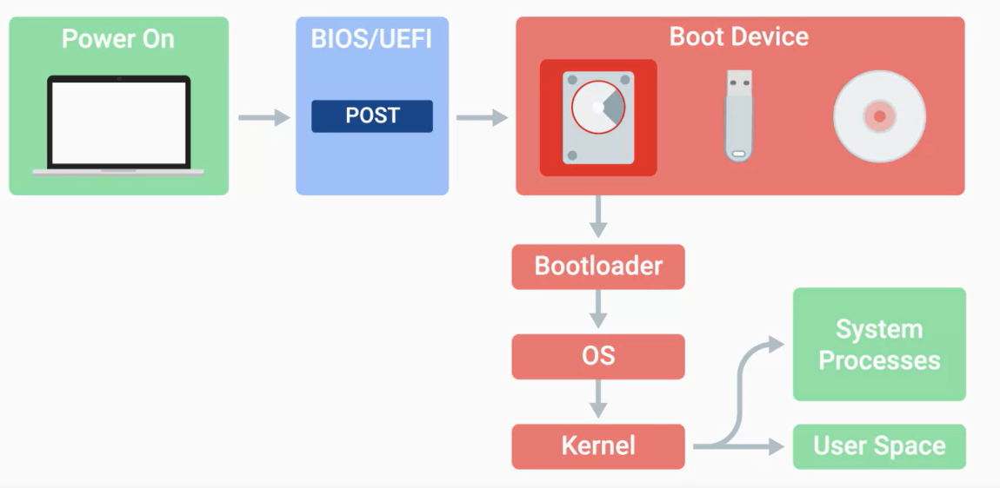
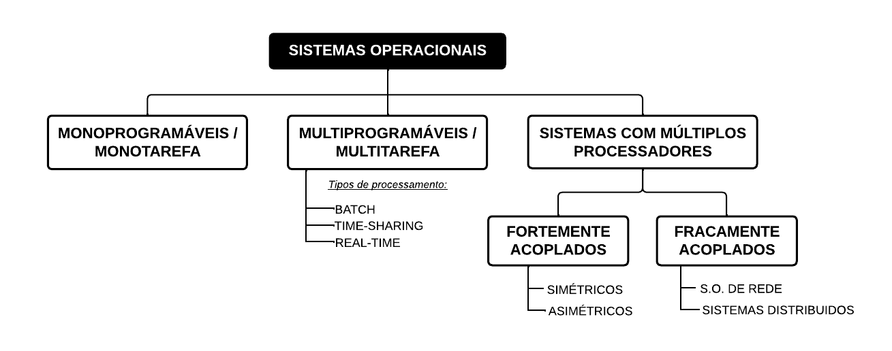
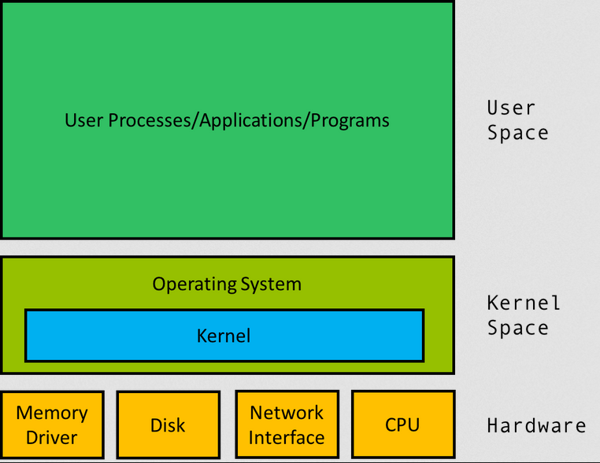
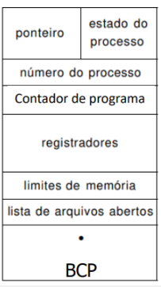
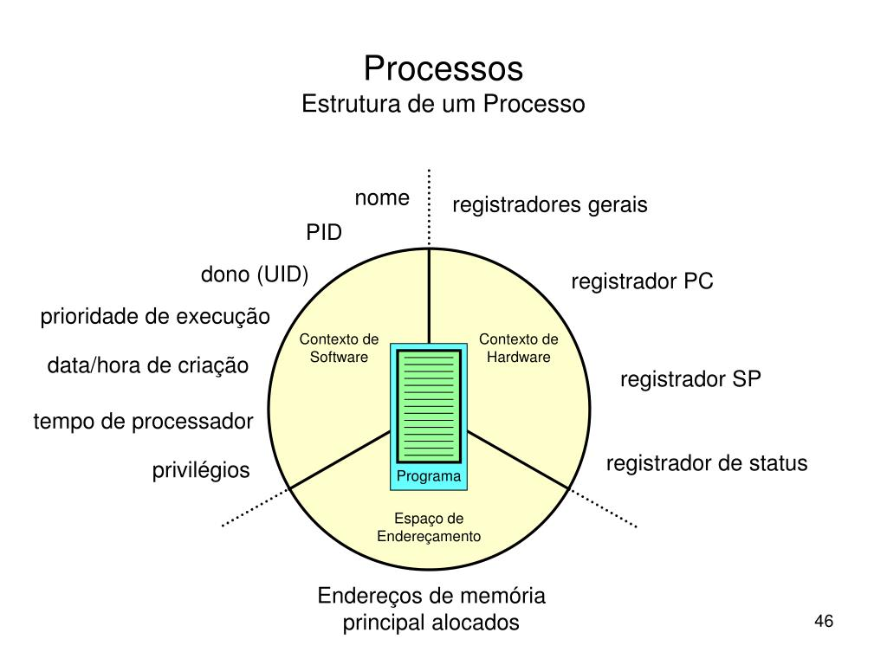
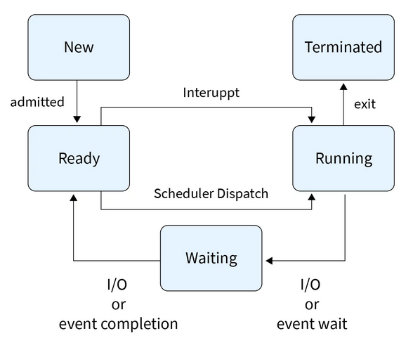
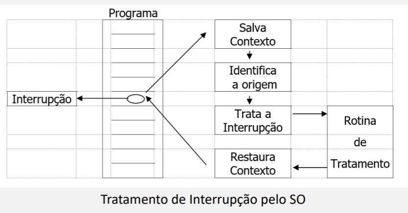
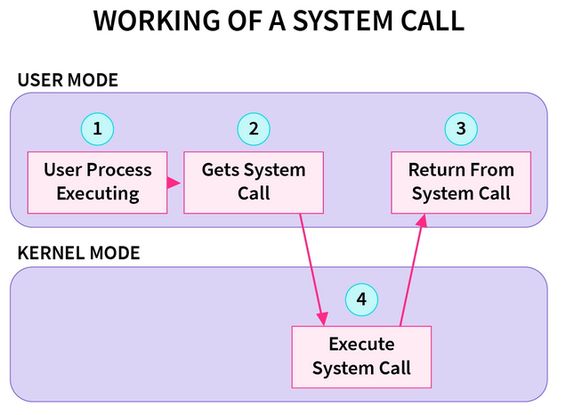
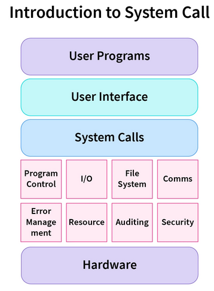
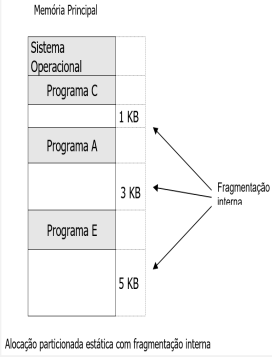

**Sistema Operacional (SO):** Programa ou conjunto de programas do sistema que gerencia recursos de hardware e atua como intermediário (interface) entre usuário e hardware

**Buffer:** Utilização de uma área da RAM para auxiliar a transferência de dados entre I/O e a memória; armazenamento temporário para mitigar diferenças de velocidade em I/O\
**Reentrância:** Capacidade de um código executável ser compartilhado por várias tarefas exigindo apenas uma cópia em memória (guias em um mesmo programa ao invés de uma nova janela)\
**Program Counter:** Ponteiro que aponta para a próxima instrução a ser processada

> **Hyper-Threading:** tecnologia onde o processador se apresenta para o SO como possuindo o dobro de núcleos que possui fisicamente; _divisão do processamento_ entre dois ou mais processadores lógicos

## Boot

**BIOS/UEFI:** Software de baixo nível que inicializa o hardware do computador\
**UEFI (Unified Extensible Firmware Interface):** Versão moderna de inicialização, mais compatível\
**POST (Power On Self Test):** Testes diagnósticos para verificar o funcionamento do computador\
**Boot Device**

* Respeita a ordem de boot
* Bootloader - Programa pequeno que carrega o sistema operacional

## Tipos

### Sistemas Monoprogramáveis (Monotarefa)

* Primeiros sistemas operacionais
* Recursos computacionais são dedicados para apenas um programa
* Para execução de novo programa, aguarda término de programa concorrente
* Implementação simples
* _jobs_ - programas
* MS-DOS

### Sistemas Multiprogramáveis (Multitarefa)

* Escalonamento / concorrência de programas
* Recursos computacionais são compartilhados entre aplicações
* Reduz tempo de resposta e custo
* Implementação complexa

Podem ser classificados pela **forma como gerencia suas aplicações**:

**Sistemas BATCH:** Primeiros sistemas multiprogramáveis (década de 60); execução por cartões perfurados, armazenados em disco ou fita; processamento sem interação humana

**Real-Time:** Tempo de execução dentro de limites rígidos; programa ocupa o processador o tempo que for necessário ou até surgir um programa de maior prioridade (definida pela aplicação); utilizados em controle de processos (refinarias de petróleo, tráfego aéreo, usinas etc)

**Time Sharing:** Compartilhamento de diversos recursos do sistema; permite execução de diversos programas a partir da divisão do tempo do processador em pequenos intervalos (time-slice); a maioria das aplicações comerciais atuais utiliza, pois oferece menos tempo de resposta ao usuário e menos custo

### Sistemas com Múltiplos Processadores

* _Cluster de processamento_
* Possuem duas ou mais CPU's interligadas trabalhando em conjunto
* Permite a execução simultânea de programas ou a subdivisão do programa para execução em mais de um processador
* Permitiu criação de sistemas para processamento científico, simulações, processamento de imagem etc

**Fortemente Acoplado:** Uma memória é compartilhada pelo cluster de processadores e dispositivos I/O são gerenciados por um único SO; maior taxa de transferência e memória

* _Multiprocessamento Simétrico (SMP):_ cada CPU executa uma cópia idêntica do SO
* _Assimético:_ quando processadores são diferentes; resposta não é em tempo real

**Fracamente Acoplado:** Processadores estão em arquiteturas diferentes, somente unidos por cabos de interconexão; cada CPU é uma máquina independente, com SO próprio e possui sua própria memória individual

* _Redes:_ Dois ou mais sistemas independentes (hosts) interligados por linhas telefônicas, permitindo que um host compartilhe seus recursos (impressora, diretórios)
* _Distribuídos:_ Também compartilha recursos, porém neste modelo o SO omite detalhes dos hosts individuais e trata como se fossem um conjunto único (fortemente acoplado)

***

# Kernel

* Núcleo do SO
* Conjunto de rotinas que oferecem serviços essenciais aos usuários, aplicações e ao próprio sistema
* Gerencia os recursos do sistema

> O usuário entra em contato com o sistema operacional por meio do **shell** que envia para o **kernel** o que foi solicitado

**Shell:** Interpretador de comandos; "casca", parte externa responsável pela comunicação (interface CLI ou GUI) com o usuário

* CLI - Command-Line Interface
* GUI - Graphic User Interface

## Estruturas

**Camadas:** Sistema é dividido em níveis sobrepostos onde cada camada fornece funções que podem ser utilizadas apenas pelas camadas superiores; _isolamento das funções do sistema_; compromete desempenho dadas as mudanças de camadas

**Microkernel - Client/Server:** Cada função/serviço do SO é disponibilizada através de processos; cliente (aplicação/usuário) solicita ao servidor (processo) responsável; permite que servidores operem como modo usuário acessando componentes limitados, pois apenas o núcleo opera em modo kernel

## Processos

* Ambiente onde um programa é executado / "programa em execução"
* Contém quantidade de recursos que o processo pode utilizar

### Bloco de Controle de Processo (BCP)

* Estrutura de dados que compõe o processo

**Contexto de Software:** Especificação de limites e recursos

1. Identificação - infos sobre o usuário, áreas de atuação no sistema
2. Quotas - limites de recursos; área utilizada em disco/memória; limite de linhas impressas; nº máx de arquivos abertos; nº máx de I/O pendentes e tempo limíte de CPU
3. Privilégios - prioridades assumidas pelo processo durante sua execução

**Contexto de Hardware:** Conteúdo dos registradores da CPU, uso geral e específico; troca de contexto

**Espaço de Endereçamento:** Área da memória p/ armazenar instruções e dados de um programa; cada processo possui seu próprio espaço de endereçamento isolado de outros processos

### Estados do Processo

**New** Processo está sendo alocado na memória; recursos necessários são reservados; mais de um processo ao mesmo tempo\
**READY:** Aguarda liberação da CPU (depois de criado ou após retorno da execução); "fila" gerenciada pelo SO\
**RUN:** Utilização da CPU; permanece no processador até sua interrupção ou término da execução; um processo por vez\
**WAIT:** Todos os processos que sofreram interrupção I/O; mais de um processo ao mesmo tempo (está em execução, aguarda periférico)\
**Terminated:** Final; término de processamento; mais de um processo ao mesmo tempo

### Tipos de Processo

* CPU executa processos do sistema com certa prioridade concorrendo com processos do usuário

**CPU-bound:** Processo que utiliza muito a CPU; utiliza a time-slice por inteiro; pouca entrada e muito processamento (programas científicos, cálculo estatístico)\
**I/O-bound:** Utiliza mais I/O que CPU; permanece mais tempo em espera do que em execução (aplicações em BD, consultas e atualizações em arquivos em disco)

### Thread

* Linha de execução; sequência de instruções que faz parte de um processo principal
* Possui contexto de hardware próprio, porém compartilha contexto de software e espaço de endereçamento com as demais threads

> Processo é dividido em threads, que formam **tarefas independentes, mas relacionadas entre si**

***

# Funções do SO

1. Gerenciamento de Processador
2. Gerenciamento de Memória
3. Sistema de Arquivos
4. Gerenciamento de I/O
5. Suporte a redes
6. Contabilização de uso do sistema
7. Segurança

## Interrupções e Exceções

Eventos inesperados que causam um _desvio forçado no fluxo normal de execução_; é armazenado o _contexto_ da execução de um programa, para então posteriormente retornar do ponto onde parou

* _Interrupção:_ Gerada por um evento externo; permitiu a implementação da concorrência nos computadores; fundamento básico de sistemas multitarefa
* _Exceção:_ Execução de instrução dentro do programa (divisão por 0, overflow)

## System Call

> **Troca de mensagens** entre cliente (aplicação/usuário) e servidor (processo)

* Porta de entrada p/ acesso ao kernel e aos serviços
* Necessária para execução de serviços através da chamada de rotinas
* Cada serviço disponível possui sua system call
* Cada SO possui conjunto específico de system call

## Gerência do Processador

**Gerenciamento de Processos:** 
- Criação / Eliminação ➡ Alocação em memória dos recursos necessários junto do contexto
- Escalonamento / Controle ➡ Organiza fila de acesso ao processador baseado nos parâmetros do sistema e do perfil o usuário

**Funções:**

* Manter CPU ocupada
* Balancear uso da CPU entre processos
* Privilegiar aplicações críticas
* Maximizar throughput
* Oferecer tempo de resposta razoável

### Escalonamento

**Política de Escalonamento:** Critérios para fila de processamento; cada SO possui uma própria

**Critérios de Escalonamento**

* Utilização do Processador
* _Throughput:_ número de tarefas executadas em função do tempo
* _Tempo de processador:_ tempo que um processo leva em RUN
* _Tempo de espera (pela CPU):_ tempo que um processo fica em READY
* _Tempo de turnaround:_ tempo total do processo no sistema, de CREATE até EXIT
* _Tempo de Resposta:_ do momento da requisição até o início da resposta

#### Não-Preeptivo

* SO não pode interromper os processos, a não ser que haja instrução para tal ou seja desviado para WAIT (operações I/O)

**FIFO / FCFS (First-Come-First-Served):** First in, first out; primeiro processo que chega na fila permanece utilizando o processador até o fim de sua execução; obedece a ordem de chegada á fila de READY; inicialmente implementado em sistemas monoprogramáveis

**SJF:** Escalonamento seleciona o processo que tiver menor tempo de CPU; parâmetro passado via contexto de software; se baseia em estatísticas de execuções anteriores

**Cooperativo:** Um processo em execução voluntariamente retorna à fila de pronto e libera a CPU para um novo processo; aumenta concorrência no processador; melhor distribuição do tempo do processador

#### Preeptivo

* Possibilidade de interrupção pelo SO (retorna para READY), permite priorização de processos

**Circular:** Preepção por tempo; projetado para sistemas time-sharing; semelhante ao FIFO, obedece ordem de chegada, porém respeita limite de time-slice\
**Prioridade:** Funcionamento com base na prioridade de execução (valor atribuído a cada processo), no caso processos com prioridades iguais é processado o primeiro a chegar (critério FIFO)

**Circular com Prioridade:** Conceito de time-slice e prioridade de execução; processo permanece em execução até que termine seu processamento, ou voluntariamente passe para o estado de espera (interrupção por E/S), ou sofra uma preempção por tempo ou prioridade; possibilidade de diferenciar grau de importância através da prioridade

**Múltiplas Filas:** Várias filas com processos em estado de pronto, cada uma com prioridade específica; a fila detém a prioridade, não o processo; processos sempre voltam para a mesma fila de onde saíram

**Múltiplas Filas com Realimentação:** Semelhante ao anterior, mas permite ao processo voltar para uma outra fila de maior ou menor prioridade; SO identifica dinamicamente o comportamento de cada processo e o redireciona para a fila mais conveniente

## Gerência de Memória

* Memória principal sempre foi vista como um recurso escasso e caro
* Gerência de sistemas multiprogramáveis é bem mais complexa do que em monoprogramáveis; alto número de usuários e aplicações enquanto deve utilizar espaço da MP eficientemente

> Programas são armazenados em memórias secundárias não voláteis\
> Como o processador somente executa o que está na MP, o SO deve sempre _transferir programas da memória secundária para a principal_ antes de serem executados

### Alocação de Memória

**Alocação Contígua Simples:** Primeiros SO sistemas monoprogramáveis; MP dividia em parte do SO e parte do usuário; limitado a apenas 1 usuário; gerenciamento não eficiente

**Segmentação de Programas - Overlay:** Divisão do programa em módulos independentes que utilizam a mesma área de memória; módulo principal ocupa a memória durante todo tempo de execução; permite execução de programas maiores que a memória física disponível

**Alocação Particionada Estática:** Código realocável, referências a endereços no programa são relativas ao início do código e não a endereços fixos; programas podem ser realocados em qualquer partição livre; tanto em sistemas de alocação absoluta como nas realocáveis, programas deixam espaço livre na partição (fragmentação interna)

_Alocação particionada estática absoluta:_ Antigamente quando programas só podiam ser carregados/executados em uma partição específica, mesmo com outras disponíveis; referências a endereços são posições fixas na memória (código absoluto)

**Alocação Particionada Dinâmica:** Eliminado o conceito de partições de tamanho fixo; tamanho da partição é definido de acordo com o espaço necessário à execução de tal programa; eliminação da fragmentação interna, porém, dada a variação de tamanho utilizado pelos programas, restam blocos de memórias cada vez menores impedindo o ingresso de novos programas (fragmentação externa)\
_Soluções para problema de fragmentação externa:_

* União dos blocos livres adjacentes em uma grande área livre (nova partição)
* Realocação das partições ocupadas para a parte inicial da memória, eliminando blocos livres entre elas, grande área livre no final da memória (alocação particionada dinâmica com realocação)

**Estratégias de Alocação de Partição:** Estratégias para determinar em qual área livre um programa será alocado para execução

* _Best-fit:_ Partição que deixa o menor espaço sem utilização; deixa pequenos blocos, fragmentação aparece mais rápido
* _Worst-fit:_ A que deixa maior espaço livre; aproveita primeiro partições maiores e deixa grandes espaços livres, retarda fragmentação
* _First-fit:_ Primeira partição que couber, independente do espaço livre que vai deixar; estratégia mais rápida, menos consumo de recursos

**Swapping:** Técnica que visa dar maior taxa de utilização à memória principal e melhorar compartilhamento; quando não há espaço na MP, o SO escolhe os processos com menor previsão de utilizar a CPU e "descarrega" em uma área reservada no disco, chamada arquivo de swap

### Memória Virtual

* Combina memória principal e secundária, permitindo que os programas acessem mais memória do que a capacidade real da memória principal
* Elimina a limitação do tamanho dos programas e suas estruturas de dados; permite um número maior de processos compartilhando a memória principal, minimizando o problema da fragmentação

### Paginação

* Técnica utilizada para gerenciar memória física de forma eficiente
* Divide o programa em blocos de tamanho fixo chamados _páginas_, facilitando o controle do acesso à memória e melhorando o desempenho geral do sistema
  * Cada página tem um número único de página (PAN) que identifica sua localização na memória física
* Páginas do espaço virtual são chamadas _páginas virtuais_, enquanto as páginas do espaço real são chamadas páginas reais ou _frames_

**Espaço de Endereçamento**

* _Espaço de endereçamento real:_ Espaço de endereçamento que um programa ocupa na memória física; limitado pela quantidade total de memória disponível
* _Espaço de endereçamento virtual:_ Conceito abstrato que permite aos programas acreditar que têm acesso contínuo e ilimitado à memória, mesmo quando essa não está disponível fisicamente; SO mapeia automaticamente as referências virtuais para endereços reais na memória física

**Mapeamento:** Processo pelo qual o SO traduz os endereços virtuais em endereços físicos  
**Tabela de Endereçamento de Páginas:** Estrutura de dados usada para armazenar informações sobre cada página na memória, inclui o endereço físico correspondente, status da página (se está em uso ou livre), e outras informações relevantes  
	
**Page Fault:** Ocorre quando o SO tenta acessar uma página que não está atualmente na memória física; para resolver isso, o sistema deve buscar a página na unidade de armazenamento secundário (como disco rígido), o que pode causar um atraso significativo conhecido como latência de página  
	
**Working Set:** Conjunto de páginas que um programa precisa ter na memória para executar corretamente durante um período de tempo; gerenciar eficientemente o working set é crucial para evitar o thrashing  
	
**Thrashing:** Acontece quando o SO passa muito tempo buscando páginas na unidade de armazenamento secundário, em vez de executar programas; isso ocorre quando há muitas trocas de página, indicando que a memória física está sobrecarregada  
	
**Tamanho da Página:** Deve estar entre 512 bytes e 128 KB, aproximadamente  
	
**Política de Busca de Páginas:** Definem como as páginas serão carregadas da memória virtual para a memória real

* _Política por Demanda:_ Estabelece que uma página somente será carregada quando for referenciada
* _Paginação Antecipada:_ Funciona carregando antecipadamente várias páginas da memória virtual para a principal, na tentativa de economizar tempo de E/S

**Política de Alocação de Páginas:** Determinam quantos frames cada processo pode manter na memória real; algumas políticas comuns incluem best fit, first fit e worst fit

* _Política de Alocação Fixa:_ Determina um limite de working-set igual para todos os processos, e pode ser vista como uma política "injusta", na medida em que processos maiores normalmente necessitam de um working-set maior
* _Política Variável:_ Define um limite de working-set diferente e variável para cada processo, em função de seu tamanho, taxa de paginação ou até mesmo da taxa de ocupação da memória principal

**Política de Substituição de Páginas:** Decide qual página será removida da memória quando ela está cheia e uma nova página precisa ser carregada. Métodos populares incluem LRU e FIFO.

* _Política Local:_ Somente as páginas do processo que gerou o page fault são candidatas a serem substituídas
* _Política Global:_ Todas as páginas alocadas na memória principal são candidatas à substituição independente do processo que gerou o page fault

#### Algoritmos de substituição de páginas

* Têm o objetivo de selecionar os frames que tenham as menores chances de serem referenciados num futuro próximo. Caso contrário, o frame poderia retornar diversas vezes para a memória real, provocando excesso de page faults

**Algoritmo Aleatório:** Escolhe qualquer página, entre as alocadas na memória, para fazer a substituição; em função de sua baixa eficiência, este algoritmo não muito utilizado, embora consuma poucos recursos do sistema

**FIFO (First In, First Out):** Escolhe a página que está há mais tempo na memória principal para fazer a troca; algoritmo de simples implementação, mas corre o risco de retirar uma página que, embora tenha sido carregada há mais tempo, esteja sendo muito utilizada

**LFU (Least Frequently Used):** Escolhe a página menos frequentemente usada para efetuar a troca; através de um contador, armazenado na tabela de endereçamento de páginas, o sistema identifica quantas referências cada página teve e utiliza esta informação para escolher a página

**LRU (Least Recently Used):** Escolhe a página menos recentemente usada para fazer a troca; o sistema mantém na tabela de endereçamento de páginas um campo onde são armazenadas a data e a hora da última referência de cada página, e com base nestas informações faz a seleção

**NRU (Not Recently Used):** NÃO elege a página mais recentemente usada para efetuar a troca; o sistema exclui da decisão a página mais recente e escolhe entre as outras, pelo método FIFO, qual página deve sair

## Sistemas de Arquivos

| FL    | Capacidade Máx de Arquivo | Compatível c/ Windows | Compatível c/ Linux           |
| ----- | ------------------------- | --------------------- | ----------------------------- |
| FAT32 | 4 GB                      | Sim                   | Sim                           |
| exFAT | 16 EB                     | Sim                   | Sim (Kernel 5.4+)             |
| NTFS  | 16 TB                     | Sim                   | Leitura (Drivers p/ gravação) |
| ext3  | 2 TB                      | Não (Requer drivers)  | Sim                           |
| ext4  | 16 TB                     | Não (Requer drivers)  | Sim                           |
| UDF   | Depende da implementação  | Sim                   | Sim                           |
