# Diagramas UML

## Modelagem de Software

> _Modelo_ ➡ Simplificação da realidade

**Importância:** parte central de todas as atividades que levam a implantação de um bom software

* Comunicar a estrutura e o comportamento desejados do sistema
* Visualizar e controlar a arquitetura do sistema
* Compreender melhor o sistema que estamos elaborando, muitas vezes expondo oportunidades de simplificação e reaproveitamento
* Construirmos modelos para gerenciar riscos

## Diagramas UML

* Unified Modeling Language
* Visualização de forma _padronizada_ o projeto de um sistema
* Visualização das classes (métodos e atributos) que irão compor o sistema; relacionamento entre classes
* Utilização na fase de _análise do projeto_

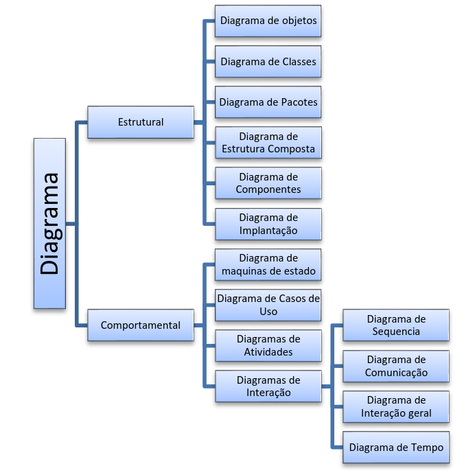

### Estrutural

* **Estática (estrutural):** Objetos, operações, relações e atributos

#### Diagrama de Classes

**Classes:** Blocos de construção mais importantes de sistemas orientado a objetos; abstração de um conjunto de objetos que possuem os mesmos tipos de características e comportamentos\
**Objetos:** Qualquer coisa que possua características e comportamentos

* _Diagrama de Objetos:_ Mostra um conjunto de objetos e seus relacionamentos em um ponto do tempo; cobre conjunto de instâncias dos itens encontrados dos diagramas de classe (ex, `OBJ:Classe`, `:Classe`,`Objeto`)

**Representação Gráfica da Classe**

* _Nome:_ Nome simples, qualificando-a; substantivos com o 1º caractere maiúsculo
* _Atributos:_ Propriedade nomeada de uma classe que descreve um intervalo de valores que a instância (objeto) pode apresentar; nome é dado por um substantivo (ex. `suporteDeCarga`)
* _Operações:_ Comportamentos; implementação de um serviço que pode ser solicitado por algum objeto da classe para modificar o comportamento (ex. `adicionar()`, `esta_vazio()`)

**Visibilidade (modificadores de acesso)**

* _(-) Privado:_ Somente a classe pode ver o valor do atributo
* _(+) Público:_ Qualquer classe pode ver o valor do atributo
* _(#) Protegido:_ Somente a própria classe ou suas filhas por herança podem ver o valor
* _(\~) Pacote:_ Somente classes do mesmo pacote podem ver o valor do atributo

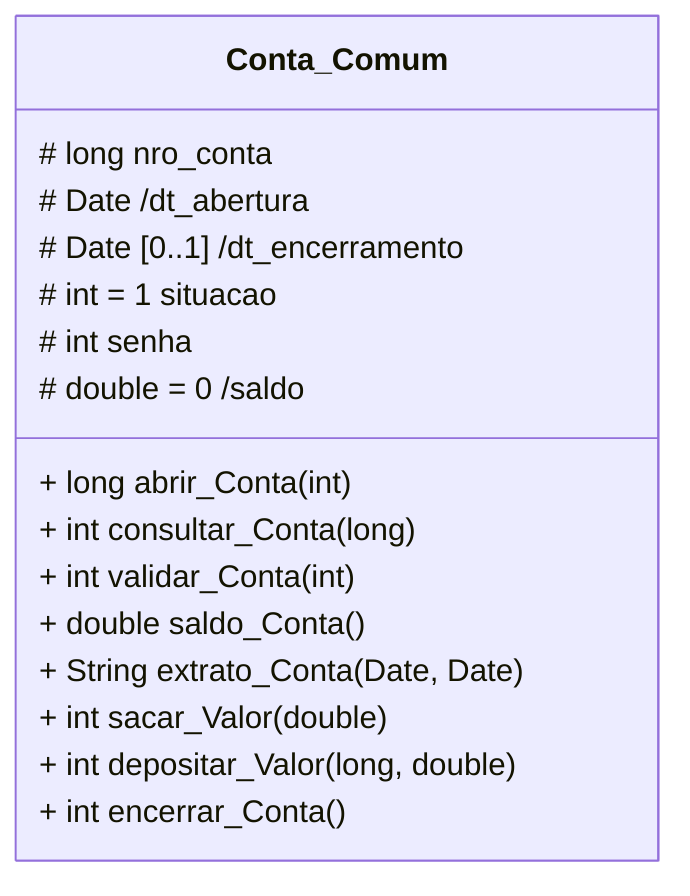

> `/` antes dos atributos significa que os valores sofrem algum tipo de cálculo

**Relacionamentos**

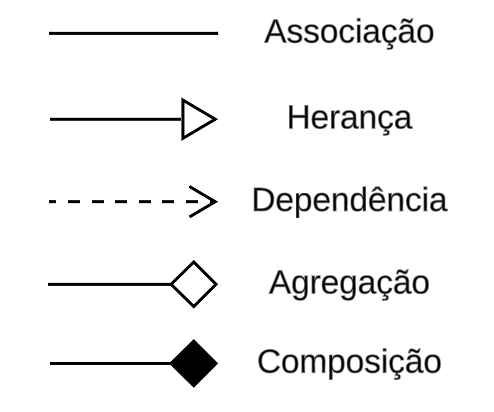

* _Dependência:_ Dependência fraca; ilustra que uma classe usa informações e serviços de outra classe em algum momento; pode existir sem a outra classe, porém, depende desta para seu funcionamento
  * Carro depende da Roda
* _Associação:_ Existe independente da outra classe; indica que a classe mantém referência a outra classe ao longo do tempo; podem conectar mais de duas classes
  * Pessoa assina Revista
* _Associação Ternária:_ Conecta objetos de três (ou mais) classes; losango indica ponto de convergência (conexão)
  * Professor leciona para Turma, Turma possui um professor, Professor/Turma utiliza Sala
* _Agregação:_ Indica que uma classe é um contêiner/coleção de outras classes; classes contidas não dependem do contêiner
  * Departamento possui Gerente(s)
* _Composição:_ Variação específica da agregação; indica dependência forte entre classes, se o contêiner é destruído, seu conteúdo também
  * Cidade faz parte do Estado
* _Herança:_ Subclasse herda propriedades (atributos e métodos) da superclasse
  * _Generalização/Especialização:_ Relacionamento entre itens gerais (superclasses / classe-mãe) e mais específicos (subclasses / classe-filha)
    * Peixe é um tipo de Animal
* _Classe Associativa:_ Quando ocorrem associações com multiplicidade muitos ( \* ) em todas as extremidades; atributos de associação que não podem ser armazenados em nenhuma das classes envolvidas

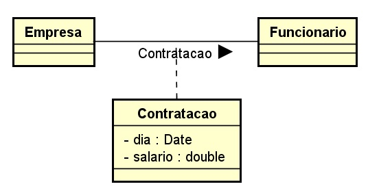

**Multiplicidade**

`[0..1] - máx 1` ➡ Obj da classe associada não precisam necessariamente estar relacionados\
`[1..1] - 1 e somente 1` ➡ Apenas um obj da classe se relacionada com os objetos da outra classe\
`[0..*] - muitos` ➡ Podem haver muitos obj de classe envolvidos no relacionamento\
`[1..*]- 1 ou muitos` ➡ Pelo menos um obj envolvido no relacionamento `[3..5]` ➡ Valores específicos

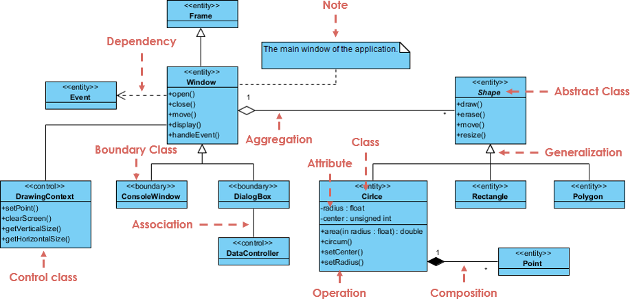

#### Diagrama de Implantação

* Configuração e arquitetura de um sistema em que estarão ligados seus componentes
* **Características:** Estrutura da plataforma em que o sistema será executado; pode representar qualquer dispositivo (gerenciador de BD, servidores, computadores, etc)

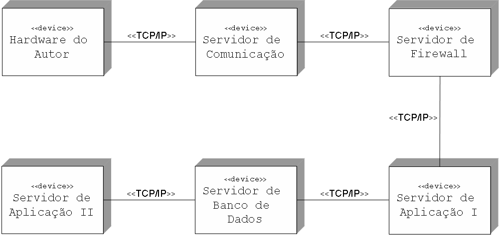

#### Diagrama de Pacotes

* Subsistemas ou submódulos englobados por um sistema de forma a determinar as partes que o compõem
* **Dependência:** Pacotes normalmente possuem dependências entre si

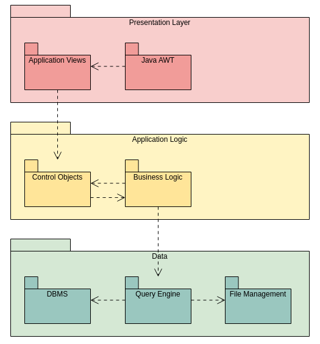

### Comportamental

* **Dinâmica (comportamental):** Relação entre objetos e mudanças em seus estados internos

#### Diagrama de Casos de Uso

* Utilizado para captar o _comportamento pretendido_ de um sistema, sem especificar como esse comportamento é implementado
* Finalidades:

1. **Definir escopo:** Funcionalidades
2. **Identificar papéis:** Quem interage com o sistema e com quais funcionalidades

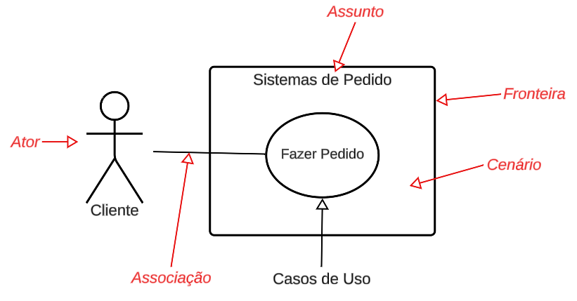

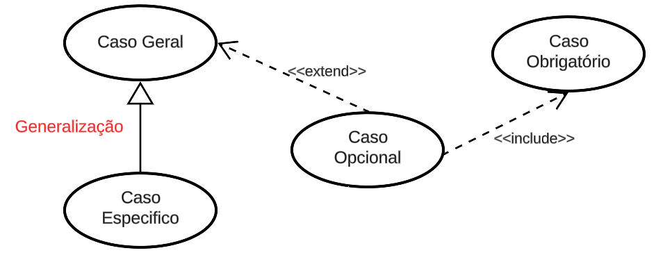

**Exemplo**

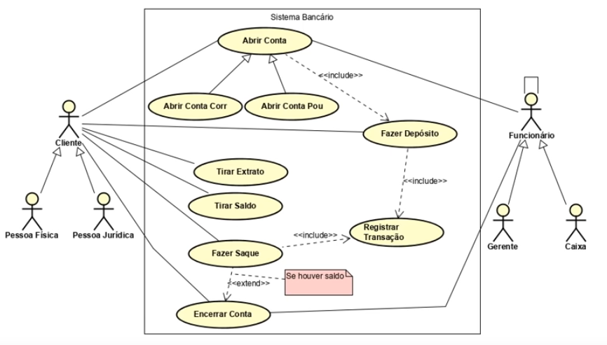

#### Diagrama de Sequência

* Ordem temporal da _troca de mensagens_ entre elementos
* Casos de Uso são refinados em um ou mais Diagramas de Sequência

**Elementos**

* _Atores:_ Usuários do sistema
* _Objetos:_ Participantes da interação; objetos que iniciam a interação a esquerda, objetos subordinados a direita
* _Linha de vida (do objeto):_ Período de tempo no qual o objeto existe
* _Caixa de Ativação ou Foco de Controle:_ Período no qual o objeto está participando ativamente de um processo
* _Mensagens (e seus parâmetros):_ Ocorrência de eventos; chamada de métodos
  * Síncrona
  * Assíncrona
  * Auto-Mensagem
  * Resposta
  * Criação/Exclusão de Participante
  * Mensagem de Guarda (condicional)

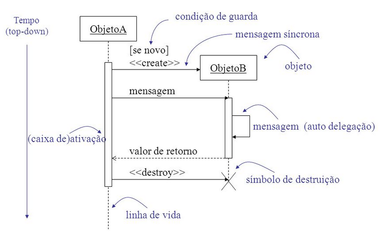

_Esteriótipos:_ Representações permitem destacas componentes que têm função especial

* `<<entity>>`: Armazena informações referentes ao problema em questão; torna explícito que a classe contém informações recebidas e armazenadas/geradas pelo sistema
* `<<boundary>>`: Fronteira; interface; identifica uma classe que serve de comunicação entre atores externos e o sistema
* `<<control>>`: Identifica classes que fazem intermédio entre classes _boundary_ e as demais classes; interpreta eventos ocorridos sobre estes objetos (movimento do mouse, pressionamento de botão)

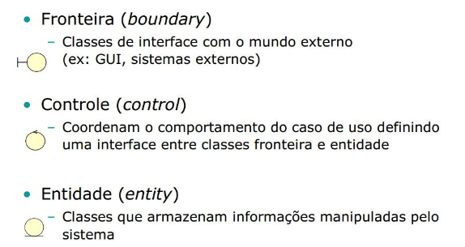

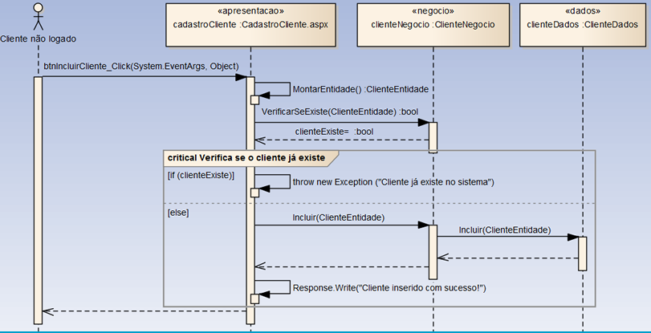

#### Diagrama de Atividades

* Representa graficamente o fluxo de controle de uma atividade para outra, com descrição de ações passo-a-passo em um sistema
* Especifica a transformação de entradas em saídas por meio de uma sequência controlada temporal de ações
* Semelhante a um fluxograma, porém com suporte a concorrência (paralelismo) e sincronismo de atividades
* Variação do diagrama de estados, que permite modelar comportamento baseado em fluxo

**Atividade:** É um processo de negócio, geralmente descreve a implementação de um caso de uso; uma _ação_ é um passo individual dentro de uma atividade

**Elementos**

* _Nó-Inicial:_ Ponto de início da atividade modelada
* _Fluxo/arestas:_ (Transição) Descreve a sequência na qual as atividades se realizam; conexões entre duas ações representada por uma seta
* _Decisão:_ Um único fluxo de entrada e vários fluxos de saída
* _Intercalação:_ Vários fluxos de entrada e uma única de saída
* _Divergência:_ Ponto no qual duas ou mais tarefas podem se iniciar em paralelo
* _Convergência:_ Ponto no qual duas ou mais tarefas paralelas se unem para dar início a uma nova tarefa única
* _Nó final da atividade:_ Ponto onde termina atividade
* _Partições:_ Mostra quem faz o que
* _Sinais ou mensagens:_ Envio ou recebimento de sinais ou mensagens por uma ação

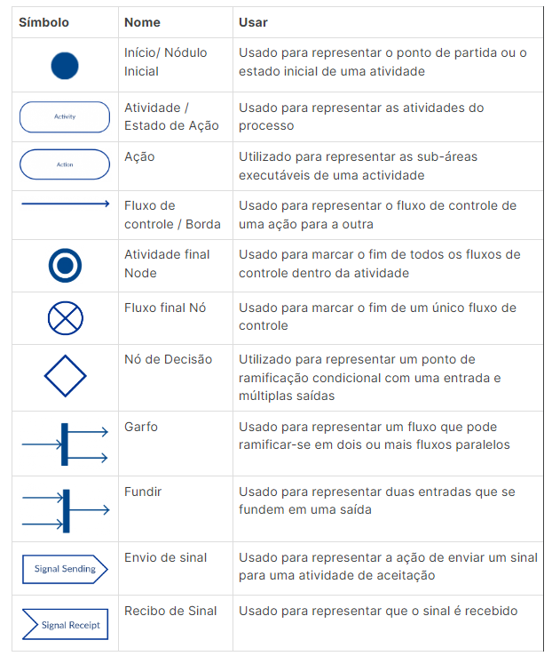

#### Diagrama de Máquina de Estado

* Diagrama comportamental para descrever como um sistema se comporta quando um evento ocorre, considerando todos os estados, transições e ações possíveis de um objeto
* Representa o estado ou situação na qual um objeto pode se encontrar ao longo da execução dos processos em um sistema
* Mostra como o elemento se comporta por meio de um cojunto de transições de estado (máquina de estado)
* Serve para modelar comportamento de interfaces, casos de uso, instâncias da classe e na modelagem de sistemas relativos

**Elementos**

* _Estado(simples):_ Condição ou situação na vida de um objeto que satisfaz alguma condição, realiza alguma atividade ou espera um evento
* _Estado inicial:_ Determina o início da modelagem dos estados de um elemento
* _Estado final:_ Indica o final dos estados modelados para o elemento
* _Estado composto:_ Estado que possui sub-estados
* _Atividade:_ É uma execução não atômica en andamento em uma máquina de estado
* _Evento:_ É a especificação de uma ocorrência significativa que tem uma localização no tempo e no espaço
* _Transição:_ É um relacionamento entre dois estados

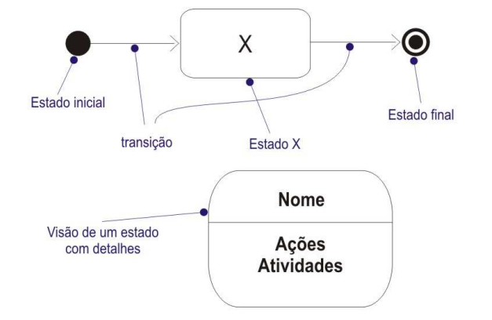
